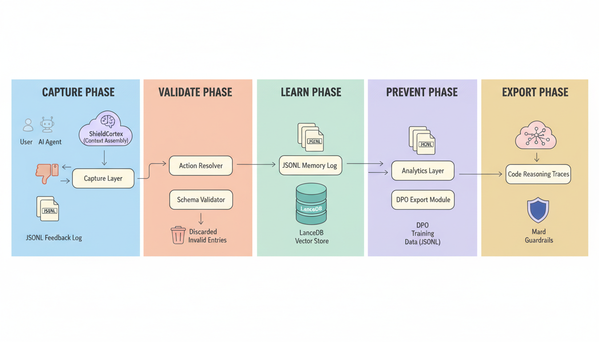

# RLHF Feedback Loop

[](https://github.com/IgorGanapolsky/rlhf-feedback-loop/actions/workflows/ci.yml)
[](https://github.com/IgorGanapolsky/rlhf-feedback-loop/actions/workflows/self-healing-monitor.yml)
[](https://www.npmjs.com/package/rlhf-feedback-loop)
[](LICENSE)
[]()
[](adapters/mcp/server-stdio.js)
[](scripts/export-dpo-pairs.js)

**Make your AI agent learn from mistakes.**

Your AI coding agent makes the same errors over and over. It claims things are done when they're not. It forgets what worked last time. This fixes that.

**rlhf-feedback-loop** captures thumbs up/down feedback on your agent's work, remembers what went right and wrong, blocks repeated failures, and exports training data so the agent actually improves.

Works with **ChatGPT**, **Claude**, **Codex**, **Gemini**, and **Amp** — same core, different adapters.

## Architecture at a Glance

### RLHF Feedback Loop



### Plugin Topology


## Why This Exists

| Problem | What this does |
|---------|---------------|
| Agent keeps making the same mistake | Prevention rules auto-generated from repeated failures |
| No proof agent tested before claiming "done" | Rubric engine blocks positive feedback without test evidence |
| Feedback collected but never used | DPO pairs exported for actual model fine-tuning |
| Different tools, different formats | One API + MCP server works across 5 platforms |

## Install in 60 Seconds

```bash
npx rlhf-feedback-loop init
node .rlhf/capture-feedback.js --feedback=up --context="tests pass"
```

That's it. You're capturing feedback. Now plug it into your agent:

| Platform | One-liner |
|----------|-----------|
| **Claude Code** | `cp plugins/claude-skill/SKILL.md .claude/skills/rlhf-feedback.md` |
| **Codex** | `cat adapters/codex/config.toml >> ~/.codex/config.toml` |
| **Gemini** | `cp adapters/gemini/function-declarations.json .gemini/rlhf-tools.json` |
| **Amp** | `cp plugins/amp-skill/SKILL.md .amp/skills/rlhf-feedback.md` |
| **ChatGPT** | Import `adapters/chatgpt/openapi.yaml` in GPT Builder |

Detailed guides: [Claude](plugins/claude-skill/INSTALL.md) | [Codex](plugins/codex-profile/INSTALL.md) | [Gemini](plugins/gemini-extension/INSTALL.md) | [Amp](plugins/amp-skill/INSTALL.md) | [ChatGPT](adapters/chatgpt/INSTALL.md)

## How It Works

```
You give feedback (thumbs up/down)
        |
        v
  Capture + validate
        |
        v
  Score with rubric (is this actually good?)
        |
    +---+---+
    |       |
   Good    Bad
    |       |
  Learn   Remember mistake
    |       |
    v       v
  DPO    Prevention
  pairs   rules
```

1. You (or your agent) gives thumbs up or down with context
2. The rubric engine scores it — blocks false positives (e.g., "done!" with no tests)
3. Good outcomes become learning memories, bad ones become error memories
4. Errors generate prevention rules so the agent stops repeating them
5. Matched pairs export as DPO training data for fine-tuning

## Pricing

| Plan | Price | What you get |
|------|-------|-------------|
| **Open Source** | **$0 forever** | Full source, self-hosted, MIT license, 573 tests, 5-platform plugins |
| **Cloud Pro** | **$10/mo** | Hosted HTTPS API, provisioned API key on payment, Stripe billing, email support |

Get Cloud Pro: see the [landing page](docs/landing-page.html) or go straight to [Stripe Checkout](https://buy.stripe.com/)

---

## Quick Start

```bash
cp .env.example .env
npm test
npm run prove:adapters
npm run prove:automation
npm run start:api
```

Set `RLHF_API_KEY` before running the API (or explicitly set `RLHF_ALLOW_INSECURE=true` for isolated local testing only).

Capture feedback:

```bash
node .claude/scripts/feedback/capture-feedback.js \
  --feedback=down \
  --context="Claimed done without test evidence" \
  --what-went-wrong="No proof attached" \
  --what-to-change="Always run tests and include output" \
  --tags="verification,testing"
```

## Integration Adapters

- ChatGPT Actions: `adapters/chatgpt/openapi.yaml`
- Claude MCP: `adapters/claude/.mcp.json`
- Codex MCP: `adapters/codex/config.toml`
- Gemini tools: `adapters/gemini/function-declarations.json`
- Amp skill: `adapters/amp/skills/rlhf-feedback/SKILL.md`

## API Surface

- `POST /v1/feedback/capture`
- `GET /v1/feedback/stats`
- `GET /v1/intents/catalog`
- `POST /v1/intents/plan`
- `GET /v1/feedback/summary`
- `POST /v1/feedback/rules`
- `POST /v1/dpo/export`
- `POST /v1/context/construct`
- `POST /v1/context/evaluate`
- `GET /v1/context/provenance`

Spec: `openapi/openapi.yaml`

## Deep Dive

For contributors and advanced configuration:

- [Context Engine](docs/CONTEXTFS.md) — multi-agent memory orchestration
- [Intent Router](docs/INTENT_ROUTER.md) — action planning with checkpoint policy
- [Autonomous GitOps](docs/AUTONOMOUS_GITOPS.md) — self-healing CI/CD
- [Verification Evidence](docs/VERIFICATION_EVIDENCE.md) — proof reports

## License

MIT. See [LICENSE](LICENSE).
