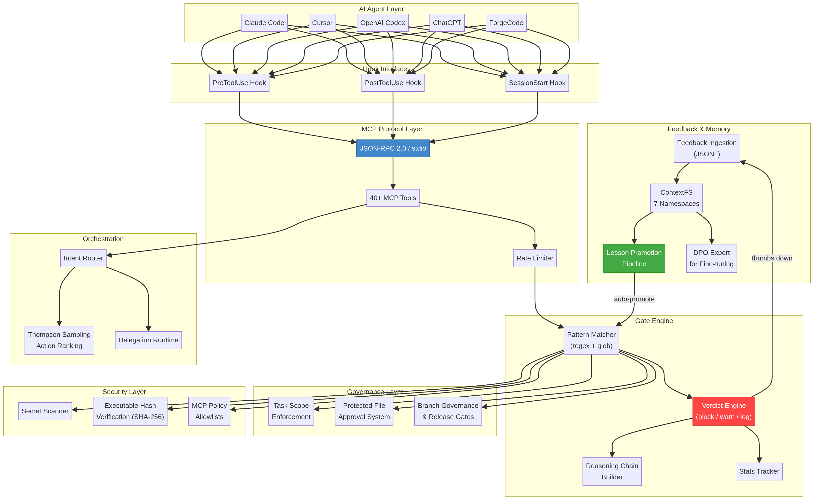
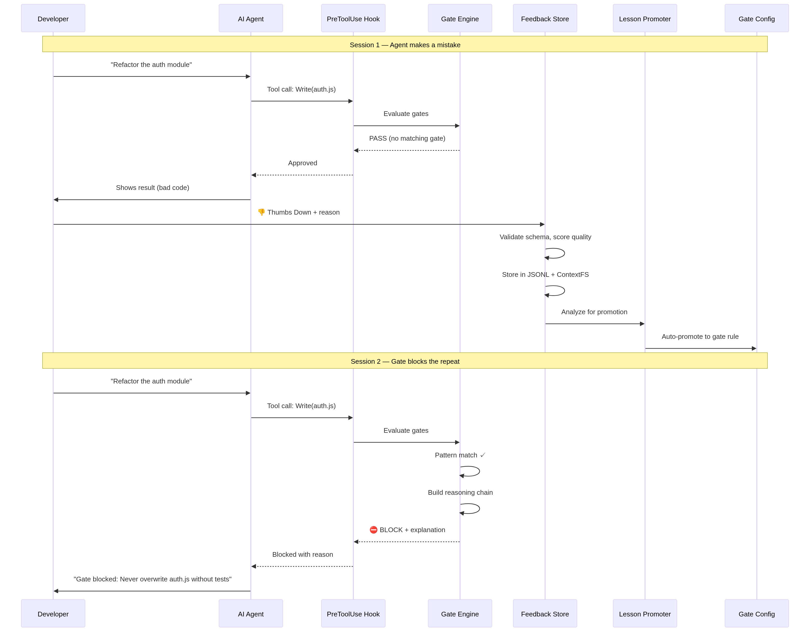
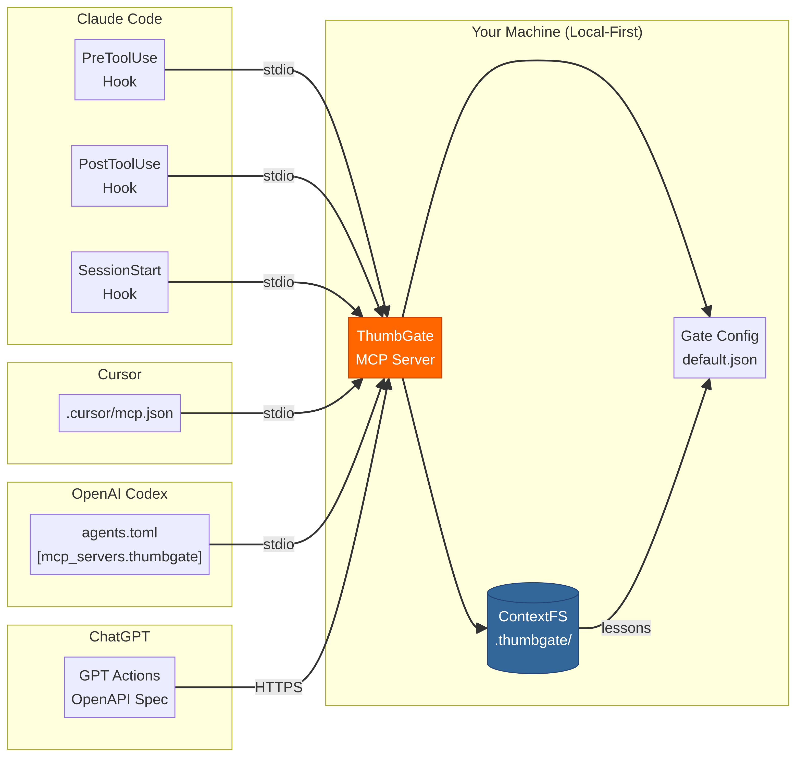
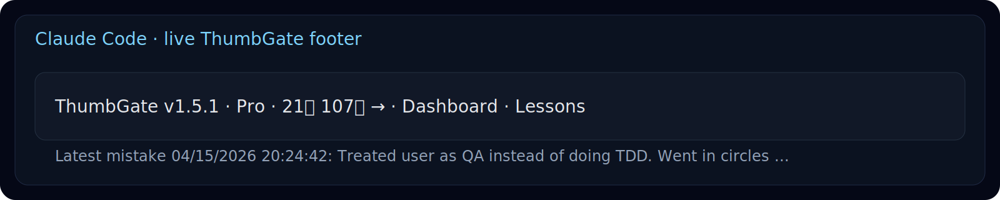
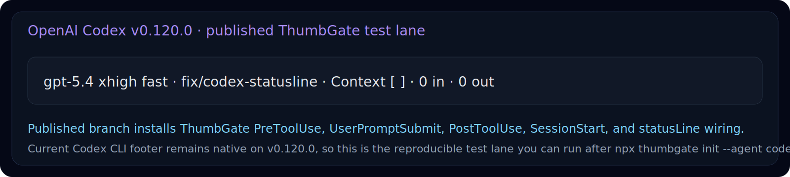

# ThumbGate

**Your AI coding bill has a leak.**

**Stop paying $ for the same AI mistake.**

Every retry loop, every hallucinated import, every *"let me try a different approach"* — those are billable tokens on every LLM vendor's bill. Thumbs-down once; ThumbGate blocks that exact mistake on every future call. Across Claude Code, Cursor, Codex, Gemini, Amp, OpenCode — any MCP-compatible agent, forever.

Under the hood: your thumbs-down becomes a **Pre-Action Gate** that physically blocks the pattern **permanently** on every future call — across every session, every model, every agent. It is **self-improving agent governance**: every correction promotes a fresh prevention rule, and your library of Pre-Action Gates grows stronger with every lesson. Works with Claude Code, Cursor, Codex, Gemini CLI, Amp, OpenCode, and any MCP-compatible agent. The monthly Anthropic / OpenAI bill stops paying for the same lesson over and over — local-first enforcement, zero tokens spent on repeats.

> **Prevent expensive AI mistakes. Make AI stop repeating mistakes. Turn a smart assistant into a reliable operator.**

> **Mission:** make AI coding affordable by making sure you never pay for the same mistake twice.

[](https://github.com/IgorGanapolsky/ThumbGate/actions/workflows/ci.yml)
[](https://www.npmjs.com/package/thumbgate)
[](LICENSE)

---

## 🎬 90-second demo

Watch the force-push scenario: agent tries to `git push --force`, one thumbs-down, next session it's blocked — zero tokens spent on the repeat.

[**▶ Watch the 90-second demo**](https://thumbgate-production.up.railway.app/#demo?utm_source=github&utm_medium=readme&utm_campaign=demo_video) · [Script](docs/marketing/demo-video-script.md) · [ElevenLabs narration: `npm run demo:voiceover`](scripts/generate-demo-voiceover.js)

<!-- Video embed lives on the landing page and YouTube. Script + voiceover automation ship with the repo so anyone can re-record. -->

---

## First-dollar activation path

If someone is not already bought into ThumbGate, do not lead with architecture. Lead with one repeated mistake.

1. **Show the pain:** open the **[ThumbGate GPT](https://thumbgate-production.up.railway.app/go/gpt?utm_source=github&utm_medium=readme&utm_campaign=first_dollar_activation&cta_id=readme_first_dollar_open_gpt&cta_placement=readme_first_dollar)** and paste the bad answer, risky command, deploy, PR action, or agent plan before it runs again.
2. **Capture the lesson:** type `thumbs down:` or `thumbs up:` with one concrete sentence. Native ChatGPT rating buttons are not the ThumbGate capture path; typed feedback is.
3. **Enforce the repeat:** run `npx thumbgate init` where the agent executes so the lesson can become a Pre-Action Gate instead of another reminder.
4. **Upgrade only after proof:** Solo Pro is for the dashboard, DPO export, proof-ready evidence, and higher capture limits after one real blocked repeat. Team starts with the Workflow Hardening Sprint around one repeated failure, one owner, and one proof review.

The buying question is simple: **what repeated AI mistake would be worth blocking before the next tool call?**

---

## The Problem — the bill nobody talks about

Frontier-model calls are not cheap. Sonnet 4.5 is ~$3 / 1M input tokens and ~$15 / 1M output tokens. Opus is 5× that. Every time your agent:

- hallucinates a function name and you have to correct it,
- retries the same failing tool call until it gives up,
- regenerates a 4,000-token plan you already approved last session,
- repeats a destructive command you blocked manually yesterday,

…you are paying for that round-trip. *Twice if it retries. Three times if you re-prompt.* And the agent has no memory across sessions, so the meter resets every Monday.

```
Session 1:  Agent force-pushes to main.     You fix it.    +4,200 tokens
Session 2:  Agent force-pushes again.       You fix it.    +4,200 tokens
Session 3:  Same mistake. Again.            You lose 45m.  +5,800 tokens
```

That's ~$0.21 in tokens just to fix the same mistake three times — multiplied by every developer, every repeated-mistake class, every week. The math gets ugly fast.

## The Solution — fix it once, the bill never sees it again

```
Session 1:  Agent force-pushes to main.     You 👎 it.       +4,200 tokens
Session 2:  ⛔ Gate blocks the force-push.  Zero round-trip. +0 tokens
Session 3+: Never happens again.                              +0 tokens
```

One thumbs-down. The PreToolUse hook intercepts the call **before** it reaches the model — no input tokens, no output tokens, no retry loop. The dashboard tracks **tokens saved this week** as a live counter so you can see exactly what your prevention rules are worth.

ThumbGate doesn't make your agent smarter. It makes your agent *cheaper to be wrong with.*

---

## Quick Start

```bash
npx thumbgate init       # auto-detects your agent, wires everything
npx thumbgate capture "Never run DROP on production tables"
```

That single command creates a gate rule. Next time any AI agent tries to run `DROP` on production:

```
⛔ Gate blocked: "Never run DROP on production tables"
   Pattern: DROP.*production
   Verdict: BLOCK
```

---

## Architecture

ThumbGate operates as a 4-layer enforcement stack between your AI agent and your codebase:



### Layer 1: Feedback Capture
Your thumbs-up/down reactions are captured via MCP protocol, CLI, or the ChatGPT GPT surface. Each reaction is stored as a structured lesson with context, timestamp, and severity.

### Layer 2: Gate Engine
The gate engine converts lessons into enforceable rules using pattern matching, semantic similarity (via LanceDB vectors), and Thompson Sampling for adaptive rule selection. Rules are stored locally in `.thumbgate/gates/`.

### Layer 3: Pre-Action Interception
Before any agent action executes, ThumbGate's `PreToolUse` hook intercepts the command and evaluates it against all active gates. This happens at the MCP protocol level — the agent physically cannot bypass it.

### Layer 4: Multi-Agent Distribution
Gates are distributed across all connected agents via MCP stdio protocol. One correction in Claude Code protects Cursor, Codex, Gemini CLI, and any MCP-compatible agent.

Prompt engineering still matters, but it is only the starting point. ThumbGate adds prompt evaluation on top: proof lanes, benchmarks, and self-heal checks tell you whether your prompt and workflow actually held up under execution instead of leaving you to guess from vibes.





---

## Install for Your Agent

| Agent | Command |
|-------|---------|
| **Claude Code** | `npx thumbgate init --agent claude-code` |
| **Cursor** | `npx thumbgate init --agent cursor` |
| **Codex** | `npx thumbgate init --agent codex` |
| **Gemini CLI** | `npx thumbgate init --agent gemini` |
| **Amp** | `npx thumbgate init --agent amp` |
| **Claude Desktop** | [Download extension bundle](https://github.com/IgorGanapolsky/ThumbGate/releases/latest/download/thumbgate-claude-desktop.mcpb) |
| **Any MCP agent** | `npx thumbgate serve` |

Works with **Claude Code, Cursor, Codex, Gemini CLI, Amp, OpenCode**, and any MCP-compatible agent.

### Status bar proof





Claude renders the live ThumbGate footer today. `npx thumbgate init --agent codex` now installs the full Codex hook bundle and writes the ThumbGate `statusLine` target into `~/.codex/config.json` so you can test it on your local Codex build immediately.

### Install Codex Plugin

Download the standalone Codex plugin bundle and follow the install guide:

1. Download: [thumbgate-codex-plugin.zip](https://github.com/IgorGanapolsky/ThumbGate/releases/latest/download/thumbgate-codex-plugin.zip)
2. Follow: [plugins/codex-profile/INSTALL.md](plugins/codex-profile/INSTALL.md)

---

## How It Works

```
  STEP 1              STEP 2                 STEP 3
  ────────            ────────               ────────

  You react           ThumbGate learns       The gate holds

  👎 on a bad    ──►  Feedback becomes  ──►  Next time the
  agent action        a saved lesson         agent tries the
                      and a block rule       same thing:
  👍 on a good   ──►  Good pattern gets      ⛔ BLOCKED
  agent action        reinforced                 (or ✅ allowed)
```

No manual rule-writing. No config files. Your reactions teach the agent what your team actually wants.

---

ThumbGate sells three concrete outcomes:

- **Prevent expensive AI mistakes** — catch bad commands, destructive database actions, unsafe publishes, and risky API calls before they run.
- **Make AI stop repeating mistakes** — fix it once, turn the lesson into a rule, and block the repeat before the next tool call lands.
- **Turn AI into a reliable operator** — move from a smart assistant that apologizes after damage to a production-ready operator with checkpoints, proof, and enforcement.
- **Measure prompts instead of rewriting them blindly** — use proof lanes, ThumbGate Bench, and `self-heal:check` to evaluate whether prompts and workflows actually improved behavior.

---

## Use Cases

- **Stop force-push to main** — Gate blocks `git push --force` on protected branches before it runs
- **Prevent repeated migration failures** — Each mistake becomes a searchable lesson that fires before the next attempt
- **Block unauthorized file edits** — Control which files agents can touch with path-based rules
- **Memory across sessions** — The agent remembers your feedback from yesterday
- **Shared team safety** — One developer's thumbs-down protects the whole team
- **Auto-improving without feedback** — Self-improvement mode evaluates outcomes and generates rules automatically

---

## Built-in Gates

```
⛔ force-push          → blocks git push --force
⛔ protected-branch    → blocks direct push to main
⛔ unresolved-threads  → blocks push with open reviews
⛔ package-lock-reset  → blocks destructive lock edits
⛔ env-file-edit       → blocks .env secret exposure

+ custom gates in config/gates/custom.json
```

---

## CLI Reference

```bash
npx thumbgate init       # detect agent, wire hooks
npx thumbgate doctor     # health check
npx thumbgate capture    # create a gate from text
npx thumbgate lessons    # see what's been learned
npx thumbgate explore    # terminal explorer for lessons, gates, stats
npx thumbgate dashboard  # open local dashboard
npx thumbgate serve      # start MCP server on stdio
npx thumbgate bench      # run reliability benchmark
```

---

## Pricing

| | Free | Pro ($19/mo) | Team ($49/seat/mo) |
|---|---|---|---|
| Local CLI + enforced gates | ✅ | ✅ | ✅ |
| Feedback captures/day | 3 | Unlimited | Unlimited |
| Prevention rules | 1 | Unlimited | Unlimited |
| Agent connections | 1 | Unlimited | Unlimited |
| Personal dashboard | — | ✅ | ✅ |
| DPO export (model fine-tuning) | — | ✅ | ✅ |
| Team lesson export/import | — | ✅ | ✅ |
| Shared hosted lesson DB | — | — | ✅ |
| Org-wide dashboard | — | — | ✅ |
| Approval + audit proof | — | — | ✅ |

The free tier gives you 3 feedback captures, 1 rule, and 1 agent — enough to prove the enforcement loop works. Pro is $19/mo or $149/yr for unlimited everything plus a dashboard and history-aware lesson recall. Team is $49/seat/mo with shared hosted lesson DB, org dashboard, and shared enforcement. Pro and Team include open_feedback_session, append_feedback_context, and finalize_feedback_session for structured multi-turn feedback capture.

**Best first paid motion for teams:** the **Workflow Hardening Sprint** — qualify one repeated failure before committing to a full rollout. **[Start intake →](https://thumbgate-production.up.railway.app/?utm_source=github&utm_medium=readme&utm_campaign=team_rollout#workflow-sprint-intake)**

**Best first technical motion:** install the CLI-first and let `init` wire hooks for the agent you already use.

**Paid path for individual operators:** [ThumbGate Pro](https://thumbgate-production.up.railway.app/pro?utm_source=github&utm_medium=readme&utm_campaign=pro_page) is the self-serve side lane for a personal dashboard and export-ready evidence.

**[Start free](https://thumbgate-production.up.railway.app/?utm_source=github&utm_medium=readme)** · **[See Pro](https://thumbgate-production.up.railway.app/pro?utm_source=github&utm_medium=readme)** · **[Team Sprint intake](https://thumbgate-production.up.railway.app/?utm_source=github&utm_medium=readme#workflow-sprint-intake)**

---

## Team Lesson Sharing (Pro + Team)

One team's hard-won lessons shouldn't stay trapped on one laptop. ThumbGate Pro and Team can export lessons as portable bundles and import them into any other ThumbGate instance — so a mistake caught by Team A becomes a prevention rule for Team B.

**Export lessons from one project:**

```bash
curl -X POST http://localhost:3456/v1/lessons/export \
  -H "Authorization: Bearer $THUMBGATE_API_KEY" \
  -H "Content-Type: application/json" \
  -d '{"outputPath": "./lessons-export.json"}'
```

Filter by signal or tags:

```bash
curl -X POST http://localhost:3456/v1/lessons/export \
  -H "Authorization: Bearer $THUMBGATE_API_KEY" \
  -H "Content-Type: application/json" \
  -d '{"signal": "down", "tags": ["push-notifications", "ci"]}'
```

**Import into another team's ThumbGate:**

```bash
curl -X POST http://localhost:3456/v1/lessons/import \
  -H "Authorization: Bearer $THUMBGATE_API_KEY" \
  -H "Content-Type: application/json" \
  -d @lessons-export.json
```

What happens on import:
- **Deduplication** — lessons with the same ID or title+signal are skipped
- **Provenance tracking** — every imported lesson is tagged `team-import` with original source project, export timestamp, and original ID
- **No overwrite** — import is additive; existing lessons are never modified

The export bundle includes full lesson metadata: signal, title, context, tags, failure type, skill, structured rules, and diagnosis. It's the same data you see in the lesson detail dashboard — portable as JSON.

**Use cases:**
- Share enforcement patterns across repos in the same org
- Onboard a new team with pre-built lessons from a mature project
- Export lessons before a project handoff so institutional knowledge transfers
- Feed lessons from multiple teams into a centralized DPO training pipeline

---

## Tech Stack

| Layer | Technology |
|-------|-----------|
| **Storage** | SQLite + FTS5, LanceDB vectors, JSONL logs |
| **Capture** | 3 feedback capture/day (free), unlimited (Pro) |
| **Intelligence** | MemAlign dual recall, Thompson Sampling |
| **Enforcement** | PreToolUse hook engine, Gates config |
| **Interfaces** | MCP stdio, HTTP API, CLI (Node.js >=18) |
| **Billing** | Stripe |
| **Execution** | Railway, Cloudflare Workers, Docker Sandboxes |
| **Governance** | Workflow Sentinel, control plane, Docker Sandboxes |

Every Changeset is tied to the exact `main` merge commit and generates Verification Evidence for Release Confidence.

---

**Popular buyer questions:** **[Stop repeated AI agent mistakes](https://thumbgate-production.up.railway.app/guides/stop-repeated-ai-agent-mistakes?utm_source=github&utm_medium=readme&utm_campaign=buyer_questions)** · **[Cursor guardrails](https://thumbgate-production.up.railway.app/guides/cursor-agent-guardrails?utm_source=github&utm_medium=readme&utm_campaign=buyer_questions)** · **[Codex CLI guardrails](https://thumbgate-production.up.railway.app/guides/codex-cli-guardrails?utm_source=github&utm_medium=readme&utm_campaign=buyer_questions)** · **[Gemini CLI memory + enforcement](https://thumbgate-production.up.railway.app/guides/gemini-cli-feedback-memory?utm_source=github&utm_medium=readme&utm_campaign=buyer_questions)**

**[Workflow Hardening Sprint](https://thumbgate-production.up.railway.app/?utm_source=github&utm_medium=readme&utm_campaign=top_cta#workflow-sprint-intake)** · **[Live Dashboard](https://thumbgate-production.up.railway.app/dashboard?utm_source=github&utm_medium=readme&utm_campaign=top_cta)**

---

## Integrations

- **[Open ThumbGate GPT](https://thumbgate-production.up.railway.app/go/gpt?utm_source=github&utm_medium=readme&utm_campaign=readme_gpt)** — ThumbGate GPT: start here. Paste agent actions, get advice + checkpointing. No, users do not have to keep chatting inside the ThumbGate GPT to use ThumbGate — the hard enforcement layer still runs where the work happens.
- **[Claude Desktop Extension](https://github.com/IgorGanapolsky/ThumbGate/releases/latest/download/thumbgate-claude-desktop.mcpb)** — One-click install for Claude Desktop
- **[Codex Plugin](https://github.com/IgorGanapolsky/ThumbGate/releases/latest/download/thumbgate-codex-plugin.zip)** — Standalone bundle for Codex CLI
- **[Perplexity Command Center](docs/PERPLEXITY_MAX_COMMAND_CENTER.md)** — AI-search visibility + lead discovery
- **[ThumbGate Bench](docs/THUMBGATE_BENCH.md)** — Reliability benchmark for gate evaluation
- **[Manus AI Skill](skills/thumbgate/SKILL.md)** — ThumbGate integration for Manus AI agents

---

## Feedback Sessions

Give the agent more context when a thumbs-down isn't enough:

```
👎 thumbs down
  └─► open_feedback_session
        └─► "you lied about deployment"    (append_feedback_context)
        └─► "tests were actually failing"  (append_feedback_context)
        └─► finalize_feedback_session
              └─► lesson inferred from full conversation
```

Free and self-hosted users can invoke `search_lessons` directly through MCP, and via the CLI with `npx thumbgate lessons`. History-aware feedback sessions give the agent full context for each lesson.

---

## FAQ

**Is ThumbGate a model fine-tuning tool?**
No. ThumbGate does not update model weights. It captures feedback, stores lessons, injects context at runtime, and blocks bad actions before they execute.

**How is this different from CLAUDE.md or .cursorrules?**
Those are suggestions the agent can ignore. ThumbGate gates are enforced — they physically block the action before it runs. They also auto-generate from feedback instead of requiring manual writing.

**Does it work with my agent?**
If it supports MCP or pre-action hooks, yes. Claude Code, Claude Desktop, Cursor, Codex, Gemini CLI, Amp, OpenCode all work out of the box.

**Is it free?**
The free tier gives you 3 captures/day, 1 rule, and 1 agent — enough to prove the enforcement loop works. Pro is $19/mo or $149/yr for unlimited everything plus a dashboard. Team is $49/seat/mo with shared hosted lesson DB, org dashboard, and shared enforcement.

---

## Docs

- [First Dollar Playbook](docs/FIRST_DOLLAR_PLAYBOOK.md) — turning one painful workflow into the next booked pilot
- [Commercial Truth](docs/COMMERCIAL_TRUTH.md) — pricing, claims, what we don't say
- [Changeset Strategy](docs/CHANGESET_STRATEGY.md) — release notes and version bump enforcement
- [Release Confidence](docs/RELEASE_CONFIDENCE.md) — changesets, version checks, proof lanes
- [Verification Evidence](docs/VERIFICATION_EVIDENCE.md) — proof artifacts
- [Claude Desktop Extension Guide](docs/CLAUDE_DESKTOP_EXTENSION.md)
- [Agent Workflow Contract](WORKFLOW.md) — the agent-run contract for all ThumbGate operations
- [Ready for Agent Intake](https://github.com/IgorGanapolsky/ThumbGate/issues/new?template=ready-for-agent.yml) — ready-for-agent intake template
- [SEO Guide: Claude Code Guardrails](docs/learn/claude-code-guardrails.md)
- [Pro Overlay Repository](https://github.com/IgorGanapolsky/thumbgate-pro) — paid overlay code in the separate `thumbgate-pro` repo/package

---

## License

MIT. See [LICENSE](LICENSE).
