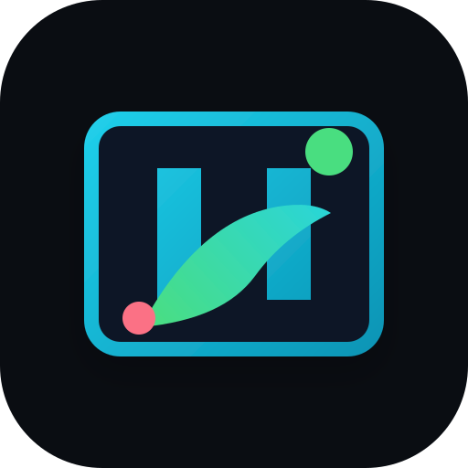
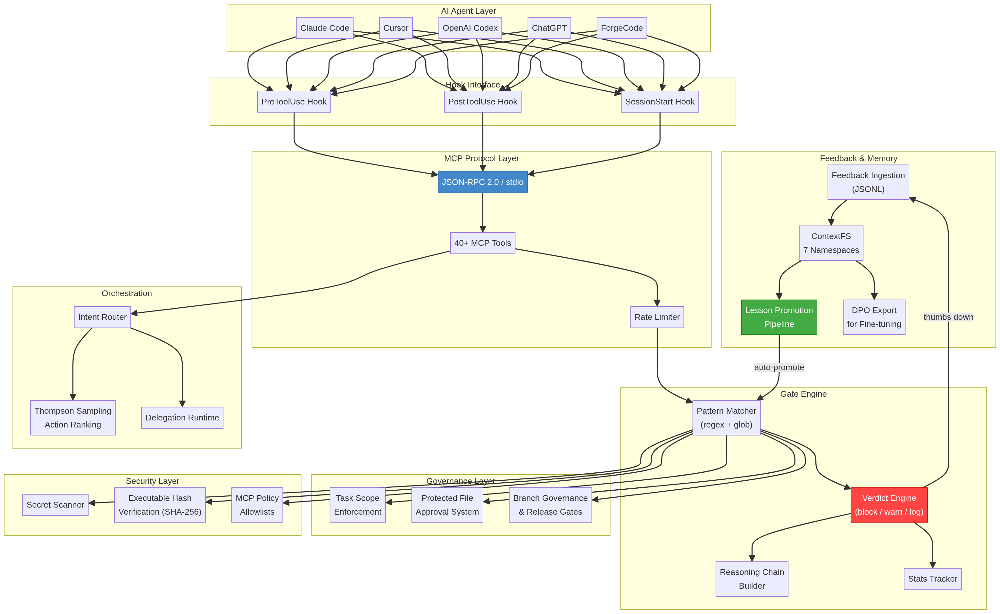
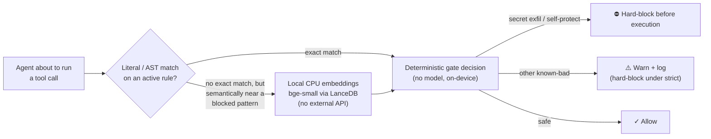
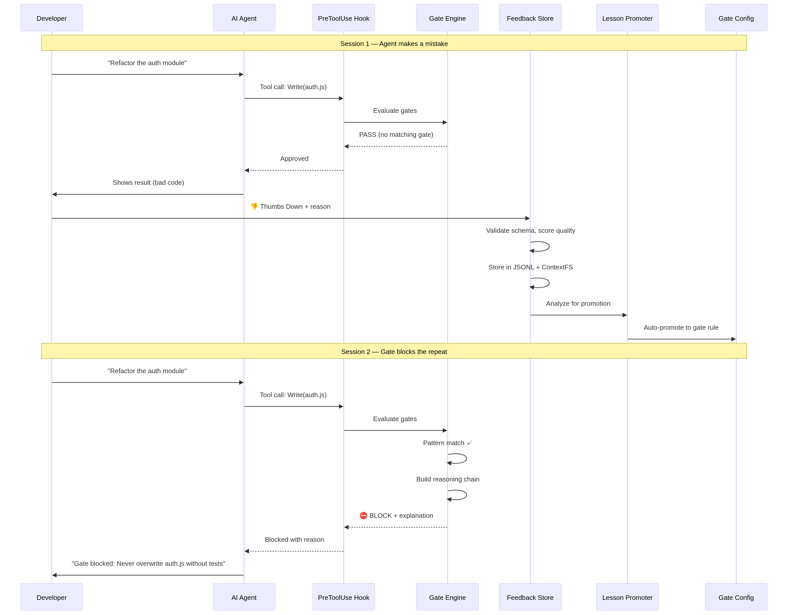
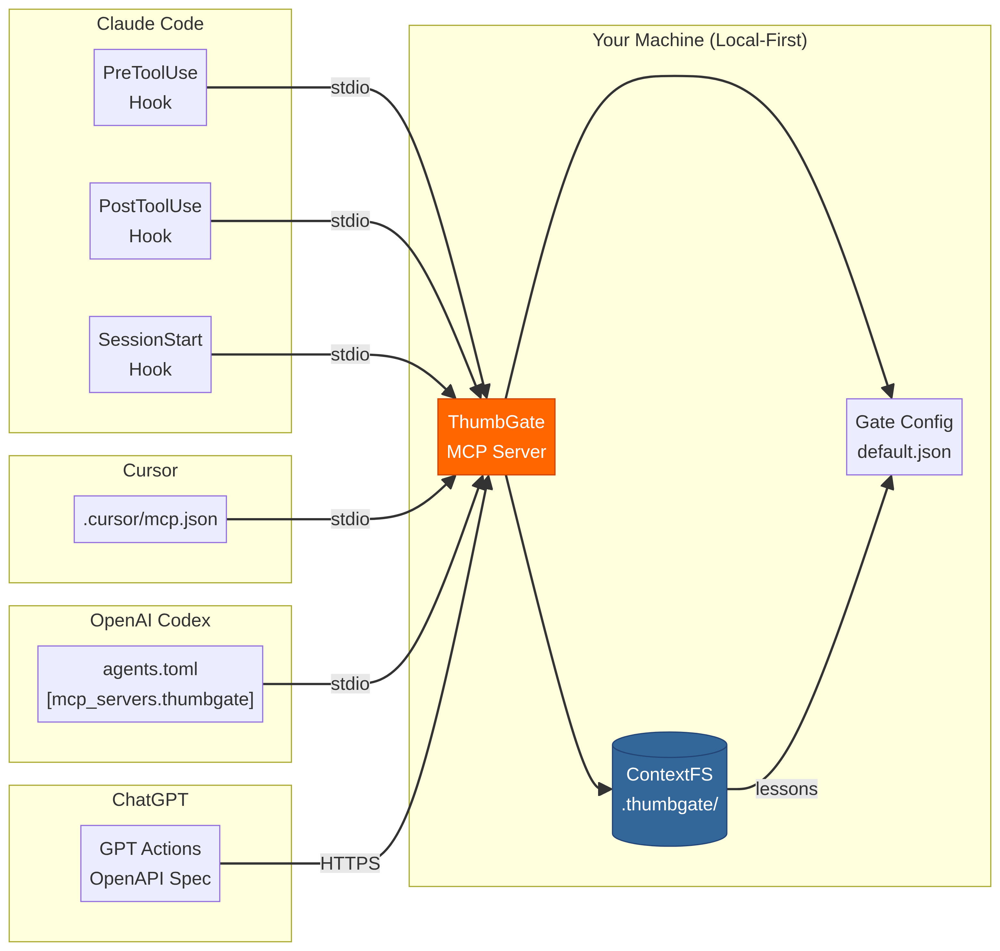
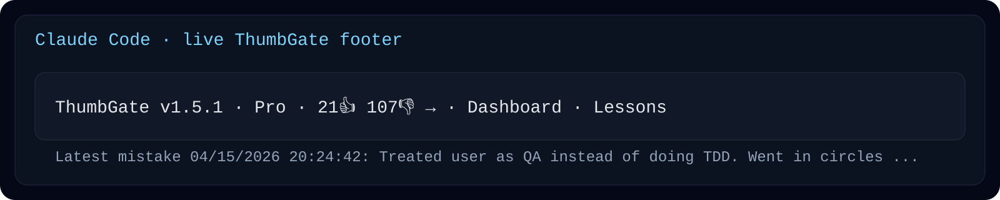
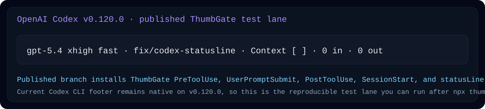

# ThumbGate

<p align="center">
  <a href="https://thumbgate.ai">
    
  </a>
</p>

**AI coding agents repeat mistakes — and one wrong tool call can wipe a directory, leak a key, or push broken code.**

ThumbGate is the local-first Pre-Action Checks engine for AI coding agents. It runs in the PreToolUse hook on your machine: it flags the next tool call and logs every decision. It **hard-blocks secret exfiltration and attempts to disable ThumbGate's own guardrails by default**, and **flags-and-logs** the other high-risk classes — destructive deletes (`rm -rf`), force-push, supply-chain fetch-and-run, off-scope edits, deploys — by default, hard-blocking **every** rule when you set `THUMBGATE_STRICT_ENFORCEMENT=1`. Works across Claude Code, Cursor, Codex, Gemini, Amp, Cline, and OpenCode. No server on the enforcement path. (Regulated-industry policy templates — legal intake, financial compliance, healthcare — are on the roadmap, built on the same engine.)

The product is a self-improving enforcement layer: thumbs-down feedback, prompt evaluation, and proof from prior runs become prevention rules that flag or block repeated failures according to policy before the next tool call executes.

<p align="center">
  
</p>

```
  Agent tries:   rm -rf tests/
  ThumbGate:     ⛔ BLOCKED — "Never delete test directories"
                 Pattern matched: rm.*-rf.*tests
                 Source: your thumbs-down from last Tuesday
                 Tokens spent on this repeat: 0
```

```bash
npx thumbgate init   # auto-detects your agent, wires hooks, 30 seconds
```

Works with **Claude Code, Cursor, Codex, Gemini CLI, Amp, Cline, OpenCode** and any MCP-compatible agent. Free tier: 2 feedback captures/day (10 total) and up to 3 active auto-promoted prevention rules. [Pro: $19/mo or $149/yr](https://thumbgate.ai/checkout/pro?utm_source=github&utm_medium=readme) — unlimited rules, history-aware lessons, feedback sessions, dashboard, DPO export. Enterprise (custom pricing, scoped after intake) adds a shared hosted lesson DB, org dashboard, and shared org-wide enforcement.

[](https://github.com/IgorGanapolsky/ThumbGate/actions/workflows/ci.yml)
[](https://www.npmjs.com/package/thumbgate)
[](LICENSE)

---

> *"A better dashboard doesn't make the agents more reliable. The hard part isn't visibility. It's trust."*
>
> — **Rob May**, CEO & co-founder, Neurometric AI, quoted in [The New Stack](https://thenewstack.io/claude-code-agent-view/) on Anthropic's Claude Code Agent View (May 2026).
>
> ThumbGate is the open-source layer that makes the trust part real: PreToolUse gates, thumbs-down to rule, audit trail on every interception.

---

## Agentic development cycle fit

Agentic development is becoming a loop: **Guide → Generate → Verify → Solve**. ThumbGate gives that loop a hard execution boundary.

- **Guide:** standards, prior thumbs-downs, and approval policies become concrete context.
- **Generate:** Claude Code, Cursor, Codex, Gemini, Amp, Cline, OpenCode, and MCP agents keep producing plans and tool calls.
- **Verify:** risky actions need evidence before execution, not just after PR review.
- **Solve:** blocked failures become reusable lessons, shared prevention rules, DPO exports, and audit events.

In that stack, ThumbGate is the pre-action gate between generated intent and executed action.

---

## Discoverable slash-commands — the guardrail layer for spec-driven agents

Spec-driven agent frameworks like **GSD** (get-shit-done) and **GitHub Spec Kit** are great at *planning and generating* work — they expose dozens of discoverable `/gsd-*` / `/specify` commands in the agent command palette. ThumbGate is the **guardrail layer for spec-driven agents**: it sits *after* the plan, on the boundary between a generated tool call and its execution. It works **alongside GSD / Spec-Kit, not instead of them** — they decide *what* to build; ThumbGate enforces *what the agent must never do while building it*.

`npx thumbgate init` installs these commands into your agent's palette (`.claude/commands/`, `.gemini/commands/`, `.antigravitycli/commands/`) so the enforcement layer is as browsable as the planning layer:

| Command | What it does | Wraps (existing capability) |
|---------|--------------|------------------------------|
| `/thumbgate-guard` | Turn the last agent mistake into a hard prevention rule | `capture_feedback` + `thumbgate force-gate` |
| `/thumbgate-rules` | List the active prevention rules + lessons guarding this repo | `prevention_rules`, `get_reliability_rules`, `search_lessons` |
| `/thumbgate-blocked` | Show what's actually been blocked — gate stats + enforcement matrix | `gate_stats`, `enforcement_matrix` |
| `/thumbgate-protect` | Show branch/release governance; grant a scoped, expiring approval | `get_branch_governance`, `approve_protected_action` |
| `/thumbgate-doctor` | Health-check the wiring (hooks, MCP, agent-readiness) | `thumbgate doctor` |

Each is a thin wrapper over an existing MCP tool or CLI command — **no new enforcement logic, just discoverability**.

---

## 🎬 90-second demo

Watch the force-push scenario: agent tries to `git push --force`, one thumbs-down, next session it's flagged and logged — and hard-blocked when you run with `THUMBGATE_STRICT_ENFORCEMENT=1` — zero tokens spent on the repeat.

[**▶ Watch the 90-second demo**](https://thumbgate.ai/#demo?utm_source=github&utm_medium=readme&utm_campaign=demo_video) · [Script](docs/marketing/demo-video-script.md) · [ElevenLabs narration: `npm run demo:voiceover`](scripts/generate-demo-voiceover.js)

<!-- Video embed lives on the landing page and YouTube. Script + voiceover automation ship with the repo so anyone can re-record. -->

---

## First-dollar activation path

If someone is not already bought into ThumbGate, do not lead with architecture. Lead with one repeated mistake.

1. **Show the pain:** open the **[ThumbGate GPT](https://thumbgate.ai/go/gpt?utm_source=github&utm_medium=readme&utm_campaign=first_dollar_activation&cta_id=readme_first_dollar_open_gpt&cta_placement=readme_first_dollar)** and paste the bad answer, risky command, deploy, PR action, or agent plan before it runs again.
2. **Capture the lesson:** type `thumbs down:` or `thumbs up:` with one concrete sentence. Native ChatGPT rating buttons are not the ThumbGate capture path; typed feedback is.
3. **Enforce the repeat:** run `npx thumbgate init` where the agent executes so the lesson can become one of your Pre-Action Checks instead of another reminder.
4. **Upgrade only after proof:** Solo Pro is for the dashboard, DPO export, proof-ready evidence, and higher capture limits after one real blocked repeat. Team starts with the Workflow Hardening Sprint around one repeated failure, one owner, and one proof review.

The buying question is simple: **what repeated AI mistake would be worth blocking before the next tool call?**

---

## Ideal customer

The first high-value customer is an enterprise engineering, security, or platform leader whose team already uses AI coding agents in high-blast-radius workflows: finance, healthcare, insurance, public sector, critical infrastructure, manufacturing, or any audited software-delivery environment.

The pain is security and operational risk; the buying context is enterprise AI-agent governance. ThumbGate owns the enforcement boundary: known-bad agent actions are flagged or blocked before shell, repo, CI/CD, SaaS, or cloud tool calls execute.

For partners building detection or coordination layers, ThumbGate is the downstream enforcement surface. Detection systems identify drift, stale shared reality, or risky workflow intent; ThumbGate turns the approved finding into a PreToolUse prevention rule with auditable execution evidence.

---

## The Problem — the bill nobody talks about

Frontier-model calls are not cheap. Sonnet 4.5 is ~$3 / 1M input tokens and ~$15 / 1M output tokens. Opus is 5× that. Every time your agent:

- hallucinates a function name and you have to correct it,
- retries the same failing tool call until it gives up,
- regenerates a 4,000-token plan you already approved last session,
- repeats a destructive command you blocked manually yesterday,

…you are paying for that round-trip. *Twice if it retries. Three times if you re-prompt.* And the agent has no memory across sessions, so the meter resets every Monday.

```
Session 1:  Agent force-pushes to main.     You fix it.    +4,200 tokens
Session 2:  Agent force-pushes again.       You fix it.    +4,200 tokens
Session 3:  Same mistake. Again.            You lose 45m.  +5,800 tokens
```

That's ~$0.21 in tokens just to fix the same mistake three times — multiplied by every developer, every repeated-mistake class, every week. The math gets ugly fast.

## The Solution — fix it once, the bill never sees it again

```
Session 1:  Agent force-pushes to main.     You 👎 it.       +4,200 tokens
Session 2:  ⚠️ Gate flags the force-push.    Zero round-trip. +0 tokens
Session 3+: Warned every time (hard-blocked under strict).   +0 tokens
```

One thumbs-down. The PreToolUse hook catches the call **before** it reaches the model — no input tokens, no output tokens, no retry loop. Secret exfiltration and attempts to disable ThumbGate's own guardrails hard-block by default; the rest — `rm -rf`, force-push, supply-chain — warn-and-log by default and hard-block under `THUMBGATE_STRICT_ENFORCEMENT=1`. The dashboard tracks **tokens saved this week** as a live counter so you can see exactly what your prevention rules are worth. Mark a review checkpoint once, and the dashboard narrows the next pass to only the feedback, lessons, and check blocks that landed since your last review.

ThumbGate doesn't make your agent smarter. It makes your agent *cheaper to be wrong with.*

---

## 🧠 The Context Brain

Every coding agent starts each session amnesiac — it has no memory of the mistakes it made yesterday, the fixes your team already rejected, or the rules this repo enforces. So it repeats them, and you pay for it again.

ThumbGate gives your repo a **context brain**: a single, versioned, agent-readable artifact that consolidates everything the agent should know *before it acts* — the lessons it has learned, the guardrails it must not cross, the gates that are enforced, and the project's own instruction files.

```bash
npx thumbgate brain --write     # → .thumbgate/BRAIN.md
```

Then point your agent at it — add `Read .thumbgate/BRAIN.md first` to your `CLAUDE.md` / `AGENTS.md`, and every Claude Code, Codex, Cursor, or Gemini CLI session boots with your repo's institutional memory already loaded. The output is **deterministic**, so `BRAIN.md` lives in git and only changes when the underlying memory does — review it like any other file.

```
# ThumbGate Context Brain
## What this codebase taught its agents (lessons)
- ⛔ Force-pushing to main was rejected — use --force-with-lease on feature branches only
## Guardrails — do NOT repeat these (prevention rules)
- Never run DROP on production tables
## Active enforcement (gates)
- `DROP.*production` → warn + log (hard-block under strict enforcement)
```

Same idea the SEO world is now calling a *"client brain"* — persistent context that AI reads before doing the work — applied to **engineering**: the institutional memory that stops your coding agent from relearning the same lesson on your dime.

---

## Quick Start

```bash
npx thumbgate init                                                         # auto-detects your agent, wires everything
npx thumbgate capture down "Never run DROP on production tables"
```

That single command creates a prevention rule. Next time any AI agent tries to run `DROP` on production:

```
⚠️ Check fired: "Never run DROP on production tables"
   Pattern: DROP.*production
   Verdict: WARN + LOG   (BLOCK when THUMBGATE_STRICT_ENFORCEMENT=1)
```

---

## Architecture

ThumbGate operates as a 4-layer enforcement stack between your AI agent and your codebase:



### Layer 1: Feedback Capture
Your thumbs-up/down reactions are captured via MCP protocol, CLI, or the ChatGPT GPT surface. Each reaction is stored as a structured lesson with context, timestamp, and severity.

### Layer 2: Check Engine
The check engine converts lessons into enforceable rules. **The runtime gate decision is deterministic** — literal pattern match → AST match → scoped rule lookup. No LLM call on the enforcement path.

Where retrieval is needed (an agent is about to run a destructive command not on the literal block list, but semantically similar to one we've blocked before), ThumbGate uses local CPU-only `bge-small` embeddings via LanceDB's built-in pipeline. No external API call, no inference cost beyond CPU. So **"no LLM in enforcement"** holds: the gate decision uses no LLM; the rule corpus is just searchable via local embeddings.

**Thompson Sampling tunes per-rule confidence weights** for soft-gating rules so high-noise rules quiet down and high-signal rules sharpen. It never decides *whether* a rule fires — a hard rule like "block `git push --force` on main" always fires deterministically. Bandit exploration would be terrifying for hard rules; we don't do it.

Rules stay in local ThumbGate runtime state.

### Layer 3: Pre-Action Interception
Before any agent action executes, ThumbGate's `PreToolUse` hook intercepts the command and evaluates it against all active checks. This happens in the hook path on every tool call, so no decision goes unlogged. Secret exfiltration and attempts to disable ThumbGate's own guardrails hard-block by default; other rules (rm -rf, force-push, supply-chain) warn-and-log by default and hard-block under `THUMBGATE_STRICT_ENFORCEMENT=1`.

### Layer 4: Multi-Agent Distribution (why not a hand-rolled hook?)
Claude Code already ships `permissions.deny` and `PreToolUse` hooks. Cursor and Codex have their own. So why ThumbGate over a hand-written hook?

Two things hand-written hooks structurally cannot do:

1. **Cross-agent propagation.** A `permissions.deny` pattern lives in one agent's config and stays there. ThumbGate's checks distribute across every connected agent over MCP stdio — thumbs-down once in Cursor, the same pattern fires (and hard-blocks under strict enforcement) on Claude Code, Codex, Gemini CLI, Cline, OpenCode, Amp in the next session, no copy-paste between configs.
2. **Learning loop.** A hand-written hook covers exactly the patterns you wrote. ThumbGate promotes every thumbs-down into a fresh rule, tunes existing rules' confidence weights from outcomes (Thompson Sampling, see Layer 2), and pulls semantically-near patterns into scope via local embeddings. The rule corpus sharpens without an operator hand-writing a regex for every new mistake shape.

Hand-rolled hooks are the right tool for a small, static denylist you maintain by hand. ThumbGate is the right tool when you want corrections from any agent to harden every agent automatically.

Prompt engineering still matters, but it is only the starting point. ThumbGate adds prompt evaluation on top: proof lanes, benchmarks, and self-heal checks tell you whether your prompt and workflow actually held up under execution instead of leaving you to guess from vibes. Run `npx thumbgate eval --from-feedback --write-report=.thumbgate/prompt-eval-proof.md` to turn real thumbs-up/down feedback into reusable eval cases and a buyer-ready proof report.

### Retrieval & latency: local-first, zero network hops

ThumbGate's latency advantage is structural, not a tuned cloud cluster: there is no retrieval service and no model on the enforcement path, so the gate decision never leaves your machine.


```mermaid
flowchart LR
    A["Agent about to run<br/>a tool call"] --> B{"Literal / AST match<br/>on an active rule?"}
    B -- "exact match" --> D["Deterministic gate decision<br/>(no model, on-device)"]
    B -- "no exact match, but<br/>semantically near a<br/>blocked pattern" --> C["Local CPU embeddings<br/>bge-small via LanceDB<br/>(no external API)"]
    C --> D
    D -- "secret exfil / self-protect" --> E["⛔ Hard-block before execution"]
    D -- "other known-bad" --> G["⚠️ Warn + log<br/>(hard-block under strict)"]
    D -- "safe" --> F["✓ Allow"]
```

- **Deterministic first.** Most decisions are a literal or AST pattern match against your active rules — sub-millisecond, on-device, no embeddings.
- **Local semantic fallback.** When an action isn't on the literal block list but is semantically near one you've blocked before, ThumbGate searches the rule corpus with CPU-only `bge-small` embeddings via LanceDB — still local, still no external API call.
- **No LLM on the enforcement path.** The gate never calls a model to decide block/allow. Thompson Sampling only tunes soft-rule confidence weights; hard rules always fire deterministically (see Layer 2).

The fastest network round-trip is the one you never make: enforcement is fully local, so it adds negligible latency to the agent loop — no cloud retrieval, no inference hop, no data leaving the machine.

### Managed model benchmark lane

When a new managed model drops, do not swap ThumbGate over on vendor claims alone. Rank it against the actual ThumbGate workload first:

```bash
npx thumbgate model-candidates --workload=pretool-gating --json
npx thumbgate model-candidates --workload=long-trace-review --provider=openai-compatible --gateway=tinker --json
```

The catalog currently includes the April 23, 2026 Tinker additions:

- `tinker/qwen3.6-35b-a3b` for pre-action gating, agentic coding, and tool-use
- `tinker/qwen3.6-27b` for the cheap fast-path
- `tinker/kimi-k2.6-128k` for long-trace review and multi-agent sessions

Each recommendation ships with the benchmark commands to run next: feedback-derived prompt eval, `gate-eval`, and `thumbgate bench`. For whole-repo clone claims, add `npx thumbgate bench --programbench-smoke` to generate a ProgramBench-style cleanroom proof report without claiming an official ProgramBench score. That keeps model selection evidence-backed instead of hype-driven.





---

## Install for Your Agent

| Agent | Command |
|-------|---------|
| **Claude Code** | `npx thumbgate init --agent claude-code` |
| **Cursor** | `npx thumbgate init --agent cursor` |
| **VS Code / Open VSX** | [plugins/vscode-extension/README.md](plugins/vscode-extension/README.md) |
| **Antigravity-compatible** | [plugins/antigravity-extension/INSTALL.md](plugins/antigravity-extension/INSTALL.md) |
| **JetBrains** | [plugins/jetbrains-plugin/README.md](plugins/jetbrains-plugin/README.md) |
| **Codex** | `npx thumbgate init --agent codex` |
| **Gemini CLI** | `npx thumbgate init --agent gemini` |
| **Amp** | `npx thumbgate init --agent amp` |
| **Cline** (Roo Code successor) | `npx thumbgate init --agent cline` |
| **OpenCode** | `npx thumbgate init --agent opencode` |
| **Claude Desktop** | [Download extension bundle](https://github.com/IgorGanapolsky/ThumbGate/releases/latest/download/thumbgate-claude-desktop.mcpb) |
| **Any MCP agent** | `npx thumbgate serve` |

Works with **Claude Code, Cursor, Codex, Gemini CLI, Amp, Cline, OpenCode**, and any MCP-compatible agent. Migrating from Roo Code (sunsetting 2026-05-15)? See [`adapters/cline/INSTALL.md`](./adapters/cline/INSTALL.md).

### Install scope: machine-wide vs per-project

ThumbGate supports two install scopes. Pick once when you install — you can switch later by re-running with the other flag.

| Scope | Command | Settings file | Lesson DB + dashboard live in | When to use |
|-------|---------|---------------|--------------------------------|-------------|
| **Machine-wide** (default) | `npx thumbgate init` | `~/.claude/settings.json` | `~/.claude/memory/feedback/` | Solo dev — **one shared dashboard across every repo on this machine**. A lesson learned in `repo-A` blocks the same mistake in `repo-B` automatically. |
| **Per-project** | `npx thumbgate init --project` (in the repo root) | `<repo>/.claude/settings.json` | `<repo>/.claude/memory/feedback/` | Client work, compliance, or multi-tenant — **separate dashboard per repo**, lessons stay isolated, audit trail belongs to the repo. |

Both scopes write `mcpServers.thumbgate` + the PreToolUse / UserPromptSubmit / PostToolUse / SessionStart hooks; the only difference is *where*. Machine-wide is the right default for most developers. Switch to `--project` only when you have a reason to keep lessons from bleeding between repos.

> Per-project lesson DBs live under each repo's `.claude/memory/feedback/` and **must stay gitignored** — they're a runtime store, not source. ThumbGate's bundled `.gitignore` template handles this.

### Status bar proof





Claude renders the live ThumbGate footer today. `npx thumbgate init --agent codex` now installs the full Codex hook bundle and writes the ThumbGate `statusLine` target into `~/.codex/config.json` so you can test it on your local Codex build immediately.

### Install Codex Plugin

Open the Codex plugin install page or download the standalone bundle from GitHub Releases. The Codex launcher resolves `thumbgate@latest` when MCP and hooks start, so published npm fixes reach active Codex installs without hand-editing `~/.codex/config.toml`.

1. Install page: [thumbgate.ai/codex-plugin](https://thumbgate.ai/codex-plugin)
2. Direct zip: [thumbgate-codex-plugin.zip](https://github.com/IgorGanapolsky/ThumbGate/releases/latest/download/thumbgate-codex-plugin.zip)
3. Follow: [plugins/codex-profile/INSTALL.md](plugins/codex-profile/INSTALL.md)

### Install ChatGPT App / GPT Action

ChatGPT is the advice, checkpointing, and typed-feedback surface; ThumbGate's hard enforcement still runs locally in Codex, Claude Code, Cursor, Gemini CLI, Amp, OpenCode, MCP, or CI after install.

1. App page: [thumbgate.ai/chatgpt-app](https://thumbgate.ai/chatgpt-app)
2. Live GPT: [thumbgate.ai/go/gpt](https://thumbgate.ai/go/gpt?utm_source=github&utm_medium=readme&utm_campaign=chatgpt_app)
3. GPT Action schema: [thumbgate.ai/openapi.yaml](https://thumbgate.ai/openapi.yaml)
4. Follow: [adapters/chatgpt/INSTALL.md](adapters/chatgpt/INSTALL.md)

---

## How It Works

```
  STEP 1              STEP 2                 STEP 3
  ────────            ────────               ────────

  You react           ThumbGate learns       The check holds

  👎 on a bad    ──►  Feedback becomes  ──►  Next time the
  agent action        a saved lesson         agent tries the
                      and a block rule       same thing:
  👍 on a good   ──►  Good pattern gets      🚦 flagged + logged
  agent action        reinforced             (hard-blocked for
                                             secret exfil / strict
                                             mode, or ✅ allowed)
```

No manual rule-writing. No config files. Your reactions teach the agent what your team actually wants.

---

ThumbGate sells three concrete outcomes:

- **Prevent expensive AI mistakes** — catch bad commands, destructive database actions, unsafe publishes, and risky API calls before they run.
- **Make AI stop repeating mistakes** — fix it once, turn the lesson into a rule, and catch the repeat before the next tool call lands (warn-and-log by default, hard-block for secret exfiltration and guardrail-tampering, or under strict enforcement).
- **Turn AI into a reliable operator** — move from a smart assistant that apologizes after damage to a production-ready operator with checkpoints, proof, and enforcement.
- **Measure prompts instead of rewriting them blindly** — use `thumbgate eval --from-feedback`, proof lanes, ThumbGate Bench, and `self-heal:check` to evaluate whether prompts and workflows actually improved behavior.

---

## Use Cases

### Developer Workflows
- **Catch force-push to main** — Check flags `git push --force` on protected branches before it runs, and hard-blocks it under `THUMBGATE_STRICT_ENFORCEMENT=1`
- **Prevent repeated migration failures** — Each mistake becomes a searchable lesson that fires before the next attempt
- **Block unauthorized file edits** — Control which files agents can touch with path-based rules
- **Memory across sessions** — The agent remembers your feedback from yesterday
- **Shared team safety** — One developer's thumbs-down protects the whole team
- **Auto-improving without feedback** — Self-improvement mode evaluates outcomes and generates rules automatically

### Enterprise & Regulated Industries (roadmap / templates)

These are policy-template directions on the roadmap, available on request — not yet exercised by a paying customer. They build on the same gate engine:

- **Legal AI intake governance** — templates targeting unauthorized practice of law (ABA Rule 5.5), conflict-of-interest clearance before fact collection (Rules 1.7/1.9/1.10), and keeping privileged content inside firm boundaries (Rule 1.6)
- **Financial compliance** — gate templates for AI-generated trade recommendations, unauthorized disclosures, and approval chains before customer-facing outputs
- **Healthcare** — templates to keep AI agents from providing medical diagnoses, route data along HIPAA-compliant paths, and require clinician review before patient-facing content
- **Audit trail** — every gate decision (block, warn, allow, reroute) is preserved with rule version, timestamp, and reviewer path for compliance review

[Talk to us about regulated templates →](https://thumbgate.ai/dashboard)

---

## Built-in Checks

```
⛔ env-file-edit       → hard-blocks .env secret exposure (default)
⚠️ force-push          → flags git push --force        (hard-block under strict)
⚠️ protected-branch    → flags direct push to main      (hard-block under strict)
⚠️ unresolved-threads  → flags push with open reviews   (hard-block under strict)
⚠️ package-lock-reset  → flags destructive lock edits   (hard-block under strict)

Every check fires and logs on every match. Secret exfiltration and attempts to
disable ThumbGate's own guardrails hard-block by default; the rest — rm -rf,
force-push, supply-chain — warn-and-log by default and hard-block under
THUMBGATE_STRICT_ENFORCEMENT=1.

+ custom prevention rules for project-specific failures
```

---

## CLI Reference

```bash
npx thumbgate init                                              # detect agent, wire hooks
npx thumbgate doctor                                            # health check
npx thumbgate capture up|down "<text>"                         # capture a signal as a stored lesson (positional format)
npx thumbgate lessons                                           # see what's been learned
npx thumbgate brain --write                                     # build .thumbgate/BRAIN.md — the agent-readable context brain
npx thumbgate explore    # terminal explorer for lessons, checks, stats
npx thumbgate background-governance  # review background-agent run risk
npx thumbgate model-candidates --workload=dashboard-analysis --provider=openai --json  # evaluate GPT-5.5 routing
npx thumbgate native-messaging-audit  # inspect local browser bridges and extension hosts
npx thumbgate dashboard --open                                  # open local project-scoped dashboard in browser
thumbgate-dashboard                                             # standalone browser dashboard shortcut (run '/project:thumbgate-dashboard' in Claude/Grok)
npx thumbgate check-update                                      # check if a new version is available on npm/GitHub
npx thumbgate self-update                                       # update ThumbGate to the latest version globally
npx thumbgate serve      # start MCP server on stdio
npx thumbgate bench      # run reliability benchmark
npx thumbgate bench --programbench-smoke  # include cleanroom whole-repo proof lane
npx thumbgate break-glass --reason="ThumbGate over-fired"  # short TTL recovery for gate over-fire
```

### Recovery if a gate over-fires

ThumbGate should block repeated unsafe actions, not trap the operator. If a noisy rule or stale memory pattern blocks the hook/settings change you need to recover, open a short-lived break-glass window:

```bash
npx thumbgate break-glass --reason="ThumbGate over-fired and blocked operator recovery"
```

What this unlocks for up to 5 minutes:

- Edits to `.claude/settings.local.json`, `.claude/settings.json`, `.codex/config.toml`, and the same files inside nested workspaces.
- The short-lived proof gates used for PR recovery: `pr_create_allowed` and `pr_threads_checked`.

What stays gated:

- Force pushes, protected-branch pushes, broad `rm -rf`, unsafe `chmod`, package publishes/releases, and local-only remote side effects.
- Arbitrary protected files such as `README.md`, `AGENTS.md`, policy bundles, or credentials.

Verify the recovery window and runtime health before continuing:

```bash
npx thumbgate break-glass --reason="verify recovery path" --json
npx thumbgate doctor
```

If you change MCP or hook settings, restart the affected agent session so Claude Code, Cursor, Codex, or another runtime reloads `.mcp.json` and local settings.

---

## Pricing

| | Free | Pro ($19/mo) | Enterprise |
|---|---|---|---|
| Local CLI + enforced checks | ✅ | ✅ | ✅ |
| Feedback captures | 2/day (10 total) | Unlimited | Unlimited |
| Active auto-promoted prevention rules | 3 | Unlimited | Unlimited |
| MCP agent integrations | All | All | All |
| Personal dashboard | — | ✅ | ✅ |
| DPO export (model fine-tuning) | — | ✅ | ✅ |
| Lesson export/import | — | ✅ | ✅ |
| Shared hosted lesson DB | — | — | ✅ |
| Org-wide dashboard | — | — | ✅ |
| Approval + audit proof | — | — | ✅ |
| Regulatory gate templates (roadmap / on request) | — | — | 🛣️ |
| Custom policy layers (firm/practice-area, roadmap) | — | — | 🛣️ |
| Compliance audit export (roadmap) | — | — | 🛣️ |
| Dedicated onboarding + SLA | — | — | ✅ |

The free tier gives you 2 feedback captures/day (10 total) and up to 3 active auto-promoted prevention rules — enough to make ThumbGate part of your daily flow before you upgrade. MCP integrations for all agents (Claude Code, Cursor, Codex, Gemini, Amp, Cline, OpenCode) ship free.

Pro ($19/mo or $149/yr) removes the rule cap and adds history-aware lesson recall, lesson search, DPO export, and a personal dashboard. Enterprise (custom pricing, scoped after intake) adds a shared hosted lesson DB, org dashboard, and shared enforcement across the org, plus dedicated onboarding with SLA. Regulatory gate templates (legal intake, financial compliance, healthcare), custom policy layers scoped to firm/practice-area, and compliance audit export are on the roadmap, available on request — not yet exercised by a paying customer.

**Best first paid motion for teams:** the **Workflow Hardening Sprint** — qualify one repeated failure before committing to a full rollout. **[Start intake →](https://thumbgate.ai/?utm_source=github&utm_medium=readme&utm_campaign=team_rollout#workflow-sprint-intake)**

**Best first technical motion:** install the CLI-first and let `init` wire hooks for the agent you already use.

**Paid path for individual operators:** [ThumbGate Pro](https://thumbgate.ai/checkout/pro?utm_source=github&utm_medium=readme&utm_campaign=pro_page) is the self-serve side lane for a personal dashboard and export-ready evidence.

**[Start free](https://thumbgate.ai/?utm_source=github&utm_medium=readme)** · **[See Pro](https://thumbgate.ai/checkout/pro?utm_source=github&utm_medium=readme)** · **[Team Sprint intake](https://thumbgate.ai/?utm_source=github&utm_medium=readme#workflow-sprint-intake)**

---

## Team Lesson Sharing (Pro + Team)

One team's hard-won lessons shouldn't stay trapped on one laptop. ThumbGate Pro and Team can export lessons as portable bundles and import them into any other ThumbGate instance — so a mistake caught by Team A becomes a prevention rule for Team B.

**Export lessons from one project:**

```bash
curl -X POST http://localhost:3456/v1/lessons/export \
  -H "Authorization: Bearer $THUMBGATE_API_KEY" \
  -H "Content-Type: application/json" \
  -d '{"outputPath": "./lessons-export.json"}'
```

Filter by signal or tags:

```bash
curl -X POST http://localhost:3456/v1/lessons/export \
  -H "Authorization: Bearer $THUMBGATE_API_KEY" \
  -H "Content-Type: application/json" \
  -d '{"signal": "down", "tags": ["push-notifications", "ci"]}'
```

**Import into another team's ThumbGate:**

```bash
curl -X POST http://localhost:3456/v1/lessons/import \
  -H "Authorization: Bearer $THUMBGATE_API_KEY" \
  -H "Content-Type: application/json" \
  -d @lessons-export.json
```

What happens on import:
- **Deduplication** — lessons with the same ID or title+signal are skipped
- **Provenance tracking** — every imported lesson is tagged `team-import` with original source project, export timestamp, and original ID
- **No overwrite** — import is additive; existing lessons are never modified

The export bundle includes full lesson metadata: signal, title, context, tags, failure type, skill, structured rules, and diagnosis. It's the same data you see in the lesson detail dashboard — portable as JSON.

**Use cases:**
- Share enforcement patterns across repos in the same org
- Onboard a new team with pre-built lessons from a mature project
- Export lessons before a project handoff so institutional knowledge transfers
- Feed lessons from multiple teams into a centralized DPO training pipeline

---

## DPO Export for Fine-Tuning (Pro + Team)

Every thumbs-up and thumbs-down becomes a training signal. ThumbGate Pro exports your captured feedback as DPO (Direct Preference Optimization) pairs — ready to feed into a LoRA fine-tune so your model stops repeating known mistakes at the weight level, not just the check level.

**Export DPO pairs:**

```bash
curl -X POST http://localhost:3456/v1/dpo/export \
  -H "Authorization: Bearer $THUMBGATE_API_KEY" \
  -o dpo-pairs.jsonl
```

**What you get:** JSONL where each line is a preference pair:
- `chosen` — the agent action you thumbed up
- `rejected` — the action you thumbed down for the same task context
- `prompt` — the originating user intent

**Use cases:**
- Fine-tune Llama 3 / Mistral / local models with a LoRA adapter trained on your real mistakes
- Feed into RLAIF or KTO pipelines (KTO export also available via `/v1/kto/export`)
- Build a model that natively avoids your team's known failure patterns — no check at inference time needed

**Why this matters:** Checks block mistakes. Fine-tuning prevents them from being attempted. Combine both for belt-and-suspenders governance.

---

## Tech Stack

| Layer | Technology |
|-------|-----------|
| **Storage** | SQLite + FTS5, LanceDB vectors, JSONL logs |
| **Capture** | 2/day, 10 total on Free; unlimited on Pro, Team, and Enterprise |
| **Intelligence** | MemAlign dual recall, Thompson Sampling |
| **Enforcement** | PreToolUse hook engine, Checks config |
| **Interfaces** | MCP stdio, HTTP API, CLI (Node.js >=18) |
| **Billing** | Stripe |
| **Execution** | Railway, Cloudflare Workers, Docker Sandboxes |
| **Governance** | Workflow Sentinel, control plane, Docker Sandboxes |

Every Changeset is tied to the exact `main` merge commit and generates Verification Evidence for Release Confidence.

---

**Popular buyer questions:** **[AI search topical presence](https://thumbgate.ai/guides/ai-search-topical-presence?utm_source=github&utm_medium=readme&utm_campaign=buyer_questions)** · **[Relational knowledge and AI recommendations](https://thumbgate.ai/guides/relational-knowledge-ai-recommendations?utm_source=github&utm_medium=readme&utm_campaign=buyer_questions)** · **[Background agent governance](https://thumbgate.ai/guides/background-agent-governance?utm_source=github&utm_medium=readme&utm_campaign=buyer_questions)** · **[GPT-5.5 model evaluation](https://thumbgate.ai/guides/gpt-5-5-model-evaluation?utm_source=github&utm_medium=readme&utm_campaign=buyer_questions)** · **[Stop repeated AI agent mistakes](https://thumbgate.ai/guides/stop-repeated-ai-agent-mistakes?utm_source=github&utm_medium=readme&utm_campaign=buyer_questions)** · **[Browser automation safety](https://thumbgate.ai/guides/browser-automation-safety?utm_source=github&utm_medium=readme&utm_campaign=buyer_questions)** · **[Native messaging host security](https://thumbgate.ai/guides/native-messaging-host-security?utm_source=github&utm_medium=readme&utm_campaign=buyer_questions)** · **[Autoresearch agent safety](https://thumbgate.ai/guides/autoresearch-agent-safety?utm_source=github&utm_medium=readme&utm_campaign=buyer_questions)** · **[Cursor guardrails](https://thumbgate.ai/guides/cursor-agent-guardrails?utm_source=github&utm_medium=readme&utm_campaign=buyer_questions)** · **[Codex CLI guardrails](https://thumbgate.ai/guides/codex-cli-guardrails?utm_source=github&utm_medium=readme&utm_campaign=buyer_questions)** · **[Gemini CLI memory + enforcement](https://thumbgate.ai/guides/gemini-cli-feedback-memory?utm_source=github&utm_medium=readme&utm_campaign=buyer_questions)** · **[Google Cloud MCP guardrails](https://thumbgate.ai/guides/gcp-mcp-guardrails?utm_source=github&utm_medium=readme&utm_campaign=buyer_questions)** · **[Roo Code alternative: migrate to Cline](https://thumbgate.ai/guides/roo-code-alternative-cline?utm_source=github&utm_medium=readme&utm_campaign=buyer_questions)**

**Conversational ad / AI-search answer assets:** **[AI Mode ads for agent governance](https://thumbgate.ai/guides/ai-mode-ads-agent-governance?utm_source=github&utm_medium=readme&utm_campaign=buyer_questions)** · **[MCP tool governance](https://thumbgate.ai/guides/mcp-tool-governance?utm_source=github&utm_medium=readme&utm_campaign=buyer_questions)** · **[AI agent pre-action approval gates](https://thumbgate.ai/guides/ai-agent-pre-action-approval-gates?utm_source=github&utm_medium=readme&utm_campaign=buyer_questions)**

**[Workflow Hardening Sprint](https://thumbgate.ai/?utm_source=github&utm_medium=readme&utm_campaign=top_cta#workflow-sprint-intake)** · **[Live Dashboard](https://thumbgate.ai/dashboard?utm_source=github&utm_medium=readme&utm_campaign=top_cta)**

---

## Integrations

- **[ChatGPT App / GPT Action](https://thumbgate.ai/chatgpt-app)** — First-class ChatGPT distribution page with the live GPT, public OpenAPI Action schema, and local enforcement install path
- **[Open ThumbGate GPT](https://thumbgate.ai/go/gpt?utm_source=github&utm_medium=readme&utm_campaign=readme_gpt)** — ThumbGate GPT: start here. Paste agent actions, get advice + checkpointing. No, users do not have to keep chatting inside the ThumbGate GPT to use ThumbGate — the hard enforcement layer still runs where the work happens.
- **[Claude Desktop Extension](https://github.com/IgorGanapolsky/ThumbGate/releases/latest/download/thumbgate-claude-desktop.mcpb)** — One-click install for Claude Desktop
- **[Codex Plugin](https://thumbgate.ai/codex-plugin)** — Auto-updating standalone bundle and install page for Codex CLI
- **[VS Code / Open VSX Extension](plugins/vscode-extension/README.md)** — Marketplace-ready MCP provider and `.vscode/mcp.json` fallback for VS Code-compatible IDEs
- **[Antigravity-compatible VSIX](plugins/antigravity-extension/INSTALL.md)** — Open VSX/direct VSIX install path while Antigravity-specific marketplace support is still unproven
- **[JetBrains Plugin Scaffold](plugins/jetbrains-plugin/README.md)** — IntelliJ/PyCharm Marketplace path for the same `thumbgate@latest` runtime
- **[Perplexity Command Center](docs/PERPLEXITY_MAX_COMMAND_CENTER.md)** — AI-search visibility + lead discovery
- **[ThumbGate Bench](docs/THUMBGATE_BENCH.md)** — Reliability benchmark and ProgramBench-style cleanroom proof lane
- **[Manus AI Skill](skills/thumbgate/SKILL.md)** — ThumbGate integration for Manus AI agents

---

## Feedback Sessions

Give the agent more context when a thumbs-down isn't enough:

```
👎 thumbs down
  └─► open_feedback_session
        └─► "you lied about deployment"    (append_feedback_context)
        └─► "tests were actually failing"  (append_feedback_context)
        └─► finalize_feedback_session
              └─► lesson inferred from full conversation
```

Free and self-hosted users can invoke `search_lessons` directly through MCP, and via the CLI with `npx thumbgate lessons`. History-aware feedback sessions give the agent full context for each lesson.

---

## Enterprise Data Chat and Optional Google Adapters

The Enterprise dashboard chat is local/open-source first: it answers over local ThumbGate data using lesson retrieval, LanceDB-backed vectors, and your configured LLM. Set `THUMBGATE_LOCAL_LLM_ENDPOINT` to an OpenAI-compatible local endpoint (Ollama, llama.cpp, vLLM, LM Studio, etc.) when you want generated answers without sending dashboard data to Google.

Google Cloud is an optional regulated-enterprise adapter, not a dashboard chatbot requirement. If a buyer already standardizes on Vertex AI or Dialogflow CX, ThumbGate can verify that posture and deploy guard adapters in their tenancy.

### Optional Vertex Setup
To wire local ThumbGate scoring to Vertex AI, run:
```bash
npx thumbgate setup-vertex
```
* **Auto-Discovery:** Automatically detects your active authenticated `gcloud` session and active project ID.
* **Auto-Enablement:** Programmatically enables the Vertex AI API in your project.
* **Auto-Configuration:** Writes local Vertex routing settings to your `.env` file.

This command does **not** create or verify a live Dialogflow CX agent. Dialogflow is only relevant when a customer wants ThumbGate guard adapters in front of their own production DFCX agents. On current Google Cloud CLI installs, the old alpha gcloud CX command group is not available; verify Conversational Agents / Dialogflow CX with the Google Cloud console or the official Dialogflow CX REST API (`projects.locations.agents`) before claiming a live DFCX deployment.

### Cost Containment ($10/mo Cap — roadmap)
Google Cloud budget alerts are "alert-only" and do not stop API traffic, risking unexpected bill shock. ThumbGate's design addresses this on the client side (no paying customer has exercised it yet):
* **Local token ledger:** ThumbGate maintains a lightweight, local token ledger intended to halt outgoing API traffic as monthly token spend approaches a configurable cap (e.g. **$10**, ~500k tokens of Gemini 1.5 Flash).
* **No extra shutdown plumbing:** the local ThumbGate-side stop condition needs no Pub/Sub or Cloud Functions. You still need normal Google Cloud billing/API setup and live-agent verification for DFCX pilots.

---

## FAQ

**Is ThumbGate a model fine-tuning tool?**
No. ThumbGate does not update model weights. It captures feedback, stores lessons, injects context at runtime, and flags bad actions before they execute — hard-blocking secret exfiltration and guardrail-tampering by default and every rule under strict enforcement.

**How is this different from CLAUDE.md or .cursorrules?**
Those are suggestions the agent can ignore. ThumbGate checks are enforced at the hook path — they fire and log on every match, hard-block secret exfiltration and guardrail-tampering by default (and every rule under `THUMBGATE_STRICT_ENFORCEMENT=1`), and warn-and-log the rest. They also auto-generate from feedback instead of requiring manual writing.

**Does it work with my agent?**
If it supports MCP or pre-action hooks, yes. Claude Code, Claude Desktop, Cursor, Codex, Gemini CLI, Amp, Cline, OpenCode all work out of the box.

**Is it free?**
The free tier gives you 2 feedback captures/day, 10 total captures, and up to 3 active auto-promoted prevention rules — enough for solo devs to prove a blocked repeat before upgrading. MCP integrations ship free for every agent.

Pro ($19/mo or $149/yr) removes the rule cap and adds history-aware lesson recall, lesson search, and a personal dashboard. Enterprise (custom pricing, scoped after intake) adds a shared hosted lesson DB, org dashboard, and shared enforcement.

---

## Docs

- [**ThumbGate for Federal Agencies**](docs/FEDERAL.md) — pilot-ready posture, NIST 800-53 control mapping, OMB M-24-10 / EO 14110 alignment. Landing page: [thumbgate.ai/federal](https://thumbgate.ai/federal).
- [First Dollar Playbook](docs/FIRST_DOLLAR_PLAYBOOK.md) — turning one painful workflow into the next booked pilot
- [Commercial Truth](docs/COMMERCIAL_TRUTH.md) — pricing, claims, what we don't say
- [Goal Contracts](docs/GOAL_CONTRACTS.md) — evidence-before-done contracts for multi-agent handoffs
- [Changeset Strategy](docs/CHANGESET_STRATEGY.md) — release notes and version bump enforcement
- [Release Confidence](docs/RELEASE_CONFIDENCE.md) — changesets, version checks, proof lanes
- [Verification Evidence](docs/VERIFICATION_EVIDENCE.md) — proof artifacts
- [Claude Desktop Extension Guide](docs/CLAUDE_DESKTOP_EXTENSION.md)
- [Agent Workflow Contract](WORKFLOW.md) — the agent-run contract for all ThumbGate operations
- [Ready for Agent Intake](https://github.com/IgorGanapolsky/ThumbGate/issues/new?template=ready-for-agent.yml) — ready-for-agent intake template
- [SEO Guide: Claude Code Guardrails](docs/learn/claude-code-guardrails.md)
- [Unsupervised Learning Signals](docs/UL.md) — silent-failure clustering (**on by default** as of 2026-05-21; opt out via `THUMBGATE_SILENT_FAILURE_CLUSTERING=0`; only meaningfully active on workspaces with ≥ 50 tool calls/day)
- [ThumbGate-Core](https://github.com/IgorGanapolsky/ThumbGate-Core) — staging repo for pre-release features plus a handful of internal cache scripts that can't ship publicly. It is **not** the moat: intelligence, ranking, and synthesis land in this public repo by default (~212 of 216 Core scripts already ship publicly). The moat is hosted services + adapter compatibility + dashboard + support — see [MOAT.md](MOAT.md).

---

---

## ThumbGate Pro — for Teams

ThumbGate is free and MIT-licensed forever. For teams that need more:

- **Team-wide enforcement policies** — apply rules across all agents and developers
- **Centralized feedback memory** — share prevention rules across your org
- **Budget monitoring** — track and cap agent spend per project
- **Priority support** — direct access, SLA, onboarding help

**$19/month · [Get started →](https://buy.stripe.com/4gM5kD9eA7DgdWh21R3sI3d)**

---

## Who builds ThumbGate — and hiring me

I'm **Igor Ganapolsky** — I designed and maintain ThumbGate. If you're shipping **payments, AI agents, or Android features** and want them built by someone demonstrably careful with production and with money, I take a small number of **freelance / contract** engagements.

ThumbGate is the receipt, not the pitch: it hard-blocks secret exfiltration by default (and every rule under strict enforcement), logs every decision, and publishes a [threat model](THREAT_MODEL.md) stating exactly what it enforces and what it can't contain. Documenting where my own guardrails end is the standard I hold client work to.

- **Payments** — Stripe / Stripe Connect: destination charges, split payouts, escrow & milestone release, 3DS/SCA, idempotent webhooks, reconciliation.
- **Applied AI / agents** — tool-use guardrails, MCP servers, orchestration, and evaluation loops (the engineering behind this repo).
- **Android + backend** — native Android and the APIs behind it, shipped end-to-end.

**$120–150/hr, 1099 · remote, US timezones** → **[LinkedIn](https://www.linkedin.com/in/igor-ganapolsky-859317343/)** · **[thumbgate.ai](https://thumbgate.ai)**

> ThumbGate is free and MIT-licensed, and stays that way. If it saved you a costly mistake, the best thank-you is an intro to someone who needs an engineer who ships carefully.

---

## License

MIT. See [LICENSE](LICENSE).
