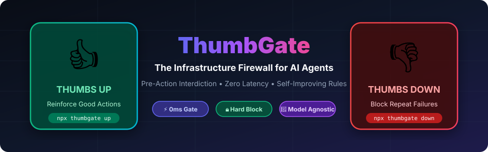
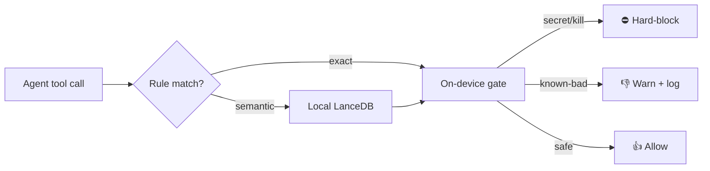

# ThumbGate 👍 👎

<p align="center">
  <a href="https://thumbgate.ai">
    
  </a>
</p>

<p align="center">
  <b>Self-improving pre-action firewall for AI coding agents</b><br>
  Intercept risky tool calls (<code>rm -rf</code>, <code>git push --force</code>, secret leaks) <em>before</em> they run.
</p>

<p align="center">
  <a href="https://mcptoplist.com/server/glama%2FIgorGanapolsky%2FThumbGate"></a>
  <a href="https://github.com/IgorGanapolsky/ThumbGate/actions/workflows/ci.yml"></a>
  <a href="https://www.npmjs.com/package/thumbgate"></a>
  <a href="LICENSE"></a>
</p>

<p align="center">
  <a href="#quick-start"></a>
  <a href="https://thumbgate.ai/#demo?utm_source=github&utm_medium=readme"></a>
  <a href="https://thumbgate.ai/go/gpt?utm_source=github&utm_medium=readme"></a>
  <a href="https://thumbgate.ai/checkout/pro?utm_source=github&utm_medium=readme"></a>
</p>

---

## What it does

ThumbGate sits in your agent's **PreToolUse** path and evaluates proposed tool calls **before execution**:

| Verdict | Default behavior |
|---------|------------------|
| ⛔ **Hard-block** | Detected secret leaks; process-kill/environment-override self-disable |
| 👎 **Warn + log** | `rm -rf`, `git push --force`, fetch-and-run, direct guardrail edits — **warn by default** |
| 👍 **Allow** | Everything else |

Set `THUMBGATE_STRICT_ENFORCEMENT=1` for **strict enforcement** (warnings become hard denies).

**Honest disclaimer:** ThumbGate does not update model weights. It intercepts tool calls at runtime. Local-first — no cloud required for the enforcement path.

Works with **Claude Code, Cursor, Codex, Gemini CLI, Amp, Cline, OpenCode**, and other MCP agents.

[](https://thumbgate.ai/#demo?utm_source=github&utm_medium=readme_meme)

```
  Agent tries:   rm -rf tests/
  ThumbGate:     👎 WARN + LOG — "Never delete test directories"
                 Pattern matched: rm.*-rf.*tests
                 Source: your thumbs-down from last Tuesday
                 Strict mode: ⛔ DENY before tool execution
```

---

## Quick Start

```bash
npx thumbgate init                                              # wire PreToolUse hooks
npx thumbgate capture down "Never run DROP on production tables"  # 👎 lesson
npx thumbgate doctor                                            # health check
```

Later `DROP` attempts in the same scope surface the check:

```
⚠️ Check fired: "Never run DROP on production tables"
   Pattern: DROP.*production
   Verdict: 👎 WARN + LOG   (⛔ BLOCK when THUMBGATE_STRICT_ENFORCEMENT=1)
```

**MCP / registry (stdio):**

```bash
npx -y thumbgate serve
```

[**▶ 90-second demo**](https://thumbgate.ai/#demo?utm_source=github&utm_medium=readme&utm_campaign=demo_video) · [GIF walkthrough](docs/media/thumbgate-demo.gif)

---

## Install for your agent

| Agent | Command | Enforcement |
|-------|---------|-------------|
| **Claude Code** | `npx thumbgate init --agent claude-code` | 🛡️ Hard — PreToolUse |
| **Codex** | `npx thumbgate init --agent codex` | 🛡️ Hard — `pre_tool_use` |
| **Gemini CLI** | `npx thumbgate init --agent gemini` | 🛡️ Hard — PreToolUse |
| **ForgeCode** | `npx thumbgate init --agent forge` | 🛡️ Hard — `pre_tool_use` |
| **Cursor** | `npx thumbgate init --agent cursor` | 💬 Advisory — MCP `gate_check` |
| **Cline** | `npx thumbgate init --agent cline` | 💬 Advisory — MCP + `.clinerules` |
| **OpenCode** | `npx thumbgate init --agent opencode` | 💬 Advisory — MCP `gate_check` |
| **Any MCP agent** | `npx thumbgate serve` | 💬 Advisory — MCP `gate_check` |
| **Amp** | `npx thumbgate init --agent amp` | 📝 Feedback capture |

Per-agent guides: [Claude/Codex bridge](plugins/claude-codex-bridge/README.md) · [Codex profile](plugins/codex-profile/README.md) · [Cursor](docs/CURSOR_PLUGIN_OPERATIONS.md) · [MCP setup](docs/MCP_AUTONOMOUS_SETUP.md)

### Machine-wide vs per-project

| Scope | Command | Settings | Lessons | Best for |
|-------|---------|----------|---------|----------|
| **Machine-wide** (default) | `npx thumbgate init` | `~/.claude/settings.json` | `~/.claude/memory/feedback/` | Solo operators; shared local store |
| **Per-project** | `npx thumbgate init --project` | `<repo>/.claude/settings.json` | `<repo>/.claude/memory/feedback/` | Client / compliance isolation |

Both scopes write `mcpServers.thumbgate` plus PreToolUse / UserPromptSubmit / PostToolUse / SessionStart hooks. Machine-wide is the right default for most developers.

**MCP tools (surface):** `gate_check` (read/evaluate proposed tool call), feedback capture + session tools (write), dashboard/stats (read). Destructive agent actions stay blocked/warned by PreToolUse — ThumbGate does not execute user shell commands for you.

---

## Slash commands

`npx thumbgate init` installs these into your agent palette:

| Command | What it does |
|---------|--------------|
| `/thumbgate-dashboard` | Open local project dashboard |
| `/thumbgate-guard` | Turn last mistake into a hard prevention rule |
| `/thumbgate-rules` | List active rules & lessons |
| `/thumbgate-blocked` | Gate stats + enforcement matrix |
| `/thumbgate-protect` | Branch governance + scoped approval |
| `/thumbgate-doctor` | Health-check hooks, MCP, readiness |

---

## Pricing

Free tier: **2 feedback captures/day (10 total)** and **up to 3 active auto-promoted prevention rules**. Pro ($19/mo or $149/yr) is the individual tier for unlimited rules, history-aware lessons, linked feedback session flow, personal dashboard, and DPO export. **Enterprise is custom and scoped after intake**; hosted team lesson sync and a hosted org dashboard are not general availability.

| | Free | Pro ($19/mo or $149/yr) | Enterprise |
|---|---|---|---|
| Local CLI + PreToolUse | ✅ | ✅ | Scoped after intake |
| Feedback captures | 2 feedback captures/day (10 total) | Unlimited | Scoped after intake |
| Active auto-promoted rules | up to 3 active auto-promoted prevention rules | Unlimited | Scoped after intake |
| Personal dashboard + DPO export | — | ✅ | Reviewed during intake |
| Hosted team lesson sync | — | — | Not general availability |
| Hosted org dashboard | — | — | Not general availability |

[**Start free**](https://thumbgate.ai/?utm_source=github&utm_medium=readme) · [**Pro $19/mo**](https://thumbgate.ai/checkout/pro?utm_source=github&utm_medium=readme&utm_campaign=pro) · [**Team Sprint intake ($499)**](https://thumbgate.ai/?utm_source=github&utm_medium=readme#workflow-sprint-intake)

---

## How it works (short)

1. **Capture** 👍/👎 feedback (CLI, MCP, linked feedback session flow / `open_feedback_session`, or [ThumbGate GPT](https://thumbgate.ai/go/gpt?utm_source=github&utm_medium=readme))
2. **Promote** concrete lessons via history-aware lesson distillation into prevention rules
3. **Evaluate** the next proposed tool call against active rules (literal/AST + local vectors)
4. **Allow / warn / deny** before the tool runs

```bash
npx thumbgate brain --write   # → .thumbgate/BRAIN.md (lessons + gates in one artifact)
```

<details>
<summary><b>Architecture diagram & stack</b></summary>

[](https://thumbgate.ai/#how-it-works)


```mermaid
flowchart LR
    A["Agent tool call"] --> B{"Rule match?"}
    B -- exact --> D["On-device gate"]
    B -- semantic --> C["Local LanceDB"]
    C --> D
    D -- secret/kill --> E["⛔ Hard-block"]
    D -- known-bad --> G["👎 Warn + log"]
    D -- safe --> F["👍 Allow"]
```

| Layer | Tech |
|-------|------|
| Storage | SQLite + FTS5, LanceDB, JSONL |
| Intelligence | MemAlign dual recall, Thompson Sampling, local embeddings |
| Interfaces | MCP stdio, HTTP API, CLI (Node.js ≥18) |

</details>

<details>
<summary><b>Built-in checks</b></summary>

```
⛔ secret-exfiltration → hard-block (default)
⛔ self-protect-kill   → hard-block (default)
⛔ self-protect-env    → hard-block (default)
⚠️ force-push          → warn; hard-block under strict
⚠️ protected-branch    → warn; hard-block under strict
⚠️ unresolved-threads  → warn; hard-block under strict
⚠️ package-lock-reset  → warn; hard-block under strict
```

</details>

<details>
<summary><b>CLI cheatsheet</b></summary>

```bash
npx thumbgate init
npx thumbgate doctor
npx thumbgate capture up|down "<text>"
npx thumbgate lessons
npx thumbgate brain --write
npx thumbgate dashboard --open
npx thumbgate break-glass --reason="ThumbGate over-fired"   # 5-min recovery
```

</details>

<details>
<summary><b>Pro: lesson + DPO export</b></summary>

```bash
# Portable lessons
curl -X POST http://localhost:3456/v1/lessons/export \
  -H "Authorization: Bearer $THUMBGATE_API_KEY" \
  -H "Content-Type: application/json" \
  -d '{"outputPath": "./lessons-export.json"}'

# DPO pairs for fine-tuning
curl -X POST http://localhost:3456/v1/dpo/export \
  -H "Authorization: Bearer $THUMBGATE_API_KEY" \
  -o dpo-pairs.jsonl
```

</details>

---

## Docs & integrations

Full index: **[docs/README.md](docs/README.md)**

| Need | Link |
|------|------|
| Verification evidence | [docs/VERIFICATION_EVIDENCE.md](docs/VERIFICATION_EVIDENCE.md) |
| First-dollar activation | [docs/FIRST_DOLLAR_PLAYBOOK.md](docs/FIRST_DOLLAR_PLAYBOOK.md) |
| Security policy | [SECURITY.md](SECURITY.md) |
| Threat model | [THREAT_MODEL.md](THREAT_MODEL.md) |
| Federal / regulated | [docs/FEDERAL.md](docs/FEDERAL.md) |
| Commercial truth | [docs/COMMERCIAL_TRUTH.md](docs/COMMERCIAL_TRUTH.md) |
| ChatGPT / GPT Action | [thumbgate.ai/chatgpt-app](https://thumbgate.ai/chatgpt-app) |
| Claude Desktop `.mcpb` | [latest release](https://github.com/IgorGanapolsky/ThumbGate/releases/latest/download/thumbgate-claude-desktop.mcpb) |
| VS Code / JetBrains | [plugins/vscode-extension](plugins/vscode-extension/README.md) · [plugins/jetbrains-plugin](plugins/jetbrains-plugin/README.md) |
| Issues / PRs | [GitHub Issues](https://github.com/IgorGanapolsky/ThumbGate/issues) · [PR template](.github/pull_request_template.md) |

**FAQ (one-liners):** Not a fine-tuner (runtime intercept only). Different from `CLAUDE.md` / `.cursorrules` (those are context; ThumbGate is an external allow/warn/deny before tools run).

---

## Who builds this

**Igor Ganapolsky** — payments (Stripe/Connect), AI agent guardrails/MCP, Android + backends. Small number of contract slots: **$120–150/hr, 1099, remote US**. [LinkedIn](https://www.linkedin.com/in/igor-ganapolsky-859317343/) · [thumbgate.ai](https://thumbgate.ai)

## License

MIT — see [LICENSE](LICENSE). Project policy: [SECURITY.md](SECURITY.md) · [THREAT_MODEL.md](THREAT_MODEL.md).
