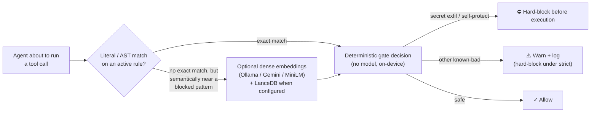

# ThumbGate

[](https://mcptoplist.com/server/glama%2FIgorGanapolsky%2FThumbGate)

<p align="center">
  <a href="https://thumbgate.ai">
    
  </a>
</p>

**Self-Improving Firewall for Your AI Agents.** AI coding agents repeat mistakes — and one wrong tool call can wipe a directory, leak a key, or push broken code.

ThumbGate is the local-first Pre-Action Checks engine for AI coding agents. It runs in the PreToolUse hook on your machine: it evaluates a proposed tool call and logs the decision before tool execution. It **hard-blocks detected secret leaks and two direct self-disable command classes by default** — commands that terminate the ThumbGate gate process or enable its bypass environment override. Other high-risk classes, including destructive deletes (`rm -rf`), force-push, fetch-and-run, direct guardrail-file edits, off-scope edits, and deploys, **warn and log by default**. Set `THUMBGATE_STRICT_ENFORCEMENT=1` to preserve deny decisions for every matched blocking rule. Works across configured Claude Code, Cursor, Codex, Gemini, Amp, Cline, and OpenCode integrations. No server is required on the local enforcement path. (Regulated-industry policy templates are roadmap directions, not shipped compliance claims.)

Accepted feedback is stored as local lessons. Repeated concrete failures can become prevention rules that promote from warnings to blocking gates; relevant lessons are re-ranked for each proposed action; stale auto-promoted gates expire; and stale lessons archive. The firewall improves from operations without retraining the model.

<p align="center">
  
</p>

```
  Agent tries:   rm -rf tests/
  ThumbGate:     ⚠️ WARN + LOG — "Never delete test directories"
                 Pattern matched: rm.*-rf.*tests
                 Source: your thumbs-down from last Tuesday
                 Strict mode: DENY before tool execution
```

```bash
npx thumbgate init   # auto-detects the supported agent and wires its integration
```

### MCP / Glama / registry install (stdio)

Directories and clients that install ThumbGate as an MCP server must start **stdio MCP**, not the HTTP API:

```bash
npx -y thumbgate serve
```

- Equivalent: `npx -y thumbgate mcp`
- Do **not** use `npm start` for MCP — that launches the hosted HTTP API (`src/api/server.js`), not the agent-facing stdio server.
- Canonical package metadata: `server.json` (`runtimeHint: npx` + `packageArguments: ["serve"]`), Smithery: `smithery.yaml`, maintainers: `glama.json`.
- Product name is **ThumbGate** only (npm: `thumbgate`). Retired legacy package aliases are not active product surfaces.

Works with **Claude Code, Cursor, Codex, Gemini CLI, Amp, Cline, OpenCode** and MCP-compatible agents after their integration is configured. Free tier: 2 feedback captures/day (10 total) and up to 3 active auto-promoted prevention rules. [Pro: $19/mo or $149/yr](https://thumbgate.ai/checkout/pro?utm_source=github&utm_medium=readme) is the individual tier for unlimited rules, history-aware lessons, feedback sessions, a personal dashboard, and DPO export. Enterprise is custom and scoped after intake; hosted team sync and a hosted org dashboard are not in the current general-availability runtime.

[](https://github.com/IgorGanapolsky/ThumbGate/actions/workflows/ci.yml)
[](https://www.npmjs.com/package/thumbgate)
[](LICENSE)

---

> *"A better dashboard doesn't make the agents more reliable. The hard part isn't visibility. It's trust."*
>
> — **Rob May**, CEO & co-founder, Neurometric AI, quoted in [The New Stack](https://thenewstack.io/claude-code-agent-view/) on Anthropic's Claude Code Agent View (May 2026).
>
> ThumbGate is our open-source attempt at that trust problem: inspectable PreToolUse decisions, accepted feedback captured as lessons, and recurring failures promoted into reviewable rules.

---

## Agentic development cycle fit

Agentic development is becoming a loop: **Guide → Generate → Verify → Solve**. ThumbGate adds a pre-action decision point before tool execution.

- **Guide:** standards, prior thumbs-downs, and approval policies become concrete context.
- **Generate:** Claude Code, Cursor, Codex, Gemini, Amp, Cline, OpenCode, and MCP agents keep producing plans and tool calls.
- **Verify:** risky actions need evidence before execution, not just after PR review.
- **Solve:** flagged or denied failures can become reusable lessons, prevention rules, DPO exports, and audit events.

In that stack, ThumbGate is the pre-action gate between generated intent and executed action.

---

## Discoverable slash-commands — the guardrail layer for spec-driven agents

Spec-driven agent frameworks like **GSD** (get-shit-done) and **GitHub Spec Kit** are great at *planning and generating* work — they expose dozens of discoverable `/gsd-*` / `/specify` commands in the agent command palette. ThumbGate is the **guardrail layer for spec-driven agents**: it sits *after* the plan, on the boundary between a generated tool call and its execution. It works **alongside GSD / Spec-Kit, not instead of them** — they decide *what* to build; configured ThumbGate policies evaluate the proposed actions used to build it.

`npx thumbgate init` installs these commands into your agent's palette (`.claude/commands/`, `.gemini/commands/`, `.antigravitycli/commands/`) so the enforcement layer is as browsable as the planning layer:

| Command | What it does | Wraps (existing capability) |
|---------|--------------|------------------------------|
| **`/thumbgate-dashboard`** | **Open the local project dashboard in your browser** (lessons, checks, tokens saved) | **`npx thumbgate dashboard --open`** (global bin after `npm i -g`) |
| `/thumbgate-guard` | Turn the last agent mistake into a hard prevention rule | `capture_feedback` + `thumbgate force-gate` |
| `/thumbgate-rules` | List the active prevention rules + lessons guarding this repo | `prevention_rules`, `get_reliability_rules`, `search_lessons` |
| `/thumbgate-blocked` | Show what's actually been blocked — gate stats + enforcement matrix | `gate_stats`, `enforcement_matrix` |
| `/thumbgate-protect` | Show branch/release governance; grant a scoped, expiring approval | `get_branch_governance`, `approve_protected_action` |
| `/thumbgate-doctor` | Health-check the wiring (hooks, MCP, agent-readiness) | `thumbgate doctor` |

> **Open the dashboard anytime:** after `npx thumbgate init`, run **`npx thumbgate dashboard --open`** (works without a global install). Type **`/thumbgate-dashboard`** in Claude Code / Cursor, or **`/project:thumbgate-dashboard`** in Grok. After `npm i -g thumbgate`, the **`thumbgate-dashboard`** bin is also on your PATH.

Each is a thin wrapper over an existing MCP tool or CLI command — **no new enforcement logic, just discoverability**.

---

## 🎬 90-second demo

Watch the force-push scenario: an agent proposes `git push --force`, the matching rule is flagged and logged by default, and the tool call is denied when you run with `THUMBGATE_STRICT_ENFORCEMENT=1`.

[**▶ Watch the 90-second demo**](https://thumbgate.ai/#demo?utm_source=github&utm_medium=readme&utm_campaign=demo_video) · [Script](docs/marketing/demo-video-script.md) · [ElevenLabs narration: `npm run demo:voiceover`](scripts/generate-demo-voiceover.js)

<!-- Video embed lives on the landing page and YouTube. Script + voiceover automation ship with the repo so anyone can re-record. -->

---

## First-dollar activation path

If someone is not already bought into ThumbGate, do not lead with architecture. Lead with one repeated mistake.

1. **Show the pain:** open the **[ThumbGate GPT](https://thumbgate.ai/go/gpt?utm_source=github&utm_medium=readme&utm_campaign=first_dollar_activation&cta_id=readme_first_dollar_open_gpt&cta_placement=readme_first_dollar)** and paste the bad answer, risky command, deploy, PR action, or agent plan before it runs again.
2. **Capture the lesson:** type `thumbs down:` or `thumbs up:` with one concrete sentence. Native ChatGPT rating buttons are not the ThumbGate capture path; typed feedback is.
3. **Enforce the repeat:** run `npx thumbgate init` where the agent executes so the lesson can become one of your Pre-Action Checks instead of another reminder.
4. **Upgrade only after proof:** Solo Pro is for the dashboard, DPO export, reviewable evidence, and higher capture limits after one real caught repeat. Enterprise starts with the Workflow Hardening Sprint around one repeated failure, one owner, and one proof review.

The buying question is simple: **what repeated AI mistake would be worth catching before the tool executes?**

---

## Ideal customer

The first high-value customer is an enterprise engineering, security, or platform leader whose team already uses AI coding agents in high-blast-radius workflows: finance, healthcare, insurance, public sector, critical infrastructure, manufacturing, or any audited software-delivery environment.

The pain is security and operational risk; the buying context is enterprise AI-agent governance. ThumbGate owns the enforcement boundary: known-bad agent actions are flagged or blocked before shell, repo, CI/CD, SaaS, or cloud tool calls execute.

For partners building detection or coordination layers, ThumbGate is the downstream enforcement surface. Detection systems identify drift, stale shared reality, or risky workflow intent; ThumbGate turns the approved finding into a PreToolUse prevention rule with auditable execution evidence.

---

## The Problem — repeated failures consume model, tool, and review time

When an agent repeats a failed action, the cost is not just the model call. It is also the attempted tool action, diagnosis, remediation, and review. ThumbGate records concrete corrections so recurring failures can become explicit checks instead of relying on the model to remember a prior session.

## The Solution — evaluate the proposed tool call before execution

`PreToolUse` runs **after the model has proposed a tool call and before the tool executes**. ThumbGate therefore does not claim that a gate decision makes the model generation free. A denial can avoid downstream execution and remediation, while a warning gives the agent another chance to choose a safer plan.

The dashboard's token and dollar savings values are **estimates**, derived from recorded block counts and documented token/price assumptions. They are not measured provider usage or a guarantee of savings. Mark a review checkpoint once, and the dashboard narrows the next pass to the feedback, lessons, and check decisions added since the last review.

---

## 🧠 The Context Brain

Coding-agent sessions do not automatically inherit ThumbGate's prior local lessons, rejected fixes, or repo rules. Without configured context and hooks, a later session can repeat a previously corrected failure.

ThumbGate gives your repo a **context brain**: a single, versioned, agent-readable artifact that consolidates everything the agent should know *before it acts* — the lessons it has learned, the guardrails it must not cross, the gates that are enforced, and the project's own instruction files.

```bash
npx thumbgate brain --write     # → .thumbgate/BRAIN.md
```

Then point each agent at it — add `Read .thumbgate/BRAIN.md first` to the relevant `CLAUDE.md` / `AGENTS.md` integration. Sessions that honor that instruction can load the repo's institutional memory. The generated output is deterministic for the same inputs, so `BRAIN.md` can be reviewed like any other file.

```
# ThumbGate Context Brain
## What this codebase taught its agents (lessons)
- ⛔ Force-pushing to main was rejected — use --force-with-lease on feature branches only
## Guardrails — do NOT repeat these (prevention rules)
- Never run DROP on production tables
## Active enforcement (gates)
- `DROP.*production` → warn + log (hard-block under strict enforcement)
```

Same idea the SEO world is now calling a *"client brain"* — persistent context that AI reads before doing the work — applied to **engineering**: the institutional memory that stops your coding agent from relearning the same lesson on your dime.

---

## Quick Start

```bash
npx thumbgate init                                                         # initializes local state; use --agent for an explicit integration
npx thumbgate capture down "Never run DROP on production tables"
```

That command stores a concrete negative lesson and applies promotion rules. If the pattern becomes an active prevention rule, configured agents in the same install scope can evaluate a later `DROP` attempt:

```
⚠️ Check fired: "Never run DROP on production tables"
   Pattern: DROP.*production
   Verdict: WARN + LOG   (BLOCK when THUMBGATE_STRICT_ENFORCEMENT=1)
```

---

## Architecture

ThumbGate operates as a 4-layer enforcement stack between your AI agent and your codebase:


### Layer 1: Feedback Capture
Concrete thumbs-up/down feedback can be captured through the MCP protocol, CLI, or a configured GPT Action. Accepted feedback is stored as a structured local lesson with the available context, timestamp, and severity.

### Layer 2: Check Engine
The check engine can promote qualifying recurring lessons into rules. **The runtime gate decision is deterministic** — literal pattern match → AST match → scoped rule lookup. No LLM call runs on the enforcement path.

Where retrieval is needed (an agent is about to run a destructive command not on the literal block list, but semantically similar to a prior rule), ThumbGate uses a **hybrid path**: SQLite+FTS5 / BM25 lexical first, then optional dense embeddings when a real provider is configured (Ollama, Gemini Embedding 2, Core AI, or local Transformers.js defaulting to `Xenova/all-MiniLM-L6-v2`). Dense vectors live in LanceDB (feedback) and a lesson-embedding cache. When no semantic embedder is available, retrieval stays lexical and is labeled `qualityTier=degraded` — never marketed as semantic search. The gate decision itself uses no LLM.

**Thompson Sampling tunes per-rule confidence weights** for soft-gating rules so high-noise rules quiet down and high-signal rules sharpen. It does not decide whether a hard pattern matches. A force-push pattern match is deterministic, while the public runtime warns by default and denies the matching action under strict enforcement.

Rules stay in local ThumbGate runtime state.

### Layer 3: Pre-Action Interception
For agents wired to the hook, ThumbGate evaluates each proposed tool call against active checks before tool execution and records the resulting decision. Detected secret leaks and the self-protect process-kill/environment-override gates deny by default. Direct guardrail-file edits, `rm -rf`, force-push, and fetch-and-run warn and log by default; strict mode preserves matched deny decisions.

### Layer 4: Multi-Agent Distribution (why not a hand-rolled hook?)
Claude Code already ships `permissions.deny` and `PreToolUse` hooks. Cursor and Codex have their own. So why ThumbGate over a hand-written hook?

Two things hand-written hooks structurally cannot do:

1. **Cross-agent reuse.** A `permissions.deny` pattern lives in one agent's config and stays there. ThumbGate integrations configured to use the same local install scope can read the same lesson and rule store across Claude Code, Codex, Gemini CLI, Cline, OpenCode, and Amp.
2. **Learning loop.** A hand-written hook covers exactly the patterns you wrote. ThumbGate can promote qualifying recurring failures into rules, tune soft-rule confidence weights from outcomes (Thompson Sampling, see Layer 2), and retrieve semantically near patterns with local embeddings.

Hand-rolled hooks are the right tool for a small, static denylist you maintain by hand. ThumbGate is useful when configured agent integrations should evaluate the same local lessons and rules.

Prompt engineering still matters, but it is only the starting point. ThumbGate adds prompt evaluation on top: proof lanes, benchmarks, and self-heal checks produce reviewable evidence about whether a prompt and workflow held up under execution. Run `npx thumbgate eval --from-feedback --write-report=.thumbgate/prompt-eval-proof.md` to turn accepted thumbs-up/down feedback into reusable eval cases and a local proof report.

### How ThumbGate knows an AI agent is working

ThumbGate does not treat a plausible response, a successful tool call, or a
demo as task success. The `record_task_outcome` MCP tool and
`POST /v1/task-outcomes` API require a task-level receipt. A receipt is marked
`working: true` only when the task is completed, verification passed, evidence
is present, tool contracts and policy checks passed, no unsupported claim was
recorded, and no side effect was duplicated.

The metrics remain separate so a strong average cannot conceal an unsafe
failure:

| Layer | Measured signals |
|-------|------------------|
| Task | verified completion, evidence-backed completion, first-attempt success, repeated failure, recovery, rollback |
| Tool | contract accuracy, execution success, retry rate, duplicate side effects |
| Safety | unsafe escapes, policy violations, safe-action false blocks |
| Escalation | correct escalation rate and human decision latency |
| Efficiency | p50/p95 latency, total cost, cost per verified success |
| Business | explicit KPI values grouped by unit; no inferred revenue |

```bash
npm run eval:agent-outcomes       # 8 reviewed golden cases; fails on regression
npm run monitor:agent-outcomes    # local production receipts; fails on missing evidence
npm run monitor:agent-outcomes -- --hosted
npm run monitor:agent-outcomes -- --install-schedule
```

Prompt evaluation is deterministic first. JSON outputs are validated against
their declared schema. An LLM judge may add a separate score, but an unavailable
or failed judge is reported as `deterministic_only`; it is never converted into
a neutral pass. Empty feedback or task-outcome datasets return
`insufficient_evidence`.

Task outcome receipts are stored locally in
`.thumbgate/task-outcome-receipts.jsonl`. Observable tool traces exclude raw
hidden reasoning and deterministic tool-argument fingerprints. Human
escalation requests are append-only, must carry evidence and requester
identity, and expire. Decisions require both the ordinary API credential and
an independently revocable `X-ThumbGate-Human-Reviewer-Key`; the decision
actor comes from server-side `THUMBGATE_HUMAN_REVIEWER_ID` configuration, not
from caller-controlled JSON.

The installed daily monitor runs through ThumbGate's local scheduler rather
than consuming a GitHub-hosted cron runner. It reads operator authentication
from the existing environment or local operator config, never from command-line
arguments, and writes a machine-readable report under
`~/.thumbgate/reports/agent-outcome-monitor.json`. The GitHub workflow remains
manual for release-time verification.

The complete five-system architecture review—local RAG, tool-using agents,
multi-agent handoffs, MCP enterprise integration, and production
evaluation/observability—is maintained in
[`VERIFICATION_EVIDENCE.md`](./VERIFICATION_EVIDENCE.md). It answers why each
architecture exists, what can fail, how it is measured and secured, how it is
deployed, and what evidence is required before claiming it works.

The full framework decision and one end-to-end RAG request—tenant authorization,
query transformation, parent-child retrieval, hybrid fusion, reranking,
structured generation, evaluation, and tracing—are documented in
[`docs/RAG_PRODUCTION_ARCHITECTURE.md`](./docs/RAG_PRODUCTION_ARCHITECTURE.md).

### Retrieval & latency: local-first, zero network hops

ThumbGate's latency advantage is structural, not a tuned cloud cluster: there is no retrieval service and no model on the enforcement path, so the gate decision never leaves your machine.


```mermaid
flowchart LR
    A["Agent about to run<br/>a tool call"] --> B{"Literal / AST match<br/>on an active rule?"}
    B -- "exact match" --> D["Deterministic gate decision<br/>(no model, on-device)"]
    B -- "no exact match, but<br/>semantically near a<br/>blocked pattern" --> C["Optional dense embeddings<br/>(Ollama / Gemini / MiniLM)<br/>+ LanceDB when configured"]
    C --> D
    D -- "secret exfil / self-protect" --> E["⛔ Hard-block before execution"]
    D -- "other known-bad" --> G["⚠️ Warn + log<br/>(hard-block under strict)"]
    D -- "safe" --> F["✓ Allow"]
```

- **Deterministic first.** Most decisions are a local literal or AST pattern match against active rules and do not require embeddings.
- **Optional dense semantic fallback.** When an action isn't on the literal block list but is near a prior lesson, hybrid retrieval fuses lexical + dense ranks (RRF) and multi-stage rerank (BM25F → MaxSim → heuristic pair CE). Dense requires a configured embedder; otherwise the system stays lexical and reports degraded quality honestly.
- **No LLM on the enforcement path.** The gate never calls a model to decide allow, warn, or deny. Thompson Sampling only tunes soft-rule confidence weights; hard-pattern matching remains deterministic, and the enforcement posture determines whether a match warns or denies (see Layer 2).

The enforcement decision is local: there is no cloud retrieval or model-inference hop on that path. Measure end-to-end latency in your own agent and machine configuration.

### Managed model benchmark lane

When a new managed model drops, do not swap ThumbGate over on vendor claims alone. Rank it against the actual ThumbGate workload first:

```bash
npx thumbgate model-candidates --workload=pretool-gating --json
npx thumbgate model-candidates --workload=long-trace-review --provider=openai-compatible --gateway=tinker --json
```

The catalog currently includes the April 23, 2026 Tinker additions:

- `tinker/qwen3.6-35b-a3b` for pre-action gating, agentic coding, and tool-use
- `tinker/qwen3.6-27b` for the cheap fast-path
- `tinker/kimi-k2.6-128k` for long-trace review and multi-agent sessions

Each recommendation ships with the benchmark commands to run next: feedback-derived prompt eval, `gate-eval`, and `thumbgate bench`. For whole-repo clone claims, add `npx thumbgate bench --programbench-smoke` to generate a ProgramBench-style cleanroom proof report without claiming an official ProgramBench score. That keeps model selection evidence-backed instead of hype-driven.


---

## Install for Your Agent

Enforcement depends on what the harness lets us intercept, so the table says which
you get. This distinction is real: with a pre-tool hook ThumbGate stops the action
before it runs; over MCP only, ThumbGate answers `gate_check` and the agent decides
whether to obey.

| Agent | Command | Enforcement |
|-------|---------|-------------|
| **Claude Code** | `npx thumbgate init --agent claude-code` | Hard — PreToolUse hook |
| **Codex** | `npx thumbgate init --agent codex` | Hard — `pre_tool_use` hook |
| **Gemini CLI** | `npx thumbgate init --agent gemini` | Hard — PreToolUse hook |
| **ForgeCode** | `npx thumbgate init --agent forge` | Hard — `pre_tool_use` trigger |
| **Cursor** | `npx thumbgate init --agent cursor` | Advisory — MCP `gate_check` |
| **Cline** (Roo Code successor) | `npx thumbgate init --agent cline` | Advisory — MCP `gate_check` + `.clinerules` |
| **OpenCode** | `npx thumbgate init --agent opencode` | Advisory — MCP `gate_check` |
| **Any MCP agent** | `npx thumbgate serve` | Advisory — MCP `gate_check` |
| **Amp** | `npx thumbgate init --agent amp` | Feedback capture only |
| **Claude Desktop** | [Download extension bundle](https://github.com/IgorGanapolsky/ThumbGate/releases/latest/download/thumbgate-claude-desktop.mcpb) | Advisory — MCP |
| **VS Code / Open VSX** | [plugins/vscode-extension/README.md](plugins/vscode-extension/README.md) | See plugin README |
| **Antigravity-compatible** | [plugins/antigravity-extension/INSTALL.md](plugins/antigravity-extension/INSTALL.md) | See plugin README |
| **JetBrains** | [plugins/jetbrains-plugin/README.md](plugins/jetbrains-plugin/README.md) | See plugin README |

**Advisory means the agent can ignore it.** Harnesses without a pre-tool hook expose no
interception point, so ThumbGate cannot stop the call itself — it returns a verdict the
agent is instructed to honor. Treat advisory coverage as a strong default, not a
guarantee, and prefer a hard-enforcement harness for anything irreversible.

The gate is **model-agnostic**: verdicts come from deterministic policy evaluation over
the proposed tool call (`scripts/gates-engine.js`), never from an LLM. Swapping the model
behind any harness does not change what is allowed.

> **Enforcement posture:** ThumbGate ships **warn-by-default** — a matched gate is logged
> and surfaced, not blocked. Set `THUMBGATE_STRICT_ENFORCEMENT=1` to hard-block. The
> `gate_check` tool reports `warn` (never `allow`) when a gate matched but posture
> downgraded it, so an agent is never told a flagged action is fine.

### Install scope: machine-wide vs per-project

ThumbGate supports two install scopes. Pick once when you install — you can switch later by re-running with the other flag.

| Scope | Command | Settings file | Lesson DB + dashboard live in | When to use |
|-------|---------|---------------|--------------------------------|-------------|
| **Machine-wide** (default) | `npx thumbgate init` | `~/.claude/settings.json` | `~/.claude/memory/feedback/` | Solo operator — configured repos can use the same machine-local feedback store. Matching actions are evaluated according to the active policy; cross-repo blocking is not automatic without the relevant integration and rule. |
| **Per-project** | `npx thumbgate init --project` (in the repo root) | `<repo>/.claude/settings.json` | `<repo>/.claude/memory/feedback/` | Client work, compliance, or multi-tenant — **separate dashboard per repo**, lessons stay isolated, audit trail belongs to the repo. |

Both scopes write `mcpServers.thumbgate` + the PreToolUse / UserPromptSubmit / PostToolUse / SessionStart hooks; the only difference is *where*. Machine-wide is the right default for most developers. Switch to `--project` only when you have a reason to keep lessons from bleeding between repos.

> Per-project lesson DBs live under each repo's `.claude/memory/feedback/` and **must stay gitignored** — they're a runtime store, not source. ThumbGate's bundled `.gitignore` template handles this.

### Status bar proof


Claude renders the live ThumbGate footer today. `npx thumbgate init --agent codex` now installs the full Codex hook bundle and writes the ThumbGate `statusLine` target into `~/.codex/config.json` so you can test it on your local Codex build immediately.

### Install Codex Plugin

Open the Codex plugin install page or download the standalone bundle from GitHub Releases. The Codex launcher resolves `thumbgate@latest` when MCP and hooks start, so published npm fixes reach active Codex installs without hand-editing `~/.codex/config.toml`.

1. Install page: [thumbgate.ai/codex-plugin](https://thumbgate.ai/codex-plugin)
2. Direct zip: [thumbgate-codex-plugin.zip](https://github.com/IgorGanapolsky/ThumbGate/releases/latest/download/thumbgate-codex-plugin.zip)
3. Follow: [plugins/codex-profile/INSTALL.md](plugins/codex-profile/INSTALL.md)

### Install ChatGPT App / GPT Action

ChatGPT is the advice, checkpointing, and typed-feedback surface; ThumbGate's hard enforcement still runs locally in Codex, Claude Code, Cursor, Gemini CLI, Amp, OpenCode, MCP, or CI after install.

1. App page: [thumbgate.ai/chatgpt-app](https://thumbgate.ai/chatgpt-app)
2. Live GPT: [thumbgate.ai/go/gpt](https://thumbgate.ai/go/gpt?utm_source=github&utm_medium=readme&utm_campaign=chatgpt_app)
3. GPT Action schema: [thumbgate.ai/openapi.yaml](https://thumbgate.ai/openapi.yaml)
4. Follow: [adapters/chatgpt/INSTALL.md](adapters/chatgpt/INSTALL.md)

---

## How It Works

```
  STEP 1              STEP 2                 STEP 3
  ────────            ────────               ────────

  You react           ThumbGate learns       The check holds

  👎 on a bad    ──►  Accepted feedback ──►  A recurring failure
  agent action        becomes a lesson       can become a rule:
  👍 on a good   ──►  Good pattern gets      🚦 flagged + logged
  agent action        reinforced             (hard-blocked for
                                             secret exfil / strict
                                             mode, or ✅ allowed)
```

Concrete feedback can reduce manual rule-writing while keeping the resulting lessons and rules inspectable.

---

ThumbGate sells three concrete outcomes:

- **Prevent expensive AI mistakes** — catch bad commands, destructive database actions, unsafe publishes, and risky API calls before they run.
- **Catch repeated AI mistakes** — turn recurring failures into rules that warn and log by default, hard-block detected secret leaks and direct self-disable commands, and deny matched blocking rules under strict enforcement.
- **Turn AI into a reliable operator** — move from a smart assistant that apologizes after damage to a production-ready operator with checkpoints, proof, and enforcement.
- **Measure prompts instead of rewriting them blindly** — use `thumbgate eval --from-feedback`, proof lanes, ThumbGate Bench, and `self-heal:check` to evaluate whether prompts and workflows actually improved behavior.

---

## Use Cases

### Developer Workflows
- **Catch force-push to main** — Check flags `git push --force` on protected branches before it runs, and hard-blocks it under `THUMBGATE_STRICT_ENFORCEMENT=1`
- **Catch repeated migration failures** — accepted feedback becomes a searchable lesson; recurring patterns can become checks
- **Flag unauthorized file edits** — path-based rules warn by default and deny matching actions under strict enforcement
- **Local lessons across sessions** — configured integrations can load accepted feedback from the same local store
- **Portable lesson handoff** — Pro export/import moves reviewable lesson bundles between operator-managed instances
- **Outcome-derived proposals** — evaluation lanes can propose rules for operator review

### Enterprise & Regulated Industries (roadmap / templates)

These are policy-template directions on the roadmap, not customer-proven compliance capabilities. They build on the same gate engine:

- **Legal AI intake governance** — templates targeting unauthorized practice of law (ABA Rule 5.5), conflict-of-interest clearance before fact collection (Rules 1.7/1.9/1.10), and keeping privileged content inside firm boundaries (Rule 1.6)
- **Financial compliance** — gate templates for AI-generated trade recommendations, unauthorized disclosures, and approval chains before customer-facing outputs
- **Healthcare** — templates to keep AI agents from providing medical diagnoses, route data along HIPAA-compliant paths, and require clinician review before patient-facing content
- **Local decision records** — gate results preserve the decision and the rule, reason, timestamp, and context fields available to that evaluation

[Talk to us about regulated templates →](https://thumbgate.ai/dashboard)

---

## Built-in Checks

```
⛔ secret-exfiltration → hard-blocks detected secret exposure (default)
⛔ self-protect-kill   → blocks direct process termination (default)
⛔ self-protect-env    → blocks direct ThumbGate env override (default)
⚠️ force-push          → flags git push --force        (hard-block under strict)
⚠️ protected-branch    → flags direct push to main      (hard-block under strict)
⚠️ unresolved-threads  → flags push with open reviews   (hard-block under strict)
⚠️ package-lock-reset  → flags destructive lock edits   (hard-block under strict)

Configured hooks record decisions for evaluated calls. Detected secret leaks and
the process-kill/environment-override self-protect gates deny by default. Direct
guardrail-file edits, rm -rf, force-push, and fetch-and-run warn and log by
default; matched blocking rules deny under THUMBGATE_STRICT_ENFORCEMENT=1.

+ custom prevention rules for project-specific failures
```

---

## CLI Reference

```bash
npx thumbgate init                                              # detect agent, wire hooks
npx thumbgate doctor                                            # health check
npx thumbgate capture up|down "<text>"                         # capture a signal as a stored lesson (positional format)
npx thumbgate lessons                                           # see what's been learned
npx thumbgate brain --write                                     # build .thumbgate/BRAIN.md — the agent-readable context brain
npx thumbgate explore    # terminal explorer for lessons, checks, stats
npx thumbgate background-governance  # review background-agent run risk
npx thumbgate model-candidates --workload=dashboard-analysis --provider=openai --json  # evaluate GPT-5.5 routing
npx thumbgate native-messaging-audit  # inspect local browser bridges and extension hosts
npx thumbgate dashboard --open                                  # open local project-scoped dashboard in browser
thumbgate-dashboard                                             # global bin after npm i -g thumbgate; agents: /thumbgate-dashboard (Claude/Cursor) or /project:thumbgate-dashboard (Grok)
npx thumbgate check-update                                      # check if a new version is available on npm/GitHub
npx thumbgate self-update                                       # update ThumbGate to the latest version globally
npx thumbgate serve      # start MCP server on stdio
npx thumbgate bench      # run reliability benchmark
npx thumbgate bench --programbench-smoke  # include cleanroom whole-repo proof lane
npx thumbgate break-glass --reason="ThumbGate over-fired"  # short TTL recovery for gate over-fire
```

### Recovery if a gate over-fires

ThumbGate should block repeated unsafe actions, not trap the operator. If a noisy rule or stale memory pattern blocks the hook/settings change you need to recover, open a short-lived break-glass window:

```bash
npx thumbgate break-glass --reason="ThumbGate over-fired and blocked operator recovery"
```

What this unlocks for up to 5 minutes:

- Edits to `.claude/settings.local.json`, `.claude/settings.json`, `.codex/config.toml`, and the same files inside nested workspaces.
- The short-lived proof gates used for PR recovery: `pr_create_allowed` and `pr_threads_checked`.

What stays gated:

- Force pushes, protected-branch pushes, broad `rm -rf`, unsafe `chmod`, package publishes/releases, and local-only remote side effects.
- Arbitrary protected files such as `README.md`, `AGENTS.md`, policy bundles, or credentials.

Verify the recovery window and runtime health before continuing:

```bash
npx thumbgate break-glass --reason="verify recovery path" --json
npx thumbgate doctor
```

If you change MCP or hook settings, restart the affected agent session so Claude Code, Cursor, Codex, or another runtime reloads `.mcp.json` and local settings.

---

## Pricing

| | Free | Pro ($19/mo) | Enterprise |
|---|---|---|---|
| Local CLI + PreToolUse checks | ✅ | ✅ | Existing public runtime |
| Feedback captures | 2/day (10 total) | Unlimited | Scoped after intake |
| Active auto-promoted prevention rules | 3 | Unlimited | Scoped after intake |
| Configured agent integrations | ✅ | ✅ | Scoped after intake |
| Personal dashboard | — | ✅ | Reviewed during intake |
| DPO export (model fine-tuning data) | — | ✅ | Reviewed during intake |
| Lesson export/import | — | ✅ | Operator-managed bundles |
| Hosted team lesson sync | — | — | Not general availability |
| Hosted org dashboard | — | — | Not general availability |
| Approval boundaries + rollout proof | — | — | Scoped after intake |

The free tier gives you 2 feedback captures/day (10 total) and up to 3 active auto-promoted prevention rules. Documented integration paths for Claude Code, Cursor, Codex, Gemini, Amp, Cline, and OpenCode ship free; each agent must be configured through its hook or MCP setup.

Pro ($19/mo or $149/yr) is the individual tier: it removes the rule cap and adds history-aware lesson recall, lesson search, DPO export, and a personal dashboard. Enterprise is custom and scoped after intake around one workflow, its approval boundaries, rollback plan, evidence requirements, and rollout support. Hosted team lesson sync, hosted org dashboards, SSO, SIEM, and compliance packaging are not general-availability features in the current public runtime.

**Enterprise intake path:** the **Workflow Hardening Sprint** scopes one repeated failure before any broader rollout commitment. **[Start intake →](https://thumbgate.ai/?utm_source=github&utm_medium=readme&utm_campaign=team_rollout#workflow-sprint-intake)**

**Local technical path:** install the CLI and use `init` plus the documented setup for the agent you already use.

**Paid path for individual operators:** [ThumbGate Pro](https://thumbgate.ai/checkout/pro?utm_source=github&utm_medium=readme&utm_campaign=pro_page) is the self-serve side lane for a personal dashboard and export-ready evidence.

**[Start free](https://thumbgate.ai/?utm_source=github&utm_medium=readme)** · **[See Pro](https://thumbgate.ai/checkout/pro?utm_source=github&utm_medium=readme)** · **[Team Sprint intake](https://thumbgate.ai/?utm_source=github&utm_medium=readme#workflow-sprint-intake)**

---

## Portable Lesson Export/Import (Pro)

ThumbGate Pro can export lessons as portable bundles and import them into another operator-managed ThumbGate instance. This is an explicit export/import workflow, not automatic hosted sync or org-wide enforcement.

**Export lessons from one project:**

```bash
curl -X POST http://localhost:3456/v1/lessons/export \
  -H "Authorization: Bearer $THUMBGATE_API_KEY" \
  -H "Content-Type: application/json" \
  -d '{"outputPath": "./lessons-export.json"}'
```

Filter by signal or tags:

```bash
curl -X POST http://localhost:3456/v1/lessons/export \
  -H "Authorization: Bearer $THUMBGATE_API_KEY" \
  -H "Content-Type: application/json" \
  -d '{"signal": "down", "tags": ["push-notifications", "ci"]}'
```

**Import into another operator-managed ThumbGate instance:**

```bash
curl -X POST http://localhost:3456/v1/lessons/import \
  -H "Authorization: Bearer $THUMBGATE_API_KEY" \
  -H "Content-Type: application/json" \
  -d @lessons-export.json
```

What happens on import:
- **Deduplication** — lessons with the same ID or title+signal are skipped
- **Provenance tracking** — every imported lesson is tagged `team-import` with original source project, export timestamp, and original ID
- **No overwrite** — import is additive; existing lessons are never modified

The export bundle includes full lesson metadata: signal, title, context, tags, failure type, skill, structured rules, and diagnosis. It's the same data you see in the lesson detail dashboard — portable as JSON.

**Use cases:**
- Move reviewable lesson patterns across repos under operator control
- Onboard another project with an explicitly reviewed lesson bundle
- Export lessons before a project handoff so institutional knowledge transfers
- Feed lessons from multiple teams into a centralized DPO training pipeline

---

## DPO Export for Fine-Tuning (Pro)

Accepted thumbs-up and thumbs-down feedback can supply preference data. ThumbGate Pro exports eligible captured feedback as DPO (Direct Preference Optimization) pairs for a separate LoRA or other fine-tuning workflow. The export does not guarantee model behavior; training and evaluation remain operator responsibilities.

**Export DPO pairs:**

```bash
curl -X POST http://localhost:3456/v1/dpo/export \
  -H "Authorization: Bearer $THUMBGATE_API_KEY" \
  -o dpo-pairs.jsonl
```

**What you get:** JSONL where each line is a preference pair:
- `chosen` — the agent action you thumbed up
- `rejected` — the action you thumbed down for the same task context
- `prompt` — the originating user intent

**Use cases:**
- Fine-tune Llama 3 / Mistral / local models with a LoRA adapter trained on your real mistakes
- Feed into RLAIF or KTO pipelines (KTO export also available via `/v1/kto/export`)
- Build a model that natively avoids your team's known failure patterns — no check at inference time needed

**Why this matters:** Checks can deny matching actions under policy. Fine-tuning may reduce attempts, but only evaluation can establish whether behavior changed.

---

## Tech Stack

| Layer | Technology |
|-------|-----------|
| **Storage** | SQLite + FTS5, LanceDB vectors, JSONL logs |
| **Capture** | 2/day, 10 total on Free; unlimited on Pro, Team, and Enterprise |
| **Intelligence** | MemAlign dual recall, Thompson Sampling |
| **Enforcement** | PreToolUse hook engine, Checks config |
| **Interfaces** | MCP stdio, HTTP API, CLI (Node.js >=18) |
| **Billing** | Stripe |
| **Execution** | Railway, Cloudflare Workers, Docker Sandboxes |
| **Governance** | Workflow Sentinel, control plane, Docker Sandboxes |

Every Changeset is tied to the exact `main` merge commit and generates Verification Evidence for Release Confidence.

---

**Popular buyer questions:** **[AI search topical presence](https://thumbgate.ai/guides/ai-search-topical-presence?utm_source=github&utm_medium=readme&utm_campaign=buyer_questions)** · **[Relational knowledge and AI recommendations](https://thumbgate.ai/guides/relational-knowledge-ai-recommendations?utm_source=github&utm_medium=readme&utm_campaign=buyer_questions)** · **[Background agent governance](https://thumbgate.ai/guides/background-agent-governance?utm_source=github&utm_medium=readme&utm_campaign=buyer_questions)** · **[GPT-5.5 model evaluation](https://thumbgate.ai/guides/gpt-5-5-model-evaluation?utm_source=github&utm_medium=readme&utm_campaign=buyer_questions)** · **[Stop repeated AI agent mistakes](https://thumbgate.ai/guides/stop-repeated-ai-agent-mistakes?utm_source=github&utm_medium=readme&utm_campaign=buyer_questions)** · **[Browser automation safety](https://thumbgate.ai/guides/browser-automation-safety?utm_source=github&utm_medium=readme&utm_campaign=buyer_questions)** · **[Native messaging host security](https://thumbgate.ai/guides/native-messaging-host-security?utm_source=github&utm_medium=readme&utm_campaign=buyer_questions)** · **[Autoresearch agent safety](https://thumbgate.ai/guides/autoresearch-agent-safety?utm_source=github&utm_medium=readme&utm_campaign=buyer_questions)** · **[Cursor guardrails](https://thumbgate.ai/guides/cursor-agent-guardrails?utm_source=github&utm_medium=readme&utm_campaign=buyer_questions)** · **[Codex CLI guardrails](https://thumbgate.ai/guides/codex-cli-guardrails?utm_source=github&utm_medium=readme&utm_campaign=buyer_questions)** · **[Gemini CLI memory + enforcement](https://thumbgate.ai/guides/gemini-cli-feedback-memory?utm_source=github&utm_medium=readme&utm_campaign=buyer_questions)** · **[Google Cloud MCP guardrails](https://thumbgate.ai/guides/gcp-mcp-guardrails?utm_source=github&utm_medium=readme&utm_campaign=buyer_questions)** · **[Roo Code alternative: migrate to Cline](https://thumbgate.ai/guides/roo-code-alternative-cline?utm_source=github&utm_medium=readme&utm_campaign=buyer_questions)**

**Conversational ad / AI-search answer assets:** **[AI Mode ads for agent governance](https://thumbgate.ai/guides/ai-mode-ads-agent-governance?utm_source=github&utm_medium=readme&utm_campaign=buyer_questions)** · **[MCP tool governance](https://thumbgate.ai/guides/mcp-tool-governance?utm_source=github&utm_medium=readme&utm_campaign=buyer_questions)** · **[AI agent pre-action approval gates](https://thumbgate.ai/guides/ai-agent-pre-action-approval-gates?utm_source=github&utm_medium=readme&utm_campaign=buyer_questions)**

**[Workflow Hardening Sprint](https://thumbgate.ai/?utm_source=github&utm_medium=readme&utm_campaign=top_cta#workflow-sprint-intake)** · **[Live Dashboard](https://thumbgate.ai/dashboard?utm_source=github&utm_medium=readme&utm_campaign=top_cta)**

---

## Integrations

- **[ChatGPT App / GPT Action](https://thumbgate.ai/chatgpt-app)** — First-class ChatGPT distribution page with the live GPT, public OpenAPI Action schema, and local enforcement install path
- **[Open ThumbGate GPT](https://thumbgate.ai/go/gpt?utm_source=github&utm_medium=readme&utm_campaign=readme_gpt)** — ThumbGate GPT: start here. Paste agent actions, get advice + checkpointing. No, users do not have to keep chatting inside the ThumbGate GPT to use ThumbGate — the hard enforcement layer still runs where the work happens.
- **[Claude Desktop Extension](https://github.com/IgorGanapolsky/ThumbGate/releases/latest/download/thumbgate-claude-desktop.mcpb)** — One-click install for Claude Desktop
- **[Codex Plugin](https://thumbgate.ai/codex-plugin)** — Auto-updating standalone bundle and install page for Codex CLI
- **[VS Code / Open VSX Extension](plugins/vscode-extension/README.md)** — Marketplace-ready MCP provider and `.vscode/mcp.json` fallback for VS Code-compatible IDEs
- **[Antigravity-compatible VSIX](plugins/antigravity-extension/INSTALL.md)** — Open VSX/direct VSIX install path while Antigravity-specific marketplace support is still unproven
- **[JetBrains Plugin Scaffold](plugins/jetbrains-plugin/README.md)** — IntelliJ/PyCharm Marketplace path for the same `thumbgate@latest` runtime
- **[Perplexity Command Center](docs/PERPLEXITY_MAX_COMMAND_CENTER.md)** — AI-search visibility + lead discovery
- **[ThumbGate Bench](docs/THUMBGATE_BENCH.md)** — Reliability benchmark and ProgramBench-style cleanroom proof lane
- **[Manus AI Skill](skills/thumbgate/SKILL.md)** — ThumbGate integration for Manus AI agents
- **Grafana Cloud revenue evidence** — The npm package includes a PII-free aggregate exporter and importable Loki dashboard. Generate the dashboard locally with `thumbgate-revenue-evidence --dashboard --out thumbgate-revenue-evidence-dashboard.json`. Snapshot preparation is dry-run by default; network delivery requires both `--send` and `THUMBGATE_GRAFANA_ZERO_SPEND_CONFIRMED=1`. Dashboard observations never promote clicks, checkout starts, or intakes into payment or customer claims. Repository operators can use the full [Grafana integration guide](docs/integrations/grafana/README.md).

---

## Feedback Sessions

Give the agent more context when a thumbs-down isn't enough:

```
👎 thumbs down
  └─► open_feedback_session
        └─► "you lied about deployment"    (append_feedback_context)
        └─► "tests were actually failing"  (append_feedback_context)
        └─► finalize_feedback_session
              └─► lesson inferred from full conversation
```

Pro operators can invoke `search_lessons` through MCP and use `npx thumbgate lessons` from the CLI. History-aware feedback sessions and lesson search are Pro capabilities; Free does not include recall or search.

---

## Enterprise Data Chat and Optional Google Adapters

The package includes a local data-chat path over ThumbGate data using lesson retrieval, LanceDB-backed vectors, and an operator-configured LLM. Set `THUMBGATE_LOCAL_LLM_ENDPOINT` to an OpenAI-compatible local endpoint (Ollama, llama.cpp, vLLM, LM Studio, etc.) when you want generated answers without sending dashboard data to Google. This is a local package capability, not a hosted org-dashboard claim.

Google Cloud is an optional adapter, not a dashboard requirement. The package provides setup and guard-adapter code for operators who already use Vertex AI or Dialogflow CX; each deployment and data boundary must be configured and verified in that tenancy.

### Optional Vertex Setup
To wire local ThumbGate scoring to Vertex AI, run:
```bash
npx thumbgate setup-vertex
```
* **Auto-Discovery:** Automatically detects your active authenticated `gcloud` session and active project ID.
* **Auto-Enablement:** Programmatically enables the Vertex AI API in your project.
* **Auto-Configuration:** Writes local Vertex routing settings to your `.env` file.

This command does **not** create or verify a live Dialogflow CX agent. Dialogflow is only relevant when a customer wants ThumbGate guard adapters in front of their own production DFCX agents. On current Google Cloud CLI installs, the old alpha gcloud CX command group is not available; verify Conversational Agents / Dialogflow CX with the Google Cloud console or the official Dialogflow CX REST API (`projects.locations.agents`) before claiming a live DFCX deployment.

### Cost Containment (roadmap / routed calls only)
Google Cloud budget alerts do not themselves stop API traffic. ThumbGate includes local budget-ledger and policy primitives, but a stop condition applies only to provider calls explicitly routed through the configured gate. It is not a cloud billing guarantee, and provider pricing or token usage must come from provider telemetry.

---

## FAQ

**Is ThumbGate a model fine-tuning tool?**
No. ThumbGate does not update model weights. It captures feedback, stores lessons, injects context at runtime, and evaluates proposed tool calls before execution. Detected secret leaks and direct process-kill/environment-override self-disable commands deny by default; strict mode denies every matched blocking rule.

**How is this different from CLAUDE.md or .cursorrules?**
Those are instructions in model context. A configured ThumbGate hook adds an external allow/warn/deny decision before tool execution. Detected secret leaks and direct process-kill/environment-override self-disable commands deny by default; other audited high-risk classes warn and log unless strict mode preserves the matched deny.

**Does it work with my agent?**
ThumbGate ships configuration paths for Claude Code, Claude Desktop, Cursor, Codex, Gemini CLI, Amp, Cline, and OpenCode. The relevant MCP or hook integration must be configured before it evaluates tool calls.

**Is it free?**
The free tier gives you 2 feedback captures/day, 10 total captures, and up to 3 active auto-promoted prevention rules — enough for a solo developer to verify a matching pre-action evaluation before upgrading. Supported MCP and hook integration files ship in the free package.

Pro ($19/mo or $149/yr) is for individual operators and adds history-aware lesson recall, lesson search, unlimited rules, exports, and a personal dashboard. Enterprise is custom and scoped after intake; hosted team sync and a hosted org dashboard are not general availability.

---

## Docs

- [**ThumbGate for Federal Agencies**](docs/FEDERAL.md) — pilot-ready posture, NIST 800-53 control mapping, OMB M-24-10 / EO 14110 alignment. Landing page: [thumbgate.ai/federal](https://thumbgate.ai/federal).
- [First Dollar Playbook](docs/FIRST_DOLLAR_PLAYBOOK.md) — turning one painful workflow into the next booked pilot
- [Commercial Truth](docs/COMMERCIAL_TRUTH.md) — pricing, claims, what we don't say
- [Sales Pipeline Evidence Contract](docs/SALES_PIPELINE_EVIDENCE.md) — stage-specific receipts, audits, and verified-revenue rules
- [Revenue Offer Ladder](docs/REVENUE_OFFER_LADDER.md) — productized diagnostic, sprint, recurring, and Enterprise economics without traction inflation
- [Goal Contracts](docs/GOAL_CONTRACTS.md) — evidence-before-done contracts for multi-agent handoffs
- [Changeset Strategy](docs/CHANGESET_STRATEGY.md) — release notes and version bump enforcement
- [Release Confidence](docs/RELEASE_CONFIDENCE.md) — changesets, version checks, proof lanes
- [Verification Evidence](docs/VERIFICATION_EVIDENCE.md) — proof artifacts
- [Claude Desktop Extension Guide](docs/CLAUDE_DESKTOP_EXTENSION.md)
- [Agent Workflow Contract](WORKFLOW.md) — the agent-run contract for all ThumbGate operations
- [Ready for Agent Intake](https://github.com/IgorGanapolsky/ThumbGate/issues/new?template=ready-for-agent.yml) — ready-for-agent intake template
- [SEO Guide: Claude Code Guardrails](docs/learn/claude-code-guardrails.md)
- [Unsupervised Learning Signals](docs/UL.md) — silent-failure clustering (**on by default** as of 2026-05-21; opt out via `THUMBGATE_SILENT_FAILURE_CLUSTERING=0`; only meaningfully active on workspaces with ≥ 50 tool calls/day)
- [ThumbGate-Core](https://github.com/IgorGanapolsky/ThumbGate-Core) — staging repo for pre-release features plus a handful of internal cache scripts that can't ship publicly. It is **not** the moat: intelligence, ranking, and synthesis land in this public repo by default (~212 of 216 Core scripts already ship publicly). The moat is hosted services + adapter compatibility + dashboard + support — see [MOAT.md](MOAT.md).

---

---

## ThumbGate Pro and Enterprise

ThumbGate is free and MIT-licensed. The paid paths are intentionally separate:

- **Pro ($19/mo or $149/yr)** — individual recall/search, unlimited rules and captures, personal dashboard, and exports
- **Enterprise (custom, intake-led)** — scope one workflow's approval boundaries, rollback plan, evidence requirements, and rollout support
- **Not general availability** — hosted team lesson sync, hosted org dashboards, SSO, SIEM, and compliance packaging

**[Start Pro →](https://thumbgate.ai/checkout/pro?utm_source=github&utm_medium=readme&utm_campaign=pro_page)** · **[Start Enterprise intake →](https://thumbgate.ai/#workflow-sprint-intake)**

---

## Who builds ThumbGate — and hiring me

I'm **Igor Ganapolsky** — I designed and maintain ThumbGate. If you're shipping **payments, AI agents, or Android features** and want them built by someone demonstrably careful with production and with money, I take a small number of **freelance / contract** engagements.

ThumbGate is the receipt, not the pitch: its default policy denies detected secret exfiltration and gate kill/bypass commands, strict mode also denies matching warning-mode checks, and the project publishes a [threat model](THREAT_MODEL.md) stating what the local evaluator does and cannot contain. Documenting where my own guardrails end is the standard I hold client work to.

- **Payments** — Stripe / Stripe Connect: destination charges, split payouts, escrow & milestone release, 3DS/SCA, idempotent webhooks, reconciliation.
- **Applied AI / agents** — tool-use guardrails, MCP servers, orchestration, and evaluation loops (the engineering behind this repo).
- **Android + backend** — native Android and the APIs behind it, shipped end-to-end.

**$120–150/hr, 1099 · remote, US timezones** → **[LinkedIn](https://www.linkedin.com/in/igor-ganapolsky-859317343/)** · **[thumbgate.ai](https://thumbgate.ai)**

> ThumbGate is free and MIT-licensed, and stays that way. If it saved you a costly mistake, the best thank-you is an intro to someone who needs an engineer who ships carefully.

---

## License

MIT. See [LICENSE](LICENSE).
