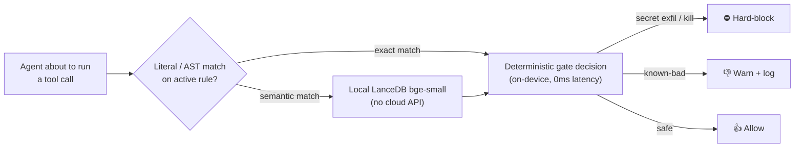

# ThumbGate 👍👎

<p align="center">
  <a href="https://thumbgate.ai">
    
  </a>
</p>

<p align="center">
  <b>Self-Improving Pre-Action Firewall for AI Agents</b><br>
  Intercept risky agent commands (<code>rm -rf</code>, <code>git push --force</code>, secret leaks) before they run.
</p>

<p align="center">
  <a href="https://mcptoplist.com/server/glama%2FIgorGanapolsky%2FThumbGate"></a>
  <a href="https://github.com/IgorGanapolsky/ThumbGate/actions/workflows/ci.yml"></a>
  <a href="https://www.npmjs.com/package/thumbgate"></a>
  <a href="LICENSE"></a>
</p>

<p align="center">
  <a href="#quick-start"></a>
  <a href="https://thumbgate.ai/#demo?utm_source=github&utm_medium=readme"></a>
  <a href="https://thumbgate.ai/go/gpt?utm_source=github&utm_medium=readme"></a>
  <a href="https://thumbgate.ai/checkout/pro?utm_source=github&utm_medium=readme"></a>
</p>

---

### 🛡️ Pre-Action Checks Engine (Thumbs Up 👍 / Thumbs Down 👎)

AI coding agents repeat mistakes — and one rogue tool call can wipe a directory (`rm -rf`), leak a secret, or force-push broken code to production.

ThumbGate runs in your machine's `PreToolUse` hook to evaluate proposed tool calls **before** execution:
- 🚫 **Hard-blocks detected secret leaks** and direct process-kill/environment-override self-disable commands by default.
- ⚠️ **Warns and logs** high-risk classes like `rm -rf`, `git push --force`, fetch-and-run, and direct guardrail edits by default.
- 🔒 Set `THUMBGATE_STRICT_ENFORCEMENT=1` to turn warnings into hard block gates.

*Honest Disclaimer:* ThumbGate does not update model weights — it intercepts tool calls at runtime.

Works seamlessly across **Claude Code, Cursor, Codex, Gemini CLI, Amp, Cline, and OpenCode**. No cloud server is required on the local enforcement path.

---

### 🎨 Clickable Reality Check (Memes & Live Demos)

[](https://thumbgate.ai/#demo?utm_source=github&utm_medium=readme_meme)
*▶ Click meme to launch the interactive live demo on thumbgate.ai*

```
  Agent tries:   rm -rf tests/
  ThumbGate:     👎 WARN + LOG — "Never delete test directories"
                 Pattern matched: rm.*-rf.*tests
                 Source: your thumbs-down from last Tuesday
                 Strict mode: ⛔ DENY before tool execution
```

[](https://thumbgate.ai/#demo?utm_source=github&utm_medium=readme_gif)
*▶ Click GIF to see full strict-mode deny video breakdown*

```bash
npx thumbgate init   # auto-detects your agent and installs PreToolUse hooks 👍
```

Works with **Claude Code, Cursor, Codex, Gemini CLI, Amp, Cline, OpenCode** and MCP-compatible agents after their integration is configured. Free tier: 2 feedback captures/day (10 total) and up to 3 active auto-promoted prevention rules. [Pro: $19/mo or $149/yr](https://thumbgate.ai/checkout/pro?utm_source=github&utm_medium=readme) is the individual tier for unlimited rules, history-aware lessons, `open_feedback_session` feedback session flow, a personal dashboard, and DPO export. Enterprise is custom and scoped after intake; hosted team lesson sync and a hosted org dashboard are not in the current general-availability runtime.

---

## 📌 Interactive Quick Navigation

| Action | Quick Link | Description |
|---|---|---|
| ⚡ **Quick Start** | [Jump to Quick Start](#quick-start) | Install in 1 command: `npx thumbgate init` |
| 💻 **Slash Commands** | [Jump to Commands](#discoverable-slash-commands-—-the-guardrail-layer-for-spec-driven-agents) | Browse `/thumbgate-dashboard`, `/thumbgate-guard`, `/thumbgate-rules` |
| 🤖 **Agent Setup** | [Jump to Agents](#install-for-your-agent) | Configure Claude Code, Cursor, Codex, Gemini, Cline |
| ⚙️ **Scope Config** | [Jump to Scope](#install-scope-machine-wide-vs-per-project) | Machine-wide (`~/.claude/`) vs Per-project (`<repo>/.claude/`) |
| 💼 **Pricing Tier** | [Jump to Pricing](#pricing) | Free vs Pro ($19/mo) vs Enterprise |
| 🔍 **Deep Dives** | [Jump to Technical Accordions](#-deep-dives--technical-architecture) | Expand Architecture, Context Brain, DPO Export, CLI Ref |

---

## Quick Start

```bash
npx thumbgate init                                                         # initializes local state
npx thumbgate capture down "Never run DROP on production tables"           # 👎 captured!
```

That command stores a concrete negative lesson (`👎`). If the pattern becomes an active prevention rule, configured agents in the same scope will evaluate later `DROP` attempts:

```
⚠️ Check fired: "Never run DROP on production tables"
   Pattern: DROP.*production
   Verdict: 👎 WARN + LOG   (⛔ BLOCK when THUMBGATE_STRICT_ENFORCEMENT=1)
```

### MCP / Glama / Registry Install (stdio)

Directories and clients that install ThumbGate as an MCP server start **stdio MCP**:

```bash
npx -y thumbgate serve
```

---

## Discoverable slash-commands — the guardrail layer for spec-driven agents

Spec-driven agent frameworks (GSD, Spec Kit) plan work. ThumbGate is the **guardrail layer**: it sits *after* the plan to gate proposed tool executions.

`npx thumbgate init` installs these slash-commands into your agent's palette (`.claude/commands/`, `.gemini/commands/`, `.antigravitycli/commands/`):

| Command | What it does | Direct Shortcut |
|---------|--------------|-----------------|
| **`/thumbgate-dashboard`** | **Open local project dashboard in browser** 👍 | [`npx thumbgate dashboard --open`](https://thumbgate.ai/dashboard) |
| **`/thumbgate-guard`** | Turn last agent mistake into a hard prevention rule | `capture_feedback` + `thumbgate force-gate` |
| **`/thumbgate-rules`** | List active prevention rules & lessons guarding this repo | `prevention_rules`, `search_lessons` |
| **`/thumbgate-blocked`** | Show gate stats + enforcement matrix | `gate_stats`, `enforcement_matrix` |
| **`/thumbgate-protect`** | Show branch governance; grant temporary approval | `get_branch_governance` |
| **`/thumbgate-doctor`** | Health-check hooks, MCP, and readiness | `thumbgate doctor` |

---

## Install for Your Agent

Click any agent name to open its installation guide:

| Agent | Command | Guide Link | Enforcement |
|-------|---------|------------|-------------|
| **Claude Code** | `npx thumbgate init --agent claude-code` | [Guide](plugins/claude-codex-bridge/README.md) | 🛡️ Hard — PreToolUse hook |
| **Codex** | `npx thumbgate init --agent codex` | [Guide](plugins/codex-profile/README.md) | 🛡️ Hard — `pre_tool_use` hook |
| **Gemini CLI** | `npx thumbgate init --agent gemini` | [Guide](docs/learn/claude-code-guardrails.md) | 🛡️ Hard — PreToolUse hook |
| **ForgeCode** | `npx thumbgate init --agent forge` | [Guide](plugins/claude-codex-bridge/INSTALL.md) | 🛡️ Hard — `pre_tool_use` trigger |
| **Cursor** | `npx thumbgate init --agent cursor` | [Guide](docs/CURSOR_PLUGIN_OPERATIONS.md) | 💬 Advisory — MCP `gate_check` |
| **Cline** | `npx thumbgate init --agent cline` | [Guide](docs/guides/roo-code-alternative-cline.md) | 💬 Advisory — MCP `gate_check` + `.clinerules` |
| **OpenCode** | `npx thumbgate init --agent opencode` | [Guide](docs/MCP_AUTONOMOUS_SETUP.md) | 💬 Advisory — MCP `gate_check` |
| **Any MCP agent** | `npx thumbgate serve` | [Guide](docs/MCP_AUTONOMOUS_SETUP.md) | 💬 Advisory — MCP `gate_check` |
| **Amp** | `npx thumbgate init --agent amp` | [Guide](skills/thumbgate/SKILL.md) | 📝 Feedback capture only |

---

## Install Scope: Machine-wide vs Per-project

ThumbGate supports two install scopes. Pick once when installing:

### 1. Machine-wide (default) 👍
- **Command:** `npx thumbgate init`
- **Settings file:** `~/.claude/settings.json`
- **Lesson DB:** `~/.claude/memory/feedback/`
- **Best for:** Solo operators — configured repos share the machine-local feedback store.

### 2. Per-project 📂
- **Command:** `npx thumbgate init --project` (run in repo root)
- **Settings file:** `<repo>/.claude/settings.json`
- **Lesson DB:** `<repo>/.claude/memory/feedback/`
- **Best for:** Client work, compliance, or multi-tenant setups — separate dashboard per repo.

---

## 🎬 90-second demo

Watch the force-push scenario: an agent proposes `git push --force`, the rule flags it, and strict mode denies it.

[**▶ Watch the 90-second demo**](https://thumbgate.ai/#demo?utm_source=github&utm_medium=readme&utm_campaign=demo_video) · [Script](docs/marketing/demo-video-script.md) · [Voiceover script](scripts/generate-demo-voiceover.js)

---

## First-dollar activation path

1. **Show the pain:** open the **[ThumbGate GPT](https://thumbgate.ai/go/gpt?utm_source=github&utm_medium=readme&utm_campaign=first_dollar_activation&cta_id=readme_first_dollar_open_gpt&cta_placement=readme_first_dollar)** and paste the bad answer or risky command before it runs again.
2. **Capture the lesson:** type `thumbs down:` or `thumbs up:` with one concrete sentence. Native ChatGPT rating buttons are not the ThumbGate capture path; typed feedback is.
3. **Enforce the repeat:** run `npx thumbgate init` so the lesson becomes a Pre-Action Check.
4. **Upgrade only after proof:** Pro adds unlimited rules, personal dashboard, and DPO export.

---

## Pricing

| Feature | Free | Pro ($19/mo or $149/yr) | Enterprise |
|---|---|---|---|
| Local CLI + PreToolUse checks | ✅ | ✅ | Existing public runtime |
| Feedback captures | 2/day (10 total) | Unlimited | Scoped after intake |
| Active auto-promoted prevention rules | 3 | Unlimited | Scoped after intake |
| Configured agent integrations | ✅ | ✅ | Scoped after intake |
| Personal dashboard | — | ✅ | Reviewed during intake |
| DPO export (fine-tuning data) | — | ✅ | Reviewed during intake |
| Hosted team lesson sync | — | — | Not general availability |
| Hosted org dashboard | — | — | Not general availability |

*Note:* Hosted team lesson sync is not general availability. The hosted org dashboard is not general availability. Pro pricing is $19/mo or $149/yr.

[**▶ Start Free**](https://thumbgate.ai/?utm_source=github&utm_medium=readme) · [**▶ See Pro ($19/mo)**](https://thumbgate.ai/checkout/pro?utm_source=github&utm_medium=readme) · [**▶ Team Sprint Intake ($499)**](https://thumbgate.ai/?utm_source=github&utm_medium=readme#workflow-sprint-intake)

---

## 🔍 Deep Dives & Technical Architecture

<details>
<summary><b>🧠 ▶ Click to Expand: The Context Brain (BRAIN.md)</b></summary>

### 🧠 The Context Brain

ThumbGate gives your repo a **context brain**: a single, versioned, agent-readable artifact (`.thumbgate/BRAIN.md`) consolidating lessons, guardrails, history-aware lesson distillation, and enforced gates.

```bash
npx thumbgate brain --write     # → .thumbgate/BRAIN.md
```

```
# ThumbGate Context Brain
## What this codebase taught its agents (lessons)
- 👎 Force-pushing to main was rejected — use --force-with-lease on feature branches only
## Guardrails — do NOT repeat these (prevention rules)
- ⛔ Never run DROP on production tables
## Active enforcement (gates)
- `DROP.*production` → warn + log (hard-block under strict enforcement)
```
</details>

<details>
<summary><b>🏗️ ▶ Click to Expand: Architecture & Zero-Latency Enforcement Engine</b></summary>

### Architecture

ThumbGate operates as a 4-layer enforcement stack:

[](https://thumbgate.ai/#how-it-works)

- **Layer 1: Feedback Capture (👍 / 👎)** via MCP, CLI, or GPT Action. Use the linked feedback session flow to append detailed context.
- **Layer 2: Deterministic Check Engine** (Literal / AST match, LanceDB embeddings, Thompson Sampling).
- **Layer 3: Pre-Action Interception** (Evaluates proposed tool call before execution).
- **Layer 4: Multi-Agent Distribution** (Cross-agent sharing across Claude Code, Codex, Gemini CLI, Cursor).


```mermaid
flowchart LR
    A["Agent about to run<br/>a tool call"] --> B{"Literal / AST match<br/>on active rule?"}
    B -- "exact match" --> D["Deterministic gate decision<br/>(on-device, 0ms latency)"]
    B -- "semantic match" --> C["Local LanceDB bge-small<br/>(no cloud API)"]
    C --> D
    D -- "secret exfil / kill" --> E["⛔ Hard-block"]
    D -- "known-bad" --> G["👎 Warn + log"]
    D -- "safe" --> F["👍 Allow"]
```
</details>

<details>
<summary><b>📊 ▶ Click to Expand: How ThumbGate Knows an AI Agent Is Working</b></summary>

### How ThumbGate knows an AI agent is working

ThumbGate requires a task-level receipt (`record_task_outcome` MCP tool / `POST /v1/task-outcomes`). A receipt is marked `working: true` only when verification passes, evidence is present, and tool contracts hold.

| Layer | Measured signals |
|-------|------------------|
| Task | verified completion, evidence-backed completion, recovery, rollback |
| Tool | contract accuracy, execution success, duplicate side effects |
| Safety | unsafe escapes, policy violations, false blocks |

```bash
npm run eval:agent-outcomes       # 8 reviewed golden cases
npm run monitor:agent-outcomes    # local production receipts
```
</details>

<details>
<summary><b>🏢 ▶ Click to Expand: Use Cases & Regulated Industries Roadmap</b></summary>

### Use Cases

- **Catch force-push to main** 👍 — Check flags `git push --force` on protected branches.
- **Catch repeated migration failures** 👎 — Accepted feedback becomes searchable lessons.
- **Flag unauthorized file edits** 🔒 — Path-based rules warn by default and deny under strict mode.

#### Enterprise & Regulated Industries (roadmap)
- **Legal AI intake governance** (ABA Rule 5.5 / 1.6 / 1.7 clearance).
- **Financial compliance & Healthcare** (HIPAA routing & clinician review).
</details>

<details>
<summary><b>🛡️ ▶ Click to Expand: Built-in Checks Reference</b></summary>

### Built-in Checks

```
⛔ secret-exfiltration → hard-blocks detected secret exposure (default)
⛔ self-protect-kill   → blocks direct process termination (default)
⛔ self-protect-env    → blocks direct ThumbGate env override (default)
⚠️ force-push          → flags git push --force        (hard-block under strict)
⚠️ protected-branch    → flags direct push to main      (hard-block under strict)
⚠️ unresolved-threads  → flags push with open reviews   (hard-block under strict)
⚠️ package-lock-reset  → flags destructive lock edits   (hard-block under strict)
```
</details>

<details>
<summary><b>🛠️ ▶ Click to Expand: CLI Reference & Recovery</b></summary>

### CLI Reference

```bash
npx thumbgate init                                              # detect agent, wire hooks
npx thumbgate doctor                                            # health check
npx thumbgate capture up|down "<text>"                         # capture signal (👍/👎)
npx thumbgate lessons                                           # see stored lessons
npx thumbgate brain --write                                     # build .thumbgate/BRAIN.md
npx thumbgate dashboard --open                                  # open local browser dashboard
npx thumbgate break-glass --reason="ThumbGate over-fired"       # 5-min operator recovery
```
</details>

<details>
<summary><b>📦 ▶ Click to Expand: Portable Lesson Export & DPO Fine-Tuning (Pro)</b></summary>

### Portable Lesson Export/Import (Pro)

```bash
curl -X POST http://localhost:3456/v1/lessons/export \
  -H "Authorization: Bearer $THUMBGATE_API_KEY" \
  -H "Content-Type: application/json" \
  -d '{"outputPath": "./lessons-export.json"}'
```

### DPO Export for Fine-Tuning (Pro)

```bash
curl -X POST http://localhost:3456/v1/dpo/export \
  -H "Authorization: Bearer $THUMBGATE_API_KEY" \
  -o dpo-pairs.jsonl
```
</details>

<details>
<summary><b>⚡ ▶ Click to Expand: Tech Stack & Ecosystem Integrations</b></summary>

### Tech Stack

| Layer | Technology |
|-------|-----------|
| **Storage** | SQLite + FTS5, LanceDB vectors, JSONL logs |
| **Capture** | 2/day, 10 total on Free; unlimited on Pro/Enterprise |
| **Intelligence** | MemAlign dual recall, Thompson Sampling |
| **Interfaces** | MCP stdio, HTTP API, CLI (Node.js >=18) |

### Integrations

- **[ChatGPT App / GPT Action](https://thumbgate.ai/chatgpt-app)**
- **[Open ThumbGate GPT](https://thumbgate.ai/go/gpt?utm_source=github)** — ThumbGate GPT: start here. Paste agent actions, get advice + checkpointing. No, users do not have to keep chatting inside the ThumbGate GPT to use ThumbGate — the hard enforcement layer still runs where the work happens.
- **[Claude Desktop Extension](https://github.com/IgorGanapolsky/ThumbGate/releases/latest/download/thumbgate-claude-desktop.mcpb)**
- **[Codex Plugin](https://thumbgate.ai/codex-plugin)**
- **[VS Code Extension](plugins/vscode-extension/README.md)**
- **[JetBrains Plugin](plugins/jetbrains-plugin/README.md)**
- **[ThumbGate-Core Staging](https://github.com/IgorGanapolsky/ThumbGate-Core)** — staging repo for pre-release features & internal cache scripts.
</details>

<details>
<summary><b>☁️ ▶ Click to Expand: Enterprise Data Chat & GCP Adapters</b></summary>

### Enterprise Data Chat & Google Adapters

Set `THUMBGATE_LOCAL_LLM_ENDPOINT` to a local endpoint (Ollama, llama.cpp, vLLM) for private answers.

```bash
npx thumbgate setup-vertex
```
</details>

<details>
<summary><b>❓ ▶ Click to Expand: FAQ & Key Docs Index</b></summary>

### FAQ

**Is ThumbGate a model fine-tuning tool?**
No. ThumbGate does not update model weights. It captures feedback, stores lessons, and evaluates proposed tool calls before execution.

**How is this different from CLAUDE.md or .cursorrules?**
Those are instructions in model context. A ThumbGate hook adds an external allow/warn/deny decision before tool execution.

### Key Documentation

- [**ThumbGate for Federal Agencies**](docs/FEDERAL.md)
- [First Dollar Playbook](docs/FIRST_DOLLAR_PLAYBOOK.md)
- [Commercial Truth](docs/COMMERCIAL_TRUTH.md)
- [Verification Evidence](docs/VERIFICATION_EVIDENCE.md)
- [Agent Workflow Contract](WORKFLOW.md)
</details>

---

## Who builds ThumbGate — and hiring me

I'm **Igor Ganapolsky** — I designed and maintain ThumbGate. If you're shipping **payments, AI agents, or Android features** and want them built by someone careful with production code and money, I take a small number of **freelance / contract** engagements.

- **Payments** — Stripe / Stripe Connect: destination charges, split payouts, 3DS/SCA, webhooks, reconciliation.
- **Applied AI / agents** — tool-use guardrails, MCP servers, orchestration, evaluation loops.
- **Android + backend** — native Android and backend APIs.

**$120–150/hr, 1099 · remote, US timezones** → **[LinkedIn](https://www.linkedin.com/in/igor-ganapolsky-859317343/)** · **[thumbgate.ai](https://thumbgate.ai)**

---

## License

MIT. See [LICENSE](LICENSE).
