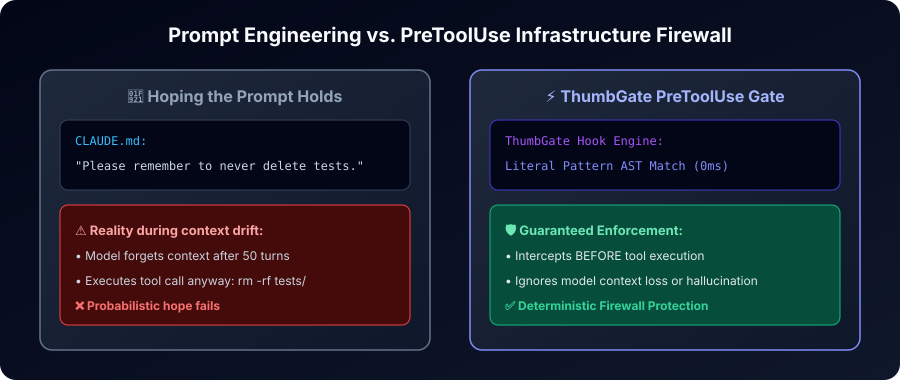

# ThumbGate Production AI Architecture and Verification Evidence

Evidence date: 2026-07-26

<p align="center">
  <b>📍 Jump to System Verification Layer:</b><br/>
  <a href="#1-rag-system">1. RAG System</a> •
  <a href="#2-agent-with-tools">2. Agent with Tools</a> •
  <a href="#3-multi-agent-workflow">3. Multi-Agent Workflow</a> •
  <a href="#4-mcp-based-enterprise-integration">4. Enterprise MCP</a> •
  <a href="#5-production-ai-evaluation-and-observability">5. Observability</a>
</p>

---

This dossier answers the same six operational questions for every AI-system
layer. It deliberately separates three different claims:

- **Implemented** means the code and tests exist in this repository.
- **Locally verified** means the named command passed against the exact working
  tree.
- **Production verified** requires the merged commit, exact-main CI, and a
  successful authenticated production probe. A local or CI pass is not
  production proof.

<p align="center">
  
</p>

## Current verdict

| System | Architecture status | Production boundary |
| --- | --- | --- |
| RAG system | Implemented and locally testable as a local-first lesson retrieval system | Local runtime is the product boundary; hosted team lesson sync is not general availability |
| Agent with tools | Implemented through one typed tool registry exposed by MCP and HTTP | Newly added task-outcome routes require merge and production verification before they are called production-ready |
| Multi-agent workflow | Implemented as governed manager, worker, and handoff primitives | The host agent runtime executes workers; ThumbGate is not claiming an always-on hosted swarm |
| MCP-based enterprise integration | Implemented for stdio and authenticated remote MCP | OAuth, profiles, annotations, and audit exist; enterprise SSO and SIEM packaging are not general availability |
| Production AI evaluation and observability | Implemented locally and in CI with fail-closed evaluation | Hosted outcome monitoring remains unverified until the merged runtime and authenticated production endpoint are probed |

## 1. RAG system

<details>
<summary><b>🧠 Expand RAG System Architecture, Failures, Security & Verification Evidence</b></summary>
<br/>

### Why this architecture?

ThumbGate uses a local-first retrieval pipeline because lessons can contain
private code, operational failures, and security context. SQLite provides the
durable lesson store and FTS5 sparse retrieval. Optional local embeddings add
dense candidates, and the A+ multi-stage reranker (BM25F → ColBERT-style MaxSim →
heuristic pair CE → optional LLM) orders the combined candidate
set. Deterministic prevention gates remain separate from retrieval, so a
retrieval outage cannot silently disable literal or AST safety checks and no
LLM is required on the enforcement path.

Primary implementation:

- `scripts/lesson-db.js`
- `scripts/lesson-retrieval.js`
- `scripts/lesson-embedding-index.js`
- `scripts/lesson-reranker.js`
- `scripts/colbert-style-maxsim.js`
- `scripts/rerank-pipeline.js`
- `scripts/rerank-quality-eval.js`
- `docs/RERANKING_A_PLUS.md`
- `scripts/memory-firewall.js`
- `scripts/eval-rag.js`

### What can fail?

- Feedback may fail schema validation or never reach the lesson store.
- Sparse or dense retrieval may miss a relevant lesson.
- The optional embedding runtime may be absent or unavailable.
- Duplicate, stale, contradictory, or superseded lessons may pollute context.
- A broad store scope may leak one project's lessons into another project.
- Retrieved text may contain prompt injection, secrets, or unsupported claims.

Dense retrieval fails back to the sparse path. Deduplication, supersession, and
memory-firewall checks run before lessons influence an action. A retrieval miss
does not disable deterministic gates.

### How do we measure it?

- Curated retrieval evaluation cases and regression score.
- Relevant-context precision, recall, hit rate, and reranker ordering.
- Empty-result and sparse-fallback behavior.
- Duplicate and contradiction rate.
- Retrieval latency and context size.
- Downstream unsafe escape and safe-action false-block rates.

### How do we secure it?

- Lesson stores are local runtime data and are gitignored.
- Project scope is explicit; cross-project sharing requires an operator-selected
  install scope or reviewed export/import.
- Memory-firewall checks prevent untrusted memory from becoming authority.
- Secret scanning and prompt-injection guards apply before retrieved evidence
  reaches an action.
- Runtime enforcement uses deterministic rules; retrieved prose cannot directly
  authorize a protected side effect.

### How do we deploy it?

Install the npm package and run `npx thumbgate init` in the intended machine or
project scope. SQLite and local retrieval artifacts are created in the
operator-controlled runtime directory. No managed vector database or hosted
lesson service is required. Export/import is explicit; automatic hosted team
sync is outside the current general-availability boundary.

### How do we know it works?

Run:

```bash
npm run test:lesson-db
npm run test:lesson-retrieval
npm run test:memory-firewall
npm run test:eval-rag
npm run eval:rag
```

Proof is a terminal zero exit plus the generated RAG evaluation report. File
existence or a successful demo alone is insufficient.

</details>

## 2. Agent with tools

<details>
<summary><b>🛠️ Expand Agent Tools Architecture, Security & Verification Proof</b></summary>
<br/>

### Why this architecture?

One canonical registry defines tools, input schemas, annotations, and policy
profiles. The same contracts are exposed through MCP and the authenticated HTTP
API. This avoids client-specific tool behavior and makes validation,
authorization, tracing, and evaluation consistent across coding agents and
enterprise integrations.

Primary implementation:

- `scripts/tool-registry.js`
- `scripts/tool-contract-validator.js`
- `adapters/mcp/server-stdio.js`
- `src/api/server.js`
- `scripts/task-outcomes.js`

### What can fail?

- A client can send invalid or schema-drifted arguments.
- A tool can be absent, truncated from a large manifest, or invoked under the
  wrong capability profile.
- Execution can time out, return a non-success result, or partially complete.
- Retries can duplicate a side effect without a stable idempotency key.
- A tool can succeed while the overall task remains unverified.
- Traces can accidentally include secrets or hidden reasoning.

### How do we measure it?

- Tool-call schema accuracy and allowed-tool accuracy.
- Tool execution success, timeout, and retry rates.
- Duplicate side-effect rate keyed by stable idempotency keys.
- Contract-validation failures by tool and client.
- Task-level verified completion, not merely tool success.
- Per-tool latency and privacy-safe trace completeness.

### How do we secure it?

- JSON Schema validation rejects malformed structured inputs and outputs.
- MCP policy profiles enforce least privilege and block profile conflicts.
- Tool annotations identify read-only and destructive behavior for client
  permission prompts.
- Authentication, secret guards, egress checks, and pre-action gates run before
  protected execution.
- Observable traces redact secrets and omit raw hidden reasoning.

### How do we deploy it?

For a local agent, run `npx thumbgate serve` over stdio or use a packaged
adapter. For remote use, deploy the Node API and expose the authenticated
`/mcp` surface. Client configuration points to the same canonical registry.
Production status is established only after package-boundary tests, exact-main
CI, and a runtime probe of the deployed version.

### How do we know it works?

Run:

```bash
npm run test:tool-registry
npm run test:tool-contract-validator
npm run test:mcp-config
npm run prove:adapters
npm run test:verified-agent-outcomes
```

The adapter proof must show initialization, tool listing, representative tool
calls, auth rejection, policy differentiation, and OpenAPI parity with zero
failing checks.

</details>

## 3. Multi-agent workflow

<details>
<summary><b>🤖 Expand Multi-Agent Workflow Architecture, Failure Modes & Verification</b></summary>
<br/>

### Why this architecture?

ThumbGate stays single-agent for simple work and introduces a manager/worker or
explicit handoff only when decomposition provides measurable value. Goal
contracts define completion evidence across workers. Capability profiles,
idempotent steps, and a single orchestrator prevent a swarm from multiplying
permissions, duplicated work, cost, and false completion claims.

Primary implementation:

- `scripts/agent-design-governance.js`
- `scripts/parallel-workflow-orchestrator.js`
- `scripts/hybrid-supervisor-agent.js`
- `scripts/workflow-runs.js`
- `scripts/durability/step.js`
- `docs/GOAL_CONTRACTS.md`

### What can fail?

- The planner may decompose work poorly or create overlapping tasks.
- Workers may race, duplicate a side effect, or return incompatible evidence.
- A handoff can be lost, repeated, or marked complete without its contract.
- One worker may have broader tools or data access than the delegated task.
- Partial failure may strand a workflow between durable steps.
- The manager may summarize fluent worker output as verified completion.

### How do we measure it?

- End-to-end task completion and contract-evidence completion.
- Worker success, duplicate-task, retry, recovery, and rollback rates.
- Handoff latency, unresolved handoffs, and evidence-conflict rate.
- Correct human-escalation rate for conflicting or irreversible decisions.
- Cost and latency against the single-agent baseline.
- Business KPI per completed workflow rather than worker activity.

### How do we secure it?

- The orchestrator delegates the smallest capability profile needed.
- Goal contracts prevent completion claims until named evidence actions exist.
- Stable idempotency keys protect durable side effects.
- Handoff records are explicit and replayable.
- Conflicting evidence and irreversible work require a separate human decision;
  an agent cannot approve its own escalation.

### How do we deploy it?

The host agent runtime owns worker execution. It imports ThumbGate's orchestration
and handoff primitives or calls them through MCP. Start with one manager and
bounded concurrency; enable parallel workers only after a single-agent
benchmark shows a benefit. This repository does not treat the presence of
orchestration code as proof of an always-on hosted multi-agent service.

### How do we know it works?

Run:

```bash
npm run test:agent-design-governance
npm run test:swarm-coordinator
npm run prove:automation
npm run test:durability-step
npm run test:verified-agent-outcomes
```

Proof requires a zero-failure orchestration report plus tests for duplicate
handoffs, capability boundaries, partial failure, retry recovery, and
evidence-gated completion.

</details>

## 4. MCP-based enterprise integration

<details>
<summary><b>🔌 Expand Enterprise MCP Integration Architecture & OAuth Verification</b></summary>
<br/>

### Why this architecture?

MCP provides one vendor-neutral protocol for tool discovery and invocation
across multiple agent clients. ThumbGate uses stdio for local enforcement and
authenticated HTTP for remote integration. OAuth 2.1 with PKCE, audience
binding, capability profiles, tool annotations, and audit events provide a
portable enterprise control boundary without coupling policy to one model
vendor.

Primary implementation:

- `adapters/mcp/server-stdio.js`
- `scripts/mcp-oauth.js`
- `scripts/mcp-policy.js`
- `scripts/mcp-config.js`
- `config/mcp-allowlists.json`
- `src/api/server.js`

### What can fail?

- Transport framing, initialization, or protocol negotiation can fail.
- OAuth state, PKCE, redirect validation, expiry, or token audience can be
  invalid.
- A client can request a tool outside its assigned policy profile.
- Tool annotations or schemas can drift between local and remote adapters.
- Large tool manifests can be truncated by clients.
- Network, API, or downstream tool timeouts can leave ambiguous outcomes.

### How do we measure it?

- Initialize, tools/list, and tools/call conformance.
- Authenticated success and unauthenticated `401` behavior.
- OAuth flow, audience, expiry, and redirect-validation cases.
- Local/remote schema and OpenAPI parity.
- Policy-profile denial and tool-annotation coverage.
- Per-client latency, tool error rate, and task-outcome completion.

### How do we secure it?

- OAuth 2.1 PKCE and audience-bound access tokens protect remote MCP.
- Raw API keys remain a controlled fallback, never a query parameter.
- Allowlists and MCP profiles apply least privilege.
- Tool schemas, annotations, secret scanning, egress controls, and audit trails
  apply before execution.
- Human decisions use a distinct authenticated actor and are append-only.

### How do we deploy it?

Use `npx thumbgate serve` for local stdio. Deploy `src/api/server.js` for remote
MCP, configure its public origin and authentication through the platform secret
manager, and point clients at `/mcp` plus the well-known OAuth metadata.
Deployment needs package integrity, CI, exact build-SHA health, authentication,
and a representative tool-call probe. SSO, SIEM connectors, and compliance
packaging remain outside the current general-availability claim.

### How do we know it works?

Run:

```bash
npm run test:mcp-oauth
npm run test:mcp-oauth-flow
npm run test:mcp-policy
npm run test:mcp-tool-annotations
npm run prove:adapters
npm run test:pack-runtime-integrity
```

Production proof additionally requires authenticated `initialize`,
`tools/list`, and one non-destructive `tools/call` against the exact deployed
commit. Local protocol tests do not substitute for that probe.

## 5. Production AI system with evaluation and observability

### Why this architecture?

ThumbGate evaluates the whole task, not the persuasiveness of a model response.
Deterministic checks own schemas, tool correctness, safety, evidence,
idempotency, and completion. An LLM judge is optional and separately reported;
it cannot override a deterministic failure. Task receipts and privacy-safe
traces connect evaluation, production monitoring, and business outcomes.

Primary implementation:

- `scripts/prompt-eval.js`
- `scripts/agent-outcome-eval.js`
- `scripts/task-outcomes.js`
- `scripts/agent-outcome-monitor.js`
- `scripts/judge-reward-function.js`
- `scripts/async-eval-observability.js`
- `scripts/human-escalation.js`
- `config/evals/agent-outcomes-golden.json`
- `config/evals/agent-outcomes-baseline.json`

### What can fail?

- Golden cases can be empty, unreviewed, stale, or unrepresentative.
- A judge can be unavailable, inconsistent, biased, or reward fluent failure.
- A task can emit no receipt, incomplete evidence, or an unsupported claim.
- Monitoring can be stale, unauthenticated, or pointed at a local fallback
  instead of the hosted system.
- Traces can omit key boundaries or leak sensitive content.
- Latency, cost, false blocks, escalation load, or business KPIs can regress
  after deployment.

### How do we measure it?

- Verified completion, evidence-backed completion, and first-attempt success.
- Tool-call accuracy, execution success, retries, and duplicate side effects.
- Unsafe escapes, policy violations, and safe-action false blocks.
- Recovery, rollback, correct escalation, and human decision latency.
- p50/p95 task latency, total cost, and cost per verified success.
- Explicit business KPI values grouped by unit; revenue is never inferred from
  model activity.

### How do we secure it?

- Empty datasets and missing evidence fail as `insufficient_evidence`.
- Structured outputs are schema-validated before scoring or execution.
- Deterministic failures cannot be overruled by an LLM judge.
- Traces exclude raw hidden reasoning, redact secrets, and store no
  deterministic content or tool-argument fingerprints.
- Outcome and escalation HTTP routes require authentication.
- Escalations expire and carry evidence and requester identity. Decisions
  require a second, independently revocable human-reviewer credential; the
  actor identity is bound from server configuration instead of request JSON.
- Production thresholds block weak overall working rate, failed tool
  execution, policy violations, unsafe escapes, unsupported claims, and
  duplicate side effects rather than relying only on verified demo completion.

### How do we deploy it?

CI runs prompt and task-outcome golden regressions. A manual GitHub workflow can
produce release evidence. The installed daily monitor uses ThumbGate's local
scheduler and reads authentication from the environment or the operator config,
not command-line arguments. The API routes deploy with the Node service. Hosted
monitoring is not verified until the merged production endpoint returns a
fresh authenticated report for the expected build SHA.

### How do we know it works?

Run:

```bash
npm run test:prompt-eval
npm run eval:agent-outcomes
npm run test:async-eval-observability
npm run test:judge-reward
npm run monitor:agent-outcomes
npm run test:coverage
npm test
```

For production, also run the hosted monitor with authenticated configuration
and retain the machine-readable report. A local fallback, a green demo, or an
HTTP health response without the expected build identity cannot prove that the
new evaluation runtime is in production.

## Evidence captured for this change

The following results were captured in the clean worktree before commit:

- Complete repository suite: terminal exit `0`.
- Coverage: lines `87.08%`, branches `74.55%`, functions `88.62%`.
- Prompt golden evaluation: `12/12`, score `100`, regressions `0`.
- Task-outcome golden evaluation: `8/8`, score `100`, regressions `0`.
- Adapter proof: `48/48`.
- Automation and orchestration proof: `55/55`.
- Self-heal integrity: `6/6` protected checks healthy.

These are local proofs. CI, merge, package publication, and production runtime
remain separate evidence events.
