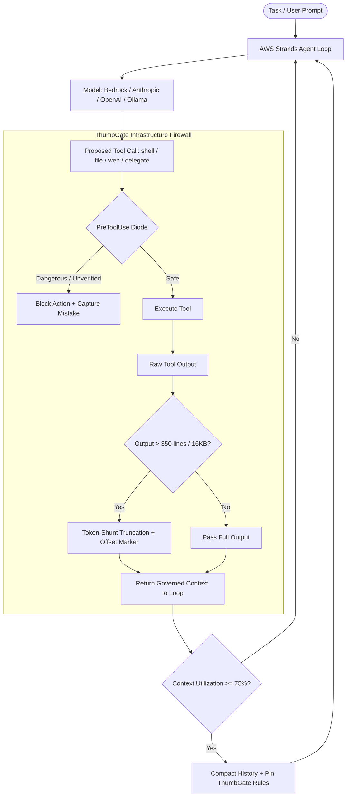

# AWS Strands Harness + ThumbGate Integration

> "The way a harness manages the surrounding agent machinery can materially affect cost and performance, even when the underlying model stays the same." — Marc Brooker, VP & Distinguished Engineer, AWS (The New Stack, 2026-10)

AWS Strands Harness (open-sourced in Python via `pip install strands-harness` and TypeScript via `npm install @strands-agents/harness`) demonstrates that harness-layer engineering yields **45% lower token costs overall** and **77% lower costs on Terminal-Bench 2.1 ($56.29 vs $248.05)** by enforcing three context-management defaults:
1. Truncating large tool outputs.
2. Compacting context once available window passes a set threshold (e.g., 75%).
3. Recovering within the agent loop if context overflows.

However, **AWS Strands Harness has no pre-action safety diode, no blast-radius boundaries, and no cross-agent lease coordination out of the box.** Executing shell tools and file mutations autonomously at 45% lower cost without pre-action governance creates rapid, cheap production failures.

**ThumbGate is the Pre-Action Infrastructure Firewall and Governance Diode for AWS Strands Harness.**

---

## Architecture: The Governed Strands Loop



---

## Integration Guide

### TypeScript (`@strands-agents/harness`)

```typescript
import { StrandsHarness } from '@strands-agents/harness';
import { createStrandsGateMiddleware } from 'thumbgate/adapters/strands/strands-middleware';

// 1. Initialize ThumbGate Diode Middleware
const thumbGateMiddleware = createStrandsGateMiddleware({
  tokenShunt: { maxOutputLines: 350, maxOutputBytes: 16384 },
  preActionDiode: { enabled: true },
});

// 2. Wrap Strands Harness Tool Pipeline
const harness = new StrandsHarness({
  model: 'anthropic.claude-3-5-sonnet', // or Bedrock / OpenAI / Ollama
  hooks: {
    beforeToolCall: thumbGateMiddleware.beforeToolCall,
    afterToolCall: thumbGateMiddleware.afterToolCall,
    onCompaction: thumbGateMiddleware.onContextCompaction,
  },
});

await harness.run('Deploy migration and verify health');
```

### Python (`strands-harness`)

```python
from strands_harness import StrandsAgent
import subprocess
import json

def thumbgate_pre_tool_hook(tool_name: str, tool_input: dict):
    """Intercept tool calls via ThumbGate CLI diode."""
    res = subprocess.run(
        ["npx", "thumbgate", "check", "--tool", tool_name, "--input", json.dumps(tool_input), "--json"],
        capture_output=True,
        text=True
    )
    decision = json.loads(res.stdout) if res.returncode == 0 else {"decision": "ALLOW"}
    if decision.get("decision") == "BLOCK":
        raise PermissionError(f"ThumbGate PreToolUse blocked: {decision.get('reason')}")

agent = StrandsAgent(
    model="bedrock/anthropic.claude-3-5-sonnet",
    pre_tool_hooks=[thumbgate_pre_tool_hook],
)
agent.run("Audit production logs and check database replication")
```

---

## Verifying Compliance

Run the automated doctor:

```bash
# Human-readable report
node scripts/strands-harness-doctor.js

# Machine-readable JSON output
node scripts/strands-harness-doctor.js --json

# CI fail-closed check
node scripts/strands-harness-doctor.js --check
```
