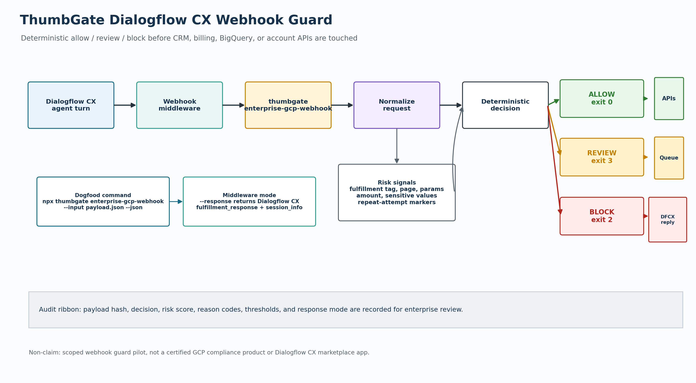
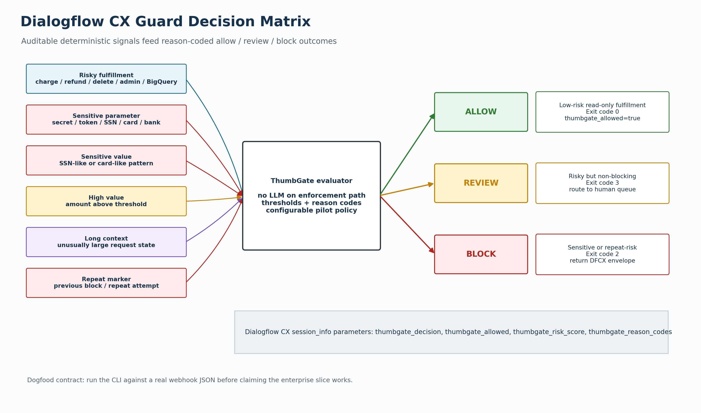

# ThumbGate Enterprise GCP Guardrails

This is the first buildable enterprise slice for Google Cloud workflows around Vertex AI Agent Engine, Vertex AI Agent Builder, Dialogflow CX, and DFCX webhook fulfillment. It is not a claim that ThumbGate has a fully native Vertex AI deployment template or Dialogflow CX marketplace integration.

## What Exists Now

`thumbgate setup-vertex` gives enterprise subscribers a concrete Google Cloud setup path for Vertex AI / Agent Builder / Dialogflow CX pilots. Default mode is plan-only; `--apply` enables the required APIs, `--create-budget` creates the optional budget guard when a billing account is provided, and `--deploy` emits/runs the guarded Cloud Run deployment path with `min-instances=0` and `max-instances=1`.

```bash
npx thumbgate setup-vertex --project=my-gcp-project --billing-account=000000-000000-000000
npx thumbgate setup-vertex --project=my-gcp-project --billing-account=000000-000000-000000 --apply --create-budget --json
THUMBGATE_API_KEY="$(openssl rand -hex 32)" npx thumbgate setup-vertex --project=my-gcp-project --deploy
```

`thumbgate enterprise-gcp-webhook` evaluates a Dialogflow CX / DFCX webhook request before fulfillment side effects run. It returns:

- `allow` for low-risk read-only requests
- `review` for risky but non-blocking fulfillment requests
- `block` for sensitive or repeat-risk fulfillment requests
- a Dialogflow CX webhook response envelope when called with `--response`

Example:

```bash
npx thumbgate enterprise-gcp-webhook --input=dialogflow-webhook.json --json
```

Middleware mode:

```bash
npx thumbgate enterprise-gcp-webhook --input=dialogflow-webhook.json --response
```

Repository dogfood example:

```bash
npx thumbgate enterprise-gcp-webhook --input=docs/examples/dialogflow-cx-high-risk-webhook.json --json
npx thumbgate enterprise-gcp-webhook --input=docs/examples/dialogflow-cx-high-risk-webhook.json --response
```

Exit codes:

- `0` allow
- `2` block
- `3` review
- `1` invalid input or runtime error

## Diagrams

The source briefs for these diagrams live next to the images:

- `docs/diagrams/dialogflow-cx-webhook-guard.txt`
- `docs/diagrams/dialogflow-cx-decision-matrix.txt`

The diagram generation path followed the repo's PaperBanana convention: install the open-source `paperbanana` Python package, keep a text brief per figure, and render executable Python/Matplotlib assets when no Gemini/Google API key is available locally.





## Vertex AI / Agent Builder Positioning

Vertex AI Agent Engine is the Google Cloud runtime surface for deploying and managing agents in production. Vertex AI Agent Builder is the broader agent-building surface. ThumbGate is not deploying into those services yet.

The current honest pilot is adjacent:

1. A Vertex AI / Agent Builder workflow or Dialogflow CX agent reaches a tool, webhook, or fulfillment boundary.
2. Customer middleware calls ThumbGate before CRM, billing, BigQuery, account, or other side-effecting APIs.
3. ThumbGate returns an auditable `allow`, `review`, or `block` decision.
4. The customer proceeds, queues human review, or returns the Dialogflow CX response envelope.

## Intended Enterprise Pilot Shape

The first honest subscriber feature is a webhook guard, not full CCAI governance:

1. Dialogflow CX webhook receives a fulfillment request.
2. The customer middleware calls ThumbGate before CRM, billing, BigQuery, or account APIs are touched.
3. ThumbGate evaluates fulfillment tag, page, parameters, sensitive values, high-value transactions, and repeat-attempt markers.
4. Middleware proceeds, queues human review, or returns the ThumbGate response envelope to Dialogflow CX.
5. Thumbs-down QA findings become reviewed prevention rules before production rollout.

## Non-Claims

Do not market this as:

- a certified GCP compliance product
- a native Vertex AI Agent Engine deployment template
- a Vertex AI Agent Builder marketplace integration
- a Dialogflow CX marketplace app
- automatic production Playbook mutation
- a complete CCAI dashboard

The accurate offer is:

> ThumbGate can run as a Dialogflow CX webhook guard in a scoped enterprise pilot, blocking risky fulfillment actions before side effects and producing auditable allow/review/block decisions.
