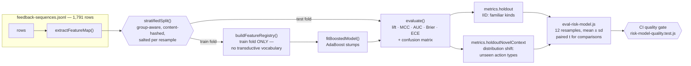
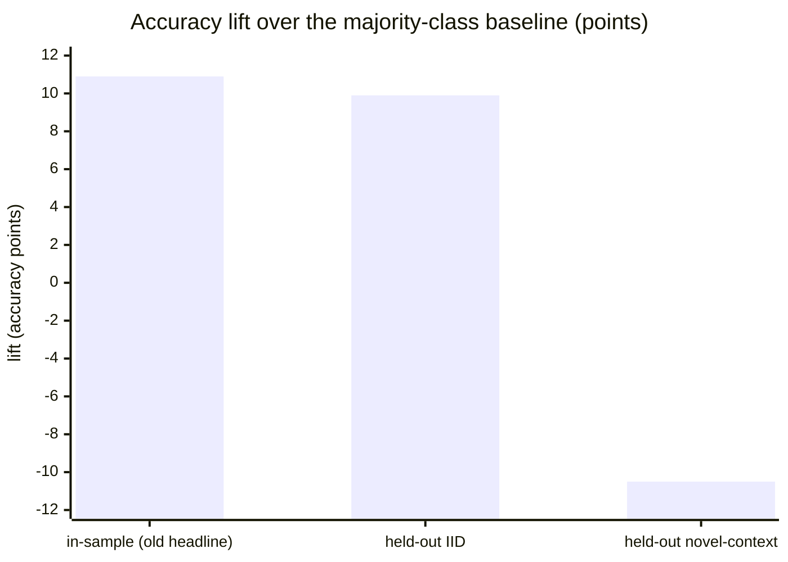
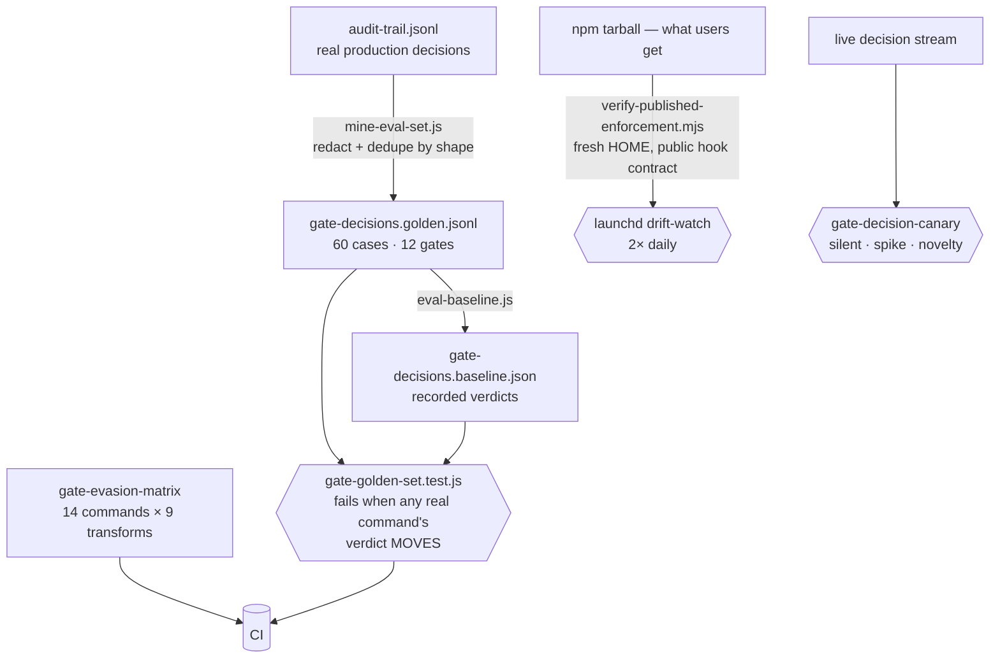

# How ThumbGate's learned models are evaluated

Written 2026-07-28, after an audit found the risk model was reporting a single number —
in-sample accuracy — and nothing else.

## The defect this fixes

`risk-model.json` reported exactly one quality figure:

```json
"metrics": { "trainingAccuracy": 0.820212171970966, "rounds": 8, "mode": "boosted" }
```

Measured on the same 1,791 rows it was trained on. Three things were wrong with it:

1. **No held-out estimate existed.** There was no split, no cross-validation, and no
   `holdout` anywhere in `risk-scorer.js`. Generalization was not poor — it was *unmeasured*.
2. **It was never compared to the trivial baseline.** The corpus base rate is **0.711**, so
   answering "high-risk" unconditionally scores 71.1%. The headline 82.0% was an 11-point
   in-sample lift being read as an 82-point achievement.
3. **Accuracy is the wrong metric for a 71/29 corpus.** No precision, recall, AUC, MCC, Brier,
   or calibration was recorded.

There was also no test that could fail if quality regressed. The existing suite asserted
mechanics — the artifact is written, a reloaded model predicts consistently, one synthetic row
outranks another. **A model that decayed to the 71% baseline would have passed CI green.**

## What is measured now

Every trained model records three reports (`scripts/model-eval.js`):

| Report | Question it answers |
|---|---|
| `metrics.inSample` | What it scores on its own training rows. Kept only as a reference point, explicitly labelled. |
| `metrics.holdout` | **IID:** does it work on new rows of familiar kinds? |
| `metrics.holdoutNovelContext` | **Distribution shift:** does it work on action types absent from training? |

Each carries `accuracy`, `baselineAccuracy`, `lift`, `precision`, `recall`, `specificity`,
`f1`, `mcc`, `rocAuc`, `brierScore`, `expectedCalibrationError`, and the confusion matrix.
`lift` sits next to `accuracy` in every report so accuracy can never again be quoted without
the baseline it must beat.

### The pipeline, end to end




## Current results

Real corpus, 1,791 rows, 12 independent group-aware stratified splits
(`node scripts/eval-risk-model.js --corpus ~/.thumbgate/feedback-sequences.jsonl`):

```
in-sample accuracy                    0.8202     <- the number that used to be reported alone

IID held-out (familiar kinds)
  lift over majority baseline        +0.099 ± 0.017     12/12 folds beat baseline
  ROC-AUC                             0.887 ± 0.011
  MCC                                 0.542
  Brier / ECE                         0.125 / 0.059

Novel-context held-out (unseen action types)
  lift over majority baseline        -0.105 ± 0.090      1/12 folds beat baseline
  ROC-AUC                             0.718 ± 0.058
  MCC                                 0.244
  Brier / ECE                         0.300 / 0.310
```

### The same result as a picture



**Evidence.** These figures are reproducible from the harness rather than asserted:
`npm run eval:risk -- --corpus <path> --json` emits the same report machine-readably, and the
repository's verification policy and artifacts are in
[VERIFICATION_EVIDENCE.md](../VERIFICATION_EVIDENCE.md)
([docs copy](./VERIFICATION_EVIDENCE.md)). Every number above carries the baseline it is
measured against and the spread across 12 resamples; a single split of this corpus has a
standard deviation large enough to reverse the sign of the novel-context result, so
single-split figures are not quoted anywhere.

**The honest reading.** On familiar traffic the model is genuinely useful: about **+10 points**
over the trivial baseline, on every fold, with AUC 0.89. On **unfamiliar** action types it is
**worse than answering "high-risk" unconditionally** — only 1 of 12 folds beats the baseline,
and calibration collapses (ECE 0.31 versus 0.06).

For a firewall that distinction is the important one, because novel actions are exactly the
case that matters. The model is therefore a **triage/ranking signal, not an authority on
unfamiliar input** — its AUC of 0.72 there still orders better than chance even while its
thresholded decisions do not. This is also why the deterministic gate rules, not the model,
remain the enforcement mechanism.

## Why both numbers are reported

The two splits differ only in what defines a "group" that must not straddle the fold boundary:

- IID uses the full feature vector — 1,754 groups over 1,791 rows, so only 37 true duplicates
  are held together.
- Novel-context uses coarse content identity (context, domain, skill, tags) — **375 groups, the
  largest holding 655 rows**, so whole categories of action move as a unit.

Neither is wrong; they answer different questions. Reporting only the first would be the same
error as reporting only in-sample accuracy, one level up.

## Five leakage bugs found while building this

Every one would have inflated the numbers above. Two were caught by the new tests, three by
adversarial code review of the evaluator itself.

1. **Tied-hash leakage.** Rows were assigned individually after sorting by hash. Identical rows
   share a hash and sort adjacently, so a cut point inside a tied block put one copy in train
   and its twin in test.
2. **Cross-class leakage.** Grouping per class still split duplicates: with label noise one
   feature vector can carry both labels, so its copies landed in different class buckets and
   different folds. Fixed by group-first assignment across classes with per-class quotas
   (`StratifiedGroupKFold` semantics).
3. **Quota overshoot.** A group was admitted whenever its class was *not yet* at quota, so one
   large group could blow past that quota by hundreds of rows. With a 655-row content group in
   this corpus, a nominal 25% fold could be swamped by a single category and the base rate would
   shift underneath the measurement. Groups must now fit entirely within the remaining quota of
   every class they contain. **This one mattered: it moved the novel-context result from
   +0.016 to −0.105.**
4. **Transductive vocabulary.** `buildFeatureRegistry` picks top tags and skills by frequency,
   and it was built from the whole corpus *before* the split — so held-out rows influenced which
   features existed for the probe. Registry and derived features are now rebuilt from the
   training fold alone.
5. **Context in the group key.** The key mixed the raw `context` string in with the feature
   vector, so two rows whose different prose maps to identical features could land on opposite
   sides. The model observes only the features, so those are duplicate inputs. The key is now
   the feature vector alone.

The lesson is uncomfortable and worth stating plainly: **the evaluator is as capable of being
wrong as the model it measures**, and its errors are harder to notice because they flatter you.

## The enforcement evaluation loop

The model harness above is one half. The other half evaluates the **gates themselves**, from
production traces to the published npm artifact:



Drift, not correctness-vs-production, is what the golden set asserts: most gates are
state-conditional, so a fresh sandbox cannot reproduce the verdict — but a verdict that
*changes* for a real command is exactly the signature of every bypass found in this codebase.

## The CI gate

`tests/risk-model-quality.test.js` runs against a **deterministic synthetic fixture** (fixed
LCG, never `Math.random()`), because the real corpus is private and CI cannot see it. This
buys a specific diagnostic:

- **These tests fail → the trainer is broken.**
- **They pass but the real corpus shows no lift → the trainer is fine and the data lacks
  signal.**

Those need different fixes, and a suite that cannot tell them apart sends you to debug the
wrong one. The gate asserts held-out lift > 0.15, AUC > 0.75, and MCC > 0.5 on planted signal;
that **pure noise yields < 0.15 lift** (a label-leak canary); that holdout is reported at all;
that every accuracy is accompanied by its baseline; and that splits are reproducible.

## Known weaknesses, not hidden

- **Boosting collapses onto one feature.** On the real corpus six of eight stumps split on
  `recentTrend` — a measure of how the session has been going, not of whether the action is
  dangerous. A `maxPerFeature` cap exists; over 12 paired splits it produced **no significant
  difference** (paired t = −0.31, 6/12 wins), so it is **off by default**. Enabling it on the
  strength of a single lucky split is exactly the mistake this document exists to prevent.
- **Later boosting rounds amplify noise features.** On the fixture, AUC lands at ~0.77 where a
  near-ideal predictor could reach ~0.88, because rounds after the first pick up noise.
- **Calibration and threshold tuning did not help.** Platt scaling and MCC-optimal threshold
  selection (both fitted on the training fold only, `scripts/model-calibration.js`) improved
  MCC from 0.247 to 0.262 and ECE from 0.232 to 0.228 — **not significant** (paired t = −0.72).
  They are implemented and tested but **not wired into the hot path**, because shipping an
  unproven behaviour change into a live PreToolUse firewall is not justified by a
  non-significant gain.
- **`feedback-model.json` is absent on at least one machine**, so the Thompson-sampling
  reliability model has no posterior there.
- **Lesson retrieval was recency-truncated** — fixed separately. It read only the newest 200
  memory-log lines, so with 383 lessons on disk about half were unreachable regardless of
  relevance. The cap is now measurement-sized rather than arbitrary.

## Running it

```sh
npm run eval:risk                                              # repo-local corpus
node scripts/eval-risk-model.js --corpus ~/.thumbgate/feedback-sequences.jsonl
node scripts/eval-risk-model.js --corpus <path> --compare-caps # paired config comparison
node scripts/eval-risk-model.js --corpus <path> --json         # machine-readable
```

`resolveFeedbackDir` prefers a repo-local `.thumbgate/` over the global one, so inside a
checkout the default corpus is the small fixture. Pass `--corpus` for the real thing.

## The rule this establishes

**No accuracy figure ships without the baseline it beats and the split it was measured on.**
An unqualified accuracy number is not a quality claim; it is a claim waiting to be checked.
