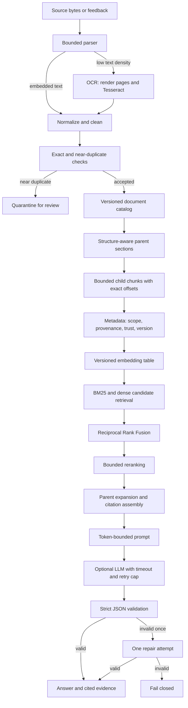

# ThumbGate production RAG

The canonical stage definitions live in `scripts/rag-stage-contracts.js`. Runtime
telemetry lives in `scripts/rag-stage-contract.js`. This guide explains the
engineering choices, tradeoffs, recovery paths, and release evidence.

## Architecture



The runtime is deterministic around probabilistic components. Parsing limits,
scope filters, version retirement, candidate budgets, retries, repair attempts,
and output validation are code-enforced. Models rank or generate inside those
bounds; they do not control orchestration.

## Document ingestion

| Stage | Why it exists | What can fail | How it is measured | Implementation |
|---|---|---|---|---|
| Parsing | Convert bytes into text with provenance. | Missing tools, corrupt files, page/size/time limits, empty extraction. | Parse success/error rate, adapter/version, pages, bytes. | `document-parser.js` |
| OCR | Recover scanned PDFs and images only when embedded text is insufficient. | Low confidence, empty OCR, excessive pages, missing Tesseract. | Trigger/success rate, mean confidence, word count. | Poppler plus Tesseract, invoked without a shell. |
| Deduplication | Avoid duplicated vectors and contradictory copies. | Hash drift, false near-duplicate match, duplicate source URLs. | Exact duplicate rate, near-duplicate quarantine rate. | SHA-256 exact fingerprint plus bounded similarity. |
| Normalization | Make hashes and offsets stable across platforms. | Unicode/control noise, over-cleaning, lost evidence. | Bytes before/after, rejected placeholders, offset invariants. | Newline/control/HTML normalization with instruction-risk tagging. |
| Chunking | Fit retrieval and prompt budgets without losing document structure. | Mid-rule splits, excess overlap, duplicated parents. | Size distribution, coverage, stable-ID reuse, parent dedup, exact offsets. | Heading-aware parents plus overlapping child chunks. |
| Metadata | Enforce scope and make citations/versioning possible. | Missing tenant, stale version, wrong trust, weak provenance. | Field fill, scope leakage, stale-hit rate, citation coverage. | Tenant/project/entity/visibility, source key, version, hashes, headings, offsets. |
| Incremental updates | Reuse unchanged work and retire superseded content. | Full re-embedding, stale vectors, partial catalog writes. | Stable chunk reuse, embedding cache hits, pending retries. | Stable chunk hashes and current-version catalog state. |
| Re-indexing | Move safely between parser/embedding/index versions. | Duplicate rows, interrupted migration, mixed dimensions. | Checkpoint/resume counts and catalog/index reconciliation. | `rag:reindex` lock, checkpoint, dry run, and resume. |
| Versioning | Preserve lineage while default retrieval returns only current truth. | Old chunks returned, source identity collision, lost rollback. | Current-version ratio and stale retrieval rate (hard target: zero). | `sourceKey`, `version`, `supersedesDocumentId`, `isCurrent`. |

Production binary adapters:

- PDF with embedded text: `pdfinfo` plus `pdftotext`.
- Scanned PDF: `pdftoppm` page rendering plus Tesseract TSV OCR.
- Image OCR: Tesseract TSV.
- DOCX: Mammoth raw-text extraction.
- Markdown, text, JSON, YAML, HTML: built-in deterministic parsing and cleaning.

Binary parsing has byte, page, command-time, and output-buffer limits. Missing
executables are explicit failures; the runtime does not silently index empty
text.

### Measured ingestion snapshot

`npm run eval:ingestion` evaluates parsing, OCR, deduplication, normalization,
chunking, metadata, incremental updates, re-indexing, and versioning separately.
The 2026-07-29 local production-adapter run scored:

- implementation readiness: 100/100 (A);
- evidence maturity: 70/100 (C-);
- overall: 91/100 (A-);
- real OCR smoke: 96.34% mean word confidence.

The lower evidence-maturity score is intentional: the current proof includes
deterministic fixtures, real PDF/DOCX/OCR adapters, failure tests, and runtime
telemetry, but not yet a labeled customer-document corpus or enough production
volume for drift baselines. A perfect fixture score is not presented as perfect
production accuracy.

## Retrieval decisions and tradeoffs

| Decision | Benefit | Cost or risk | ThumbGate choice |
|---|---|---|---|
| Better chunking | Improves local relevance and citations. | More overlap raises vector and prompt cost. | Parent sections plus bounded children; include each parent once. |
| Rich metadata | Enables hard scope/version filters. | Ingestion is stricter and schemas must evolve. | Required scope, provenance, trust, version, and offsets. |
| Metadata filtering | Prevents tenant and stale-version leaks. | A missing field can hide otherwise relevant content. | Filter before returning candidates; leakage target is zero. |
| Hybrid BM25 plus vectors | Exact identifiers and paraphrases both work. | Two retrieval paths add latency and operational surface. | Fuse ranks with RRF; lexical remains a measured fallback. |
| Reranking | Improves top-result ordering. | Model rerankers cost latency; heuristic rerankers can be mislabeled. | Bounded deterministic reranker now; measure MRR/nDCG and per-query harm before a paid model reranker. |
| Better embeddings | Can improve semantic recall. | Re-embedding costs time/money and can mix dimensions. | Version tables by model and dimension; upgrade only after judged eval lift. |
| Query rewriting | Helps short or implicit-risk queries. | Can damage paths, hashes, quoted strings, and exact IDs. | Selective conversational rewrite plus a bounded safety lexicon; exact identifiers bypass it. |
| Parent-child retrieval | Returns enough surrounding evidence to answer. | Repeated child hits can duplicate context. | Retrieve children, expand one parent once, preserve child offsets for citations. |

## Failure recovery and cost control

- Vector indexing failures leave a document as `pending_retry`; retry does not
  duplicate stable row IDs.
- Re-indexing writes a lock and checkpoint, supports dry-run, and resumes after
  interruption.
- Model and vector calls have bounded timeouts. LLM retries are capped at two;
  structured output receives at most one repair call.
- Input and output token budgets are fixed. Prompt assembly reports included and
  dropped source IDs rather than overflowing context.
- Unchanged chunks reuse cached production embeddings. Fallback feature-hash
  vectors are marked degraded and are not cached as production semantics.
- Query expansion and reranking have fixed candidate limits. There is no
  agent-controlled while-loop, so retrieval cannot recurse indefinitely.

## Evaluation

`npm run eval:rag` runs 24 deterministic, ranked, cross-domain cases with genuine
distractors. The label is used only by the evaluator, never by retrieval.

Release metrics:

- Recall@1, Recall@5, Recall@10
- Precision@5
- MRR@10
- nDCG@10
- scope-leak and stale-hit rates

Current thresholds are encoded in `scripts/eval-rag.js`: at least 24 cases,
Recall@10 >= 0.90, MRR@10 >= 0.75, nDCG@10 >= 0.80, Precision@5 >= 0.15,
and zero scope/stale leakage. A model judge may add diagnostics, but it cannot
turn a deterministic release failure green.

This seeded suite is release regression evidence, not a claim about every live
customer corpus. Live quality also requires runtime telemetry, judged
production queries, and drift review.

## Verification

```bash
npm run eval:rag
npm run prove:rag
npm run test:rag-pipeline
node --test tests/document-parser.test.js tests/document-intake.test.js \
  tests/vector-store.test.js tests/reindex-rag.test.js \
  tests/rag-ranking.test.js tests/rag-prompt-assembly.test.js \
  tests/dashboard-chat.test.js tests/llm-client.test.js
```

Evidence artifacts:

- `reports/eval-rag-report.md`
- `reports/eval-document-ingestion.md`
- `reports/rag-stage-contracts.md`
- `proof/rag-pipeline-report.md`
- `proof/rag-pipeline-report.json`

Authenticated operators can call `GET /v1/rag/operations` or the read-only MCP
tool `rag_operations` to inspect the stage contracts, recent privacy-safe stage
health, document version/index state, and vector-index availability. Raw queries
and provider error messages are not returned.

Buyer-facing material already has stable routes at `/architecture`,
`/evaluations`, `/whitepaper`, and `/case-studies`. Those pages must distinguish
seeded/local/CI evidence from live production telemetry.
