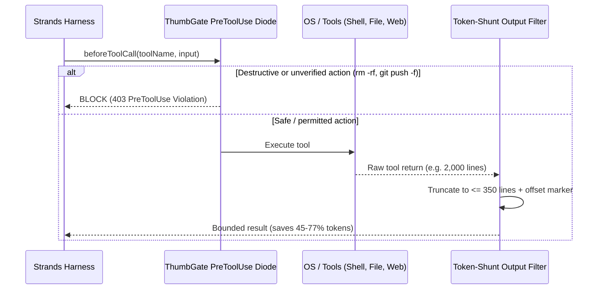

# AWS Strands Harness Architecture & ThumbGate Diode

## Overview

In October 2026, AWS open-sourced **Strands Harness** (The New Stack), demonstrating that agent harness defaults—specifically context management, output bounding, and loop recovery—can reduce token spend by **45% compared to Claude Code and Codex**, and by **77% on Terminal-Bench 2.1 ($56.29 vs $248.05)**.

However, running autonomous agents with file and shell access at lower token costs without pre-action safety controls simply produces **cheap, accelerated mistakes**.

ThumbGate acts as the **Infrastructure Firewall and Governance Diode** for AWS Strands Harness, ensuring every tool invocation is vetted, output is bounded, and lessons are preserved across compaction cycles.

---

## Benchmark Reality: Terminal-Bench 2.1

| Harness | Model | Cost (89 trials) | Score | Cost Delta vs Claude Code |
| :--- | :--- | :--- | :--- | :--- |
| **Claude Code** | Claude 3.5 Sonnet | $248.05 | 61.8 | Baseline |
| **DeepSeek Harness** | DeepSeek V3 | $40.30 | 59.5 | -83.7% |
| **AWS Strands Harness** | Fable 5 | $56.29 | 69.7 | **-77.3%** |

AWS achieved this efficiency not by degrading model reasoning, but through three harness-layer mechanisms:
1. **Output Shunting:** Truncating large tool returns (> 350 lines or 16 KB) with structured offset markers so the model searches with `grep` or pagination instead of ingesting firehoses.
2. **Context Compaction Threshold:** Automatically summarizing conversational drift at 75% window utilization.
3. **In-Loop Overflow Recovery:** Gracefully pruning intermediate tool calls when approaching window limits without throwing unhandled exceptions.

---

## The ThumbGate Diode for Strands

ThumbGate integrates directly into the Strands Harness execution loop via `adapters/strands/strands-middleware.js`:



---

## Verifying with Doctor

ThumbGate provides an automated doctor to audit Strands Harness compliance:

```bash
node scripts/strands-harness-doctor.js --json
```

Output:
```json
{
  "name": "strands-harness-doctor",
  "status": "healthy",
  "checks": [
    { "name": "output_shunting", "pass": true },
    { "name": "compaction_threshold_preservation", "pass": true },
    { "name": "in_loop_overflow_recovery", "pass": true },
    { "name": "provider_decoupling", "pass": true },
    { "name": "pre_action_safety_diode", "pass": true }
  ]
}
```
