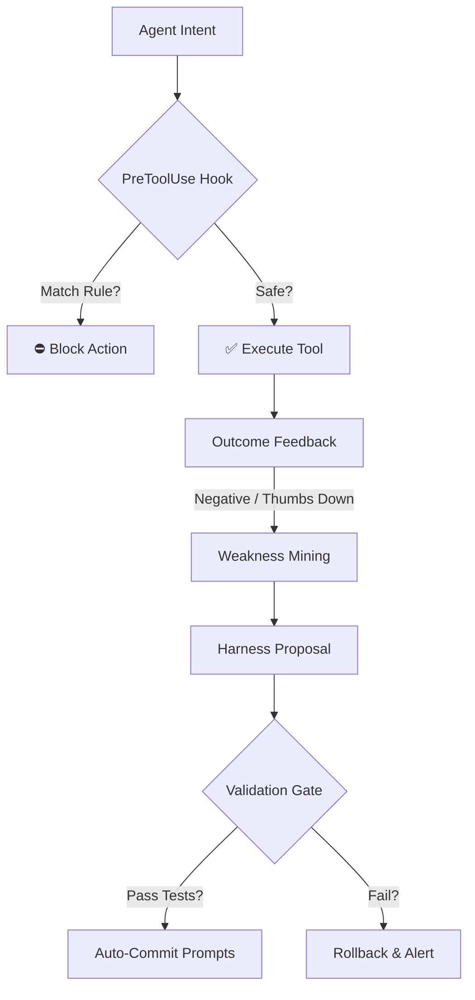

# Self-Harness Governance

> How ThumbGate turns agent mistakes into permanent pre-action gates and self-improving prompts.

---

## The Problem: The Amnesiac Agent & Token Burn

Every AI coding session boots up fresh. Your agent (Claude Code, Cursor, Codex, Gemini) has no memory of the mistakes it made yesterday, the codebase constraints your team already established, or the files it accidentally deleted in a previous session. It is amnesiac.

This amnesia leads to two critical problems:

1. **Safety Risks**: A single bad plan can execute `rm -rf tests/`, push broken code to `main`, or leak credentials to stderr. Because the agent doesn't remember previous failures, it is just as likely to repeat the dangerous action next time.
2. **Token Burn**: Frontier models are expensive. If your agent spends 5 iterations re-generating a plan you already rejected, or retries a failing command in a loop, you are paying for those round-trip input and output tokens. The cost of correcting the same mistake Class repeatedly accumulates rapidly.

The common solution is to add long instructions to a static system prompt. But as prompts grow longer, they compete for attention in the model's finite context window. Important rules get ignored, and token overhead increases on every single exchange.

---

## ThumbGate's Answer: Pre-Action Interception

ThumbGate resolves this by splitting governance into two layers: **active pre-tool interception** and a **self-improving prompt loop** (Self-Harness).

### 1. PreToolUse Interception
Instead of letting the model round-trip to discover a mistake, ThumbGate hooks into the agent's pre-action layer (using the IDE's PreToolUse hook or a command-line wrapper). When the agent emits a tool call, ThumbGate evaluates it locally against a set of compiled regex rules. 

If a rule matches, the action is **blocked before the tool runs and before the model consumes tokens**. This reduces the cost of repeated mistakes to exactly **zero tokens**.

### 2. The Self-Harness Loop (arXiv:2606.09498)
ThumbGate implements the **Self-Harness** framework to automate the upkeep of system prompts. Instead of a developer manually editing prompts to fix agent behavior, the scaffolding rewrites itself based on real outcomes:

* **Weakness Mining**: Cluster failure cases and user thumbs-down signals to identify repeated classes of errors (e.g. force-pushing to main, deleting tests).
* **Harness Proposal**: Automatically translate these clustered weaknesses into structured prevention rules and inject them directly into the agent's system prompts (`AGENTS.md` and `GEMINI.md`).
* **Validation Gate**: Run the project's quick test suite to ensure the modified prompt has not introduced regressions or degraded performance.
* **Auto-Commit**: If validation passes, the prompt changes are committed to Git history. The agent's next boot cycle immediately runs under the refined harness.

---

## Spec-Driven Context: `BRAIN.md`

To ensure context survives session restarts and tool failures, ThumbGate preserves knowledge in the filesystem:

* **`.thumbgate/`**: The local database containing the raw audit logs, feedback history, and generated gates.
* **`BRAIN.md`**: A version-controlled, human-readable summary of the repo's institutional memory. 

`BRAIN.md` compiles:
1. **Lessons learned**: What this codebase taught its agents.
2. **Active guardrails**: Prevention rules currently active.
3. **Regex patterns**: The exact gates applied at PreToolUse.

By referencing `Read .thumbgate/BRAIN.md first` in your main `CLAUDE.md` or `AGENTS.md`, you ensure any agent boots up with the distilled context of every mistake your team already corrected.
