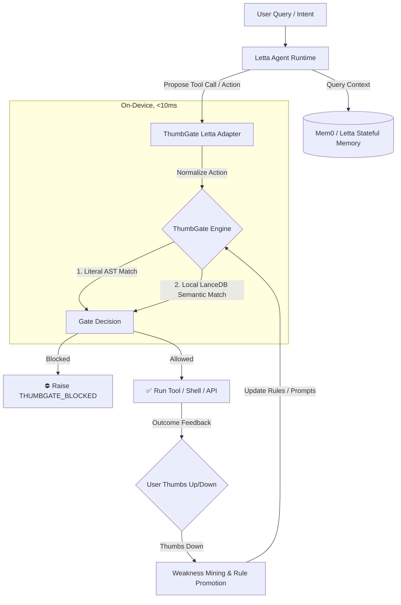

# Stateful Memory (Mem0 / Letta) + ThumbGate Integration Guide

This guide outlines how to design agent architectures that combine **long-term stateful memory** (like Mem0 or Letta) with **pre-action governance** (ThumbGate).

---

## 1. Dual-Loop Architecture

In a robust agentic system, cognitive memory and deterministic enforcement occupy different layers of the execution loop:

1. **The Cognitive Memory Loop (Retrieval/Assembly)**: Mem0 or Letta retrieves historical context, user preferences, and entities to feed into the LLM system prompt.
2. **The Governance/Enforcement Loop (Interception/Gating)**: ThumbGate intercepts proposed model actions (tool calls, shell commands, file edits) right before execution, verifying them against rules derived from past feedback.



---

## 2. Timing in the Agent Loop

| Metric / Phase | Memory Layer (Mem0 / Letta) | Governance Layer (ThumbGate) |
| :--- | :--- | :--- |
| **Stage** | Retrieval & Assembly (Input-Side) | Pre-Action Interception (Output-Side) |
| **Responsibility** | Recall, user profiling, semantic correlation | Rule enforcement, threat mitigation, safety rails |
| **Action** | Injects facts into prompts | Intercepts and blocks tool calls |
| **Typical Latency** | $100\text{ms} - 1000\text{ms}$ (embedding search, graph query) | $<10\text{ms}$ (cached local rule check) |
| **Data Scope** | Rich conversation state, history, user preferences | Strict constraint definitions, known-bad command regexes |

---

## 3. Integration Patterns

### Pattern A: Guarded Tool Executor (Adapter Pattern)
Wrap your Letta/Mem0 tool execution surface in a ThumbGate guard. When the model invokes a tool, the guard normalizes the target action and checks active gates before routing to the underlying execution library.

```javascript
const { createLettaToolGuard } = require('../../adapters/letta/thumbgate-letta-adapter');
const { runGateCheck } = require('../../src/gates-engine');

// Guard a Letta tool
const guardedShellTool = createLettaToolGuard({
  gateCheck: async (normalizedAction) => {
    // Executes on-device rule evaluation against local LanceDB/literal rules
    return runGateCheck(normalizedAction);
  },
  executeTool: async (input) => {
    // Run the actual system shell call
    return execCommand(input.command);
  }
});
```

### Pattern B: Rule-Conditioned Memory Queries
Query the memory layer to retrieve developer-specified constraints or environments, and inject them dynamically as session rules inside ThumbGate:

```javascript
const preferences = await mem0.getMemory("user-1");
// If preferences dictate production freeze
if (preferences.includes("Production freeze active")) {
  thumbgate.addTemporaryGate({
    toolPattern: "git push origin main",
    reason: "Block pushes during production freeze preference"
  });
}
```

### Pattern C: Feedback Capture Synchronization
When a user gives a negative feedback signal (Thumbs Down 👎):
1. **Mem0/Letta** registers the conversational failure (e.g. "User disliked format of output").
2. **ThumbGate** captures the concrete tool command or plan segment that caused the failure, mines the structural weakness, and automatically promotes a new pre-action gate.

---

## 4. Why Use Both?

* **No Amnesia**: Letta and Mem0 keep the agent personal and conversational across sessions.
* **No Token Waste on Repeats**: When Letta proposes a tool call that previously failed, ThumbGate intercepts it instantly at the terminal/wrapper level, saving LLM round-trip costs and keeping execution deterministic.
* **Local-First Safety**: ThumbGate guarantees that even if the remote memory service is slow, unavailable, or compromised, high-risk actions (force pushing, credential prints, test deletion) are locked down locally.
