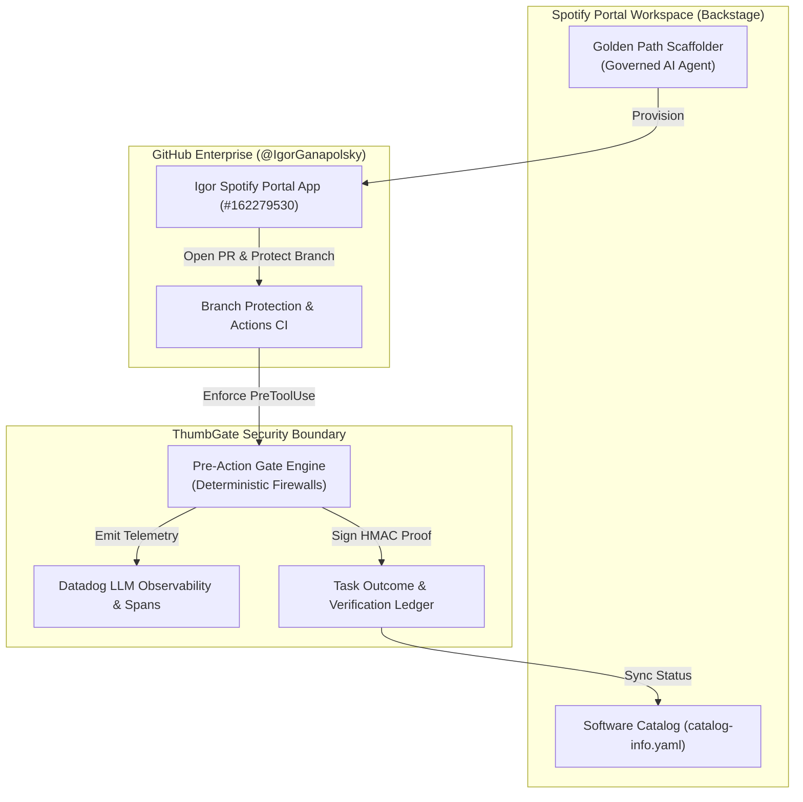

# Spotify Portal & Backstage Enterprise Governance Proposal

**Target Account:** Enterprise Engineering Organizations deploying Spotify Portal (Backstage)  
**Provider:** Max Smith KDP LLC / ThumbGate Infrastructure  
**Integration Authority:** Igor Spotify Portal GitHub App (`#162279530`)  
**Portal Workspace:** `igorganapolsky.spotifyportal.com`  
**Date:** September 2026  
**Commercial Model:** B2B Turnkey Setup + Managed Platform Retainer  

---

## Executive Summary

As enterprise engineering organizations adopt **Spotify Portal for Backstage** to centralize developer experience and enforce Golden Paths, autonomous AI coding agents and MCP servers present massive compliance and operational risk:
1. **Unbounded Tool Execution:** AI agents executing arbitrary bash commands, database mutations, and file overwrites without pre-action controls.
2. **Data Exfiltration:** Sensitive credentials, proprietary IP, and customer PII leaking into model inference endpoints without tenant diodes.
3. **Observability Blind Spots:** Traditional APM missing LLM-specific telemetry, multi-agent span hierarchies, and token economics.

**ThumbGate for Spotify Portal** delivers the industry's first **Pre-Action Infrastructure Firewall & Golden Path Scaffolder** natively integrated into Spotify's Enterprise Developer Portal.

---

## Architecture & Integration

---

## Enterprise Commercial Offerings

### Tier 1: Spotify Portal Catalog & API Onboarding
*Target: Startups and scaleups standardizing on Spotify Portal.*
- Full `catalog-info.yaml` entity definitions for all services, microservices, and MCP gateways.
- OpenAPI 3.1 specification sync and real-time health checks directly in the portal.
- Automated GitHub App (`#162279530`) wiring and branch protection auditing.
- **Price:** **$1,500** one-time setup.

### Tier 2: Managed Golden Path Scaffolder (High-ROI)
*Target: Mid-market engineering departments (50–250 engineers).*
- Custom Backstage Scaffolder Golden Path template (`template-governed-ai-agent`).
- 1-click self-service provisioning of autonomous agents pre-wired with ThumbGate pre-action gates.
- Built-in Datadog LLM observability, latency budget monitoring, and token leak tripwires.
- Pre-configured GitHub Actions CI/CD with CodeQL, Socket Security, and SonarCloud gates.
- **Price:** **$2,500** setup + **$1,500/month** managed retainer.

### Tier 3: Enterprise Platform Retainer & SLA
*Target: Enterprise platform teams & VP of Engineering.*
- Multi-repository automated PR healing loop (resolves bot comments and behind-main lockups).
- Zero-egress local compliance diodes (HIPAA / SOC 2 / ISO 42001 proof receipts).
- Dedicated Slack/Teams escalation bridge and weekly security gate tuning.
- 99.9% uptime SLA on gate decision evaluation endpoints.
- **Price:** **$5,000** setup + **$4,500/month** retainer.

---

## Proof & Verification

- **Live Production Service:** `https://thumbgate-production.up.railway.app/health`
- **GitHub App Authority:** `https://github.com/settings/installations/162279530`
- **Catalog Descriptor:** `catalog-info.yaml` (Production Component + OpenAPI spec)
- **Scaffolder Template:** `templates/golden-paths/governed-ai-agent/template.yaml`
