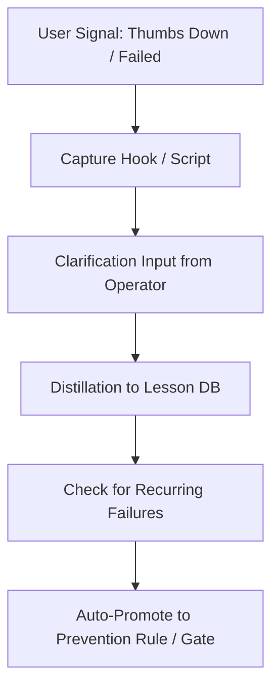

# ThumbGate Feedback Best Practices

This reference document explains how to get the most value out of the ThumbGate feedback capture loop.

## Feedback Lifecycle

## Strategy: Coarse to Fine

When you first capture feedback for a new kind of failure, start with a broad description of what went wrong. Do not try to write a perfect regex rule immediately.

- **Bad**: "blocked curl command to production url when process.env.NODE_ENV is test"
- **Good**: "prevent production URL curl calls during test runs"

ThumbGate's Thompson Sampling and Bayes-optimal scorer will automatically elevate the risk category as the same type of failure repeats.

## Rule Consolidation

When you have 3+ prevention rules targeting the same command or file path, consolidate them:
1. View the active rules in `config/gates/`.
2. Merge the patterns into a single regex (e.g. `(git push --force|git push -f)` -> `git push (-f|--force)`).
3. Delete the redundant specific rules.

## Using On-Demand Modes

To temporarily increase safety boundaries:
- Set `THUMBGATE_CAREFUL_MODE=1` to enforce maximum blocks on dangerous commands.
- Set `THUMBGATE_FREEZE_PATHS=src/` to restrict all edit/write tool calls to specific target directories.
